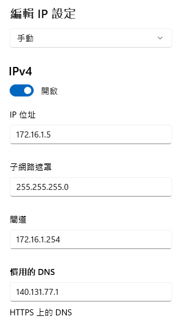
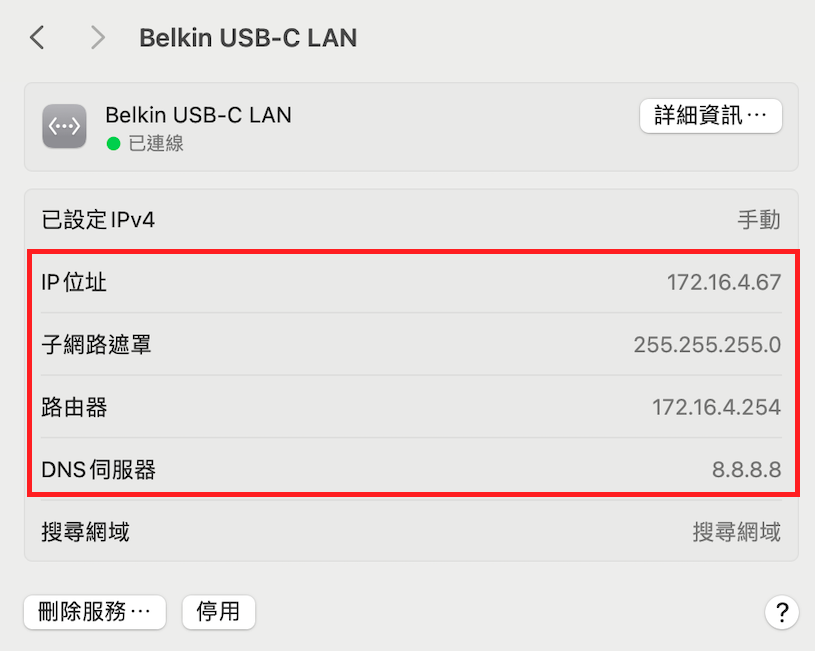

# 網路設定說明

 

## 使用情境
1. 使用學校電腦；
2. 使用個人攜帶的電腦＋手機熱點；
3. 使用個人攜帶的電腦＋學校的網路線；
4. 以上，無論電腦與網路如何配置，樹莓派與電腦必須在相同區網才能透過 SSH 連線。
5. 連線樹莓派時，若未查詢網路線指派的 `IP` ，可使用燒錄時自訂的 `主機名稱` 進行連接即可。

 

## 使用教室電腦

1. 電腦的網路無需進行設定；
2. 樹莓派也要接上學校網路；
3. 按常規樹莓派無需對網路進行設置；
4. 可同時開啟手機熱點提供樹莓派連外網；
5. 如因學校網路規範導致無法順利連線，可透過設置靜態 IP 來排除。

 

## 使用自己的電腦

1. 同前面說明，如需設定特定 IP，使用 `ifconfig` 或 `ipconfig` 進行 IP 查詢。
2. 然後進行電腦的乙太網路卡設定，詳下一大項說明。
3. 樹莓派部分同前項說明。

 

## 乙太網路卡設定

### IP 及 子網路遮罩

1. 使用網路查詢的結果配置。

### DNS 設置

1. 使用網路查詢的結果顯示 DNS 伺服器的地址，如 `140.131.77.1` 。
2. 使用公共 DNS，如 Google 的 `8.8.8.8` 和 `8.8.4.4` 。

 

### 圖示

- Windows

 

- MacOS

 

---

_END：以上進行網路設置_
