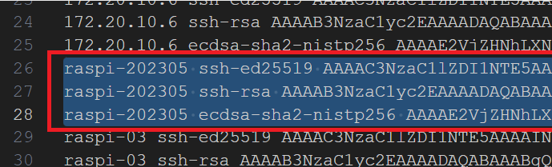

# SSH 連線常見錯誤

_基本上這兩種方式能排除決大部分連線問題_

<br>

## 遠端主機驗證已經改變

_無法連線樹莓派時，可先嘗試刪除連線設定紀錄_

<br>

1. 出現警告並提示錯誤，這是紀錄遠程伺服器的公開金鑰，連線遠端主機之後會被自訂記錄在本機路徑中，若因硬體與名稱衝突時常導致無法連線，可將連線紀錄資料刪除。

   

<br>

2. Mac 所在路徑 `~/.ssh/known_hosts`。

   ```bash
   # 開啟上層資料夾進行編輯
   code ~/.ssh
   ```

<br>

3. Windows 所在路徑 `%USERPROFILE%\.ssh\known_hosts`。

   ```bash
   # 開啟上層資料夾進行編輯
   code %USERPROFILE%\.ssh
   ```

<br>

4. 將連線主機的舊紀錄刪除，刪除這些紀錄完全不影響連線，只會在連線再次詢問是否進行連線。

   
 
<br>

## 檢查本機 `hosts` 檔案

1. 該文件用於記錄並映射 `主機名稱` 到 `指定的 IP 位置`，假如存在舊資料或映射錯誤可能導致無法連線，可嘗試將其刪除。

<br>

2. 另外，當遇到 `無法解析 DNS` 的時候，也可嘗試 `設定映射` 進行手動解析，而 `指定映射` 也可用於阻止訪問某些網路。

<br>

3. Mac 路徑 `/etc/hosts`。

   ```bash
   code /etc/hosts
   ```

   _內容說明_

   ```bash
   # 將 localhost 解析為 127.0.0.1，這是指向本機的IP地址
   127.0.0.1	localhost

   # 將 broadcasthost 解析為 255.255.255.255
   # 廣播地址用於向網絡中的所有設備發送訊息
   # 允許設備在不需要知道區網內其他設備 IP 的情況下與整個區網進行通信
   255.255.255.255	broadcasthost

   # 將 localhost 解析為 ::1，這是 IPv6 的回送地址，相當於 IPv4 的 127.0.0.1
   # 兩種協定都是用於網際網路上的數據傳輸和路由
   # IPv6 是為了解決 IPv4 地址耗盡問題，以及提高網際網路性能和安全性而設計的
   ::1             localhost

   # 將 raspi-2023-05 解析為 172.16.4.1
   # 這是區網內的設備 的 IP 地址
   172.16.4.2 raspi-2023-06
   ```

<br>

4. Windows：`C:\Windows\System32\drivers\etc\hosts`。

   ```bash
   code C:\Windows\System32\drivers\etc\hosts
   ```

<br>

## SSH 可以連線 IP 卻無法連線 Hostname

_詳連線錯誤簡易排除_

<br>

___

_END_