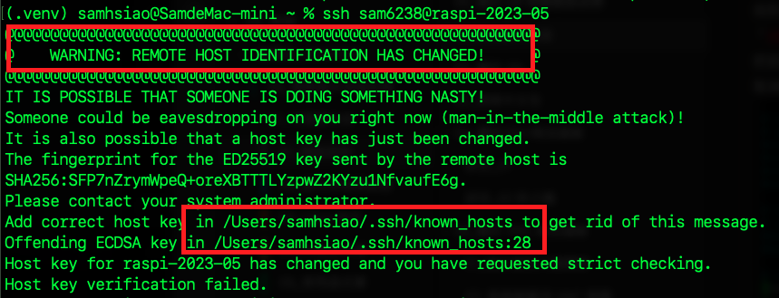

# SSH 連線常見錯誤

<br>

## SSH 可以連線 IP 卻無法連線 Hostname

_詳連線錯誤簡易排除_

<br>

## 遠端主機驗證已經改變

1. 按照綠色警告的提示進行修改即可

   

<br>

2. 編輯檔案

   ```bash
   /Users/samhsiao/.ssh/known_hosts
   ```

<br>

3. 將連線主機的舊紀錄刪除。

   

<br>

___

_END_