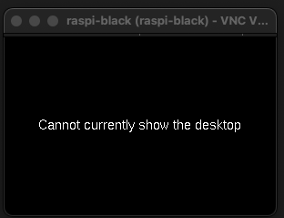

# VNC 連線時可能發生的錯誤

_這是在 `Bullseye` 以前的系統上使用的排除方式_

<br>

## 當前無法顯示桌面

_Cannot currently show the desktop_

<br>

1. 出現如下的畫面，無法進入桌面，這可能起因於在無頭模式下，系統無法辨識硬體裝置；在桌面設定中可以進行無頭模式的預設解析度，但必須先進入桌面。

   

<br>

2. 透過 SSH 連線編輯設定檔案。

   ```bash
   sudo nano /boot/config.txt
   ```

<br>

3. 取消該行預設的註解並設定為 `1`，表示強制開啟 HDMI。

   ```bash
   hdmi_force_hotplug=1
   ```

<br>

4. 使用 nano 編輯時，鍵盤組合鍵的操作為：儲存 `CTRL + O`、`退出 CTRL + X`。

<br>

5. 如下內容設定，`group`、`mode` 分別設定為 `2`、`82`，這會令做說明；另外，渲染解析度可不用設定。

   

<br>

6. 編輯設定文件之後需重新啟動樹莓派。

   ```bash
   sudo reboot now
   ```

<br>

___

_END_