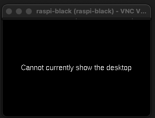
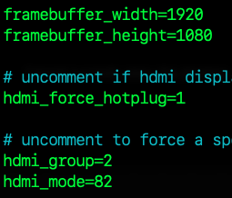

# VNC 連線時可能發生的錯誤

<br>

## Cannot currently show the desktop

1. 無險顯示遠端桌面

2. 出現黑屏＋文字

3. [參考](https://blog.csdn.net/Dorian15/article/details/128321804)

4. 使用終端機進行編輯，可避免權限問題

   

<br>

## 排除步驟

1. 編輯設定檔案。

   ```bash
   sudo nano /boot/config.txt
   ```

<br>

2. 取消註解：強制開啟 HDMI。

   ```bash
   hdmi_force_hotplug=1
   ```

<br>

3. nano 操作：`儲存 CTRL + O`、`退出 CTRL + X`。

<br>

4. 如下設定。

   

<br>

5. 重新啟動。

   ```bash
   sudo reboot now
   ```

<br>

___

_END_