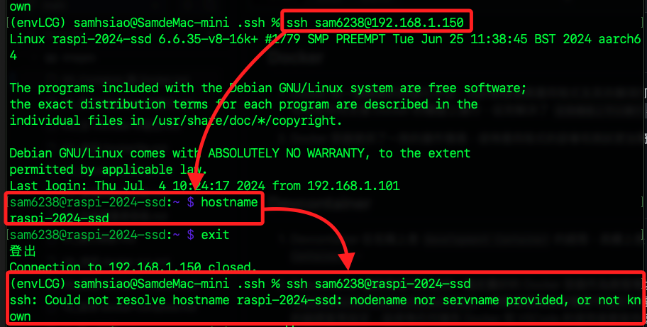
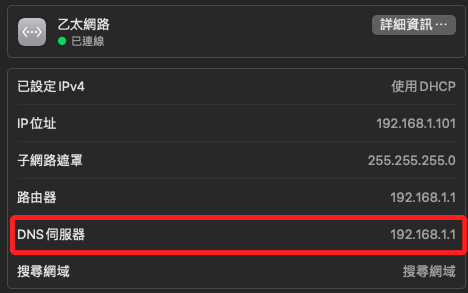

# SSH 可以連線 IP 卻無法連線 Hostname

<br>

## 說明

1. 如圖顯示，使用 IP 連線正常，並確認了 Hostname，但是退出使用 Hostname 連線卻失敗，可參考以下的程序進行檢查與排除。

    

<br>

## 清除本地緩存

1. 當出現 DNS 相關問題時，在進行排除步驟之前，可先在本地電腦運行 `dscacheutil` 指令清除 DNS 快取，並使用 `killall` 來重新啟動 mDNSResponder 進行 DNS 解析的刷新。

    ```bash
    sudo dscacheutil -flushcache && sudo killall -HUP mDNSResponder
    ```

<br>

## 查詢主機解析

1. 使用 `nslookup` 查詢和診斷 DNS 問題；以下指令是查詢 `raspi-2024-ssd` 的 DNS 記錄以獲取其 `IP 地址`，如果主機名稱無法解析時會返回錯誤信息。

    ```bash
    nslookup raspi-2024-ssd
    ```

    _若無法解析：該主機名稱在 DNS 伺服器中無法解析_

    ```bash
    Server:		8.8.8.8
    Address:	8.8.8.8#53

    ** server can't find raspi-2024-ssd: NXDOMAIN
    ```

    _正常解析_

    ```bash
    Server:		192.168.1.1
    Address:	192.168.1.1#53

    Name:	raspi-2024-ssd
    Address: 192.168.1.149
    ```

<br>

2. 同上，也可使用 `dig` 查詢 DNS 伺服器的詳細信息，查詢結果包含連線過程中的各種步驟和解析記錄；以下指令會查詢 `raspi-2024-ssd` 的 `A 記錄`。

    ```bash
    dig raspi-2024-ssd
    ```

    _無法解析：該主機名在 DNS 伺服器中無法解析_

    ```bash
    ; <<>> DiG 9.10.6 <<>> raspi-2024-ssd
    ;; global options: +cmd
    ;; Got answer:
    ;; ->>HEADER<<- opcode: QUERY, status: NXDOMAIN, id: 9585
    ;; flags: qr rd ra ad; QUERY: 1, ANSWER: 0, AUTHORITY: 1, ADDITIONAL: 1

    ;; OPT PSEUDOSECTION:
    ; EDNS: version: 0, flags:; udp: 512
    ;; QUESTION SECTION:
    ;raspi-2024-ssd.			IN	A

    ;; AUTHORITY SECTION:
    .			86395	IN	SOA	a.root-servers.net. nstld.verisign-grs.com. 2024070302 1800 900 604800 86400

    ;; Query time: 12 msec
    ;; SERVER: 8.8.8.8#53(8.8.8.8)
    ;; WHEN: Thu Jul 04 10:43:56 CST 2024
    ;; MSG SIZE  rcvd: 118
    ```

    _正常解析_

    ```bash
    ; <<>> DiG 9.10.6 <<>> raspi-2024-ssd
    ;; global options: +cmd
    ;; Got answer:
    ;; ->>HEADER<<- opcode: QUERY, status: NOERROR, id: 17254
    ;; flags: qr aa rd ra; QUERY: 1, ANSWER: 1, AUTHORITY: 0, ADDITIONAL: 1

    ;; OPT PSEUDOSECTION:
    ; EDNS: version: 0, flags:; udp: 4096
    ;; QUESTION SECTION:
    ;raspi-2024-ssd.			IN	A

    ;; ANSWER SECTION:
    raspi-2024-ssd.		0	IN	A	192.168.1.149

    ;; Query time: 1 msec
    ;; SERVER: 192.168.1.1#53(192.168.1.1)
    ;; WHEN: Sat Jul 06 06:07:48 CST 2024
    ;; MSG SIZE  rcvd: 59
    ```

<br>

## 查看當前設備的 DNS 設定

_可跳到第 `5` 點先進行排除_

<br>

1. macOS 和 Linux。

    ```bash
    cat /etc/resolv.conf
    ```

    _例如_

    ```bash
    nameserver 192.168.1.1
    nameserver 8.8.8.8
    nameserver 8.8.4.4
    ```

<br>

2. Windows。

    ```bash
    ipconfig /all
    ```

<br>

3. 查詢結果顯示系統設定了三個 DNS，雖然已經涵蓋了區網及公網 DNS，但系統進行連線時會並行嘗試多個 DNS 伺服器，而不是按照配置中的順序依次查詢，當其中一個查詢先返回 NXDOMAIN 或其他錯誤，便會導致報錯，也不會再查詢其他 DNS。

<br>

4. 本地 DNS 伺服器 `192.168.1.1` 通常是能夠解析內網主機名稱，但這些名稱可能不會在公共 DNS 伺服器如 `8.8.8.8` 和 `8.8.4.4` 上註冊，所以當公共 DNS 伺服器無法解析內網名稱且先於 `192.168.1.1` 返回的 NXDOMAIN 結果，便可能會干擾後續的查詢。

<br>

5. 基於以上的說明，若在家中使用，可將 DNS 設定為 `192.168.1.1` 並刪除其他 DNS。

    

<br>

6. 若在公司或學校單位使用設備時，則設定為 `8.8.8.8`、`8.8.4.4` 或透過查看既有連線的 DNS 作為設定值。


<br>

___

_END_