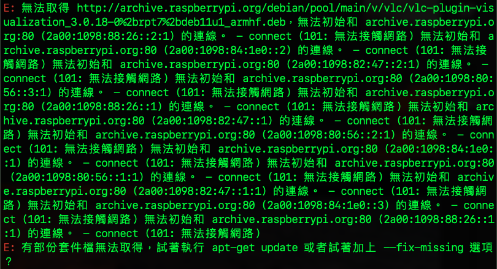
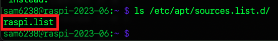
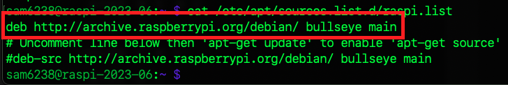
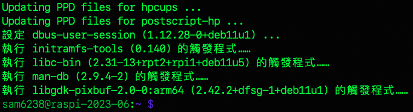
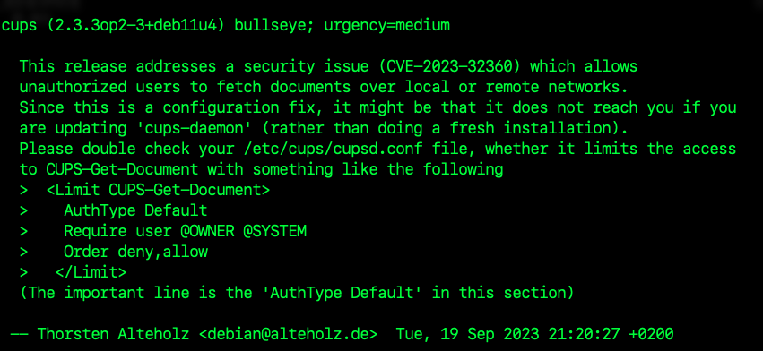

# 更新時常見錯誤 / 訊息

</br>

## A. sudo apt upgrade 出錯



_說明與排除_

1. 以下指令進行更新時出現錯誤訊息如上
   

   ```bash
   sudo apt-get update && apt-get upgrade -y
   ```

2. 查看 sources.list.d 目錄下所有文件

   ```bash
   ls /etc/apt/sources.list.d/
   ```

3. 假如是剛安裝好，可能只有一個
   
   

4. 逐一查看內容

   ```bash
   cat /etc/apt/sources.list.d/<文件名>
   ```

5. 使用編輯指令進行編輯，這裡編輯的是 `raspi-list`

   ```bash
   sudo nano /etc/apt/sources.list.d/<文件名>
   ```
   
6. 把報錯的鏡像來源註解起來

   

7. 再次更新，順利完成

   
   


</br>

## B. 通知軟體庫更新


_說明與排除_

1. 無需特別處理。

</br>

## C. 安全通告 



_說明與排除_

1. 這是一個安全通告，關於 Common UNIX Printing System（CUPS）的一個版本，具體來說是 `cups 2.3.3op2-3+deb11u4` 這個版本，針對 Debian 的 `bullseye` 版本，訊息內容說明省略。

2. 建議檢查 `/etc/cups/cupsd.conf` ，添加限制對 `CUPS-Get-Document` 的訪問，配置應該類似於以下：

    ```ini
    <Limit CUPS-Get-Document>
        AuthType Default
        Require user @OWNER @SYSTEM
        Order deny,allow
    </Limit>
    ```
    這裡特別強調，該區段中重要的配置行是 `'AuthType Default'`。


</br>

---

_END_
