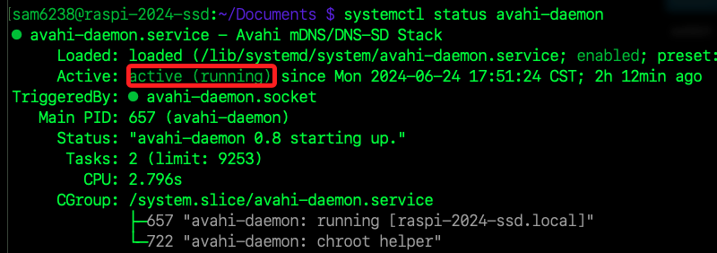

# DNS

<br>

# avahi

1. 樹莓派預設安裝了 `avahi` 服務，可透過指令查看。

   ```bash
   systemctl status avahi-daemon
   ```

   

<br>

# mDNS

1. 一種在本地網路解析 `hostname` 的技術。

2. 安裝了 `mDNS` 便可使用 `.local` 來訪問。

<br>

___

_END_
