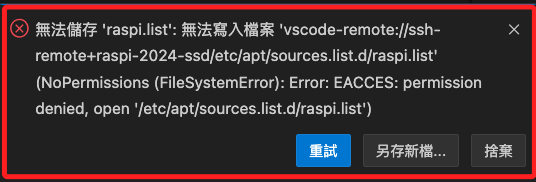

# 更新時常見錯誤 / 訊息

_基本上，更新時出錯的處理原則就是哪裡錯就把哪裡的更新列表註解掉重新來。_

<br>

## sudo apt upgrade 出錯

1. 錯誤訊息。

   

<br>

_說明與排除_

<br>

2. 執行更新指令時出現如上方截圖中的錯誤訊息。

   ```bash
   sudo apt-get update && apt-get upgrade -y
   ```

<br>

3. 查看 `sources.list.d` 目錄下所有文件。

   ```bash
   ls /etc/apt/sources.list.d/
   ```

<br>

4. 假如系統是才安裝好的，此時可能只有一個清單文件。
   
   

<br>

5. 透過 `cat` 指令逐一查看內容。

   ```bash
   cat /etc/apt/sources.list.d/<文件名>
   ```

<br>

6. 使用編輯指令進行編輯，這裡編輯的是 `raspi-list`。

   ```bash
   sudo nano /etc/apt/sources.list.d/<文件名>
   ```

<br>

7. 把報錯的 `鏡像來源` 註解起來。

   

<br>

8. 再次更新，順利完成。

   

<br>

## 透過 VSCode 編輯文件出現權限問題

1. 使用終端機可透過 `sudo` 進行授權，但使用 `VSCode` 無法進行這種形態的授權，導致於編輯文件出現權限警告。

   

<br>

2. 先使用指令 `ls -l` 查詢當前授權。

   ```bash
   ls -l /etc/apt/sources.list.d/
   ```

<br>

3. 這是一個 `10` 碼的資訊，第一碼為 `文件類型`，輸出 `-` 代表 `普通文件`，其他常見還有 `d 目錄`、`l 符號連結`；接下來三組三個符號分別代表 `擁有者`、`擁有者同組用戶`、`其他用戶`的權限組合；而每個權限組合代表的是 `讀 r`、`寫 w`、`執行 x`，對應的數字為 `4、2、1`。

   ```bash
   # 普通文件：（擁有者：可讀寫）（同組：可讀）（其他：無權限）
   -rw-r--r-- 1 root root 113  6月 24 19:51 nodesource.list
   -rw-r--r-- 1 root root 192  6月 24 20:17 raspi.list
   ```

<br>

4. 可先在終端機使用 `sudo` 對文件進行授權可讀寫 `666`；如同前述的 `讀、寫、執行` 分別對應的數值是 `4、2、1`，所以 `666` 代表賦予 `讀＋寫` 的權限。

   ```bash
   sudo chmod 666 /etc/apt/sources.list.d/raspi.list
   ```

<br>

5. 編輯完文件後，恢復原來的權限 `644`，只有 `root` 可以編輯。

   ```bash
   sudo chmod 644 /etc/apt/sources.list.d/raspi.list
   ```

<br>

## 通知軟體庫更新

1. 顯示訊息如下時，無需特別進行處理。

   

<br>

## 安全通告 

1. 顯示狀況。

   

<br>

_說明與排除_

<br>

1. 這是一個關於 `Common UNIX Printing System（CUPS）` 的 `安全通告`，具體訊息內容說明省略。

<br>

2. 根據建議進行檢查 `/etc/cups/cupsd.conf`，並對 `CUPS-Get-Document` 的訪問添加限制如下。

   ```ini
   <Limit CUPS-Get-Document>
   AuthType Default
   Require user @OWNER @SYSTEM
   Order deny,allow
   </Limit>
   ```

<br>

___

_END_