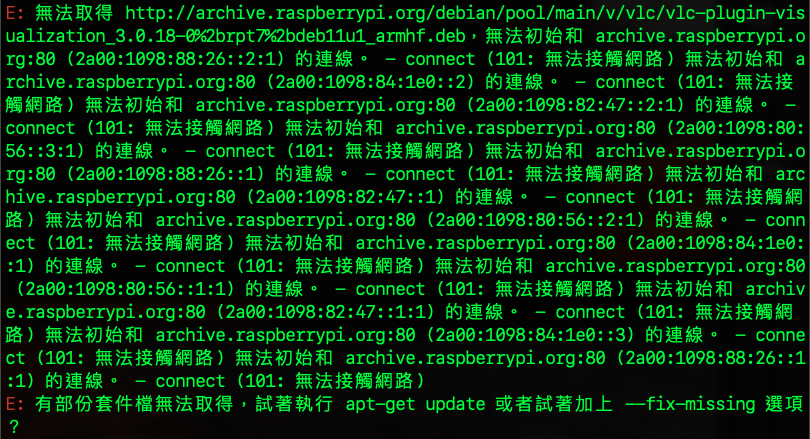
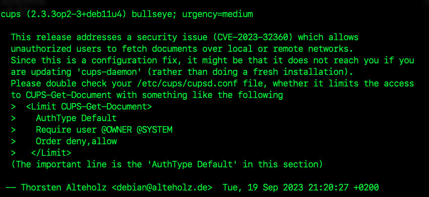

# 更新時常見錯誤 / 訊息

_基本上，更新時出錯的處理原則就是哪裡錯就把哪裡的更新列表註解掉重新來。_

<br>

## sudo apt upgrade 出錯

1. 錯誤訊息。

   

<br>

_說明與排除_

<br>

2. 執行更新指令時出現如上方截圖中的錯誤訊息。

   ```bash
   sudo apt-get update && apt-get upgrade -y
   ```

<br>

3. 查看 `sources.list.d` 目錄下所有文件。

   ```bash
   ls /etc/apt/sources.list.d/
   ```

<br>

4. 假如系統是才安裝好的，此時可能只有一個清單文件。
   
   

<br>

5. 透過 `cat` 指令逐一查看內容。

   ```bash
   cat /etc/apt/sources.list.d/<文件名>
   ```

<br>

6. 使用編輯指令進行編輯，這裡編輯的是 `raspi-list`。

   ```bash
   sudo nano /etc/apt/sources.list.d/<文件名>
   ```

<br>

7. 把報錯的 `鏡像來源` 註解起來。

   

<br>

8. 再次更新，順利完成。

   

<br>

## 通知軟體庫更新

1. 顯示訊息如下時，無需特別進行處理。

   

<br>

## 安全通告 

1. 顯示狀況。

   

<br>

_說明與排除_

<br>

1. 這是一個關於 `Common UNIX Printing System（CUPS）` 的 `安全通告`，具體訊息內容說明省略。

<br>

2. 根據建議進行檢查 `/etc/cups/cupsd.conf`，並對 `CUPS-Get-Document` 的訪問添加限制如下。

   ```ini
   <Limit CUPS-Get-Document>
   AuthType Default
   Require user @OWNER @SYSTEM
   Order deny,allow
   </Limit>
   ```

<br>

___

_END_