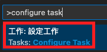
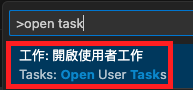
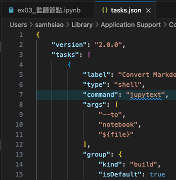
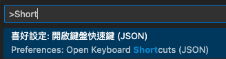
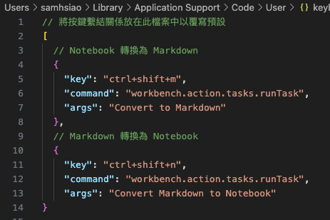

# Markdown 與 Jupyter 的轉換

_以下分別說明 Markdown 與 Jupyter Notebook 文件的雙向轉換_

<br>

## .ipynb 轉換為 .md

_使用自動化腳本_

<br>

1. 先自訂一個腳本 `convert_to_md.sh`。

    ```sh
    #!/bin/bash
    jupyter nbconvert --to markdown "$1"
    ```

2. 其餘後補。

<br>

## .md 轉換為 .ipynb

_在終端機中執行_

<br>

1. 安裝必要插件。

    ```bash
    pip install jupytext
    ```

<br>

2. 執行指令。

    ```bash
    jupytext --to notebook <要轉換的 markdown.md>
    ```

<br>

## 建立任務

_在 VSCode 中建立任務，並設定快捷鍵來執行這個任務_

<br>

1. 打開命令面板，組合鍵為 `Ctrl+Shift+P` 或 `Cmd+Shift+P`。

<br>

2. 輸入 `Tasks: Configure Task` 並選擇 `Create tasks.json file from template` 。

    

<br>

3. 假如沒有的話，選擇 `Open User Tasks` ，並任選其中一個就會開啟 `tasks.json` 檔案。

    

<br>

4. 在 `tasks.json` 檔案中，添加以下任務配置，當運行任務時，會將當前打開的 `Markdown 檔案` 轉換為 `Jupyter Notebook` 文件。

    ```json
    {
        "version": "2.0.0",
        "tasks": [
            {
                "label": "Convert Markdown to Notebook",
                "type": "shell",
                "command": "jupytext",
                "args": [
                    "--to",
                    "notebook",
                    "${file}"
                ],
                "group": {
                    "kind": "build",
                    "isDefault": true
                }
            }
        ]
    }
    ```

    

<br>

## 設定快捷鍵

1. 打開命令面板。

<br>

2. 輸入 `Preferences: Open Keyboard Shortcuts (JSON)` 並選擇它。

    

<br>

3. 在 `keybindings.json` 檔案中添加以下配置，這將為剛剛建立的 `任務` 設定一個 `快捷鍵`。

    ```json
    {
        // 或其他任何快捷鍵
        "key": "ctrl+alt+n",
        "command": "workbench.action.tasks.runTask",
        "args": "Convert Markdown to Notebook"
    }
    ```

    

<br>

4. 在 VSCode 中打開一個 Markdown 檔案並使用設定的快捷鍵時，它會自動轉換為 Jupyter Notebook。

<br>

___

_END_
