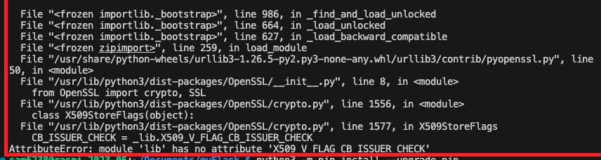

# 安裝套件時出現關於 SSL 的錯誤

<br>

## 說明

1. 錯誤截圖

   

<br>

2. 這個錯誤信息顯示在使用 `pip` 安裝 Flask 時遇到了問題，錯誤原因是在使用 OpenSSL 的 Python 庫 pyOpenSSL 時遇到了一個 `屬性錯誤`。

<br>

3. 具體說這個錯誤是在訪問 `lib` 模組中的 `X509_V_FLAG_CB_ISSUER_CHECK` 屬性時引發的，但是該屬性不存在。

<br>

## 推判與除錯

_錯誤可能來自幾個原因_


1. pyOpenSSL 版本不兼容：可能安裝了一個不兼容的 pyOpenSSL 版本。

<br>

2. 系統中的 OpenSSL 版本不兼容：系統中安裝的 OpenSSL 版本可能與 Python 的 pyOpenSSL 庫不兼容。

<br>

3. pip 或 Python 版本過舊：使用的 pip 或 Python 版本可能過舊，無法正確地安裝或運行需要的庫。


<br>

### 解決方法

1. 更新 pip 和 Python

   ```bash
   python3 -m pip install --upgrade pip
   ```

<br>

2. 更新 pyOpenSSL 和相關庫
   
   ```bash
   pip install --upgrade pyOpenSSL
   ```

<br>

3. 檢查 OpenSSL 版本
   
   _假如更新後還是錯誤，可再進一步檢查系統中安裝的 OpenSSL 版本與 pyOpenSSL 是否兼容。_

<br>

4. 使用虛擬環境：

    _假如以上程序都未能解決，只好建立新的虛擬環境來開發_

<br>

___

_END_