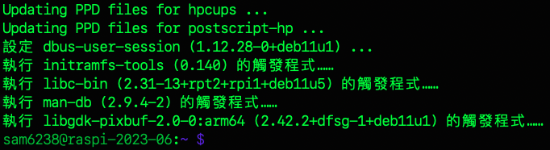

# 更新時常見錯誤 / 訊息

_基本上，執行更新指令 `apt update` 或 `apt upgrade` 時出錯的處理原則就是 `哪裡錯就把哪裡的更新列表註解掉`，重新再更新一次就好。_

<br>

##  錯誤訊息

1. 錯誤訊息示例一。

   

<br>

2. 錯誤訊息示例二。

   


## 說明與排除

<br>

1. 執行更新指令時出現如上方截圖中的錯誤訊息。

   ```bash
   sudo apt-get update && apt-get upgrade -y
   ```

<br>

2. 查看 `sources.list.d` 目錄下所有文件。

   ```bash
   ls /etc/apt/sources.list.d/
   ```

<br>

3. 假如系統是才安裝好的，此時可能只有一個清單文件。
   
   

<br>

4. 透過 `cat` 指令逐一查看內容。

   ```bash
   cat /etc/apt/sources.list.d/<文件名>
   ```

<br>

5. 使用編輯指令進行編輯，這裡編輯的是 `raspi-list`。

   ```bash
   sudo nano /etc/apt/sources.list.d/<文件名>
   ```

<br>

6. 把報錯的 `鏡像來源` 註解起來。

   

<br>

7. 再次更新，順利完成。

   

<br>

___

_END_