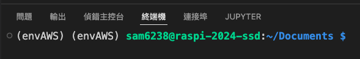

# 更新時出現鎖文件被佔用

## 錯誤訊息

1. 顯示如下。



2. 這個錯誤表明 `apt` 的鎖文件 `/var/lib/apt/lists/lock` 已被另一個進程（`packagekitd`）佔用，導致 `apt update` 無法運行。

## 排除步驟

1. 先查詢當前網路連線。
```bash
nmcli device show
```

2. 確認是哪個進程佔用了鎖文件，透過指令列出佔用鎖文件的進程 ID。

    ```bash
    ps aux | grep apt
    ```

3. 得到類似的訊息，顯示進程 ID。

    

4. 終止佔用鎖文件的進程。

    ```bash
    sudo kill -9 <實際查詢的 ID>
    ```

5. 重新嘗試更新：
   終止進程後，重新嘗試執行 `apt update`：
   ```bash
   sudo apt update
   ```

### 注意事項
- 避免直接刪除鎖文件：直接刪除鎖文件可能會導致系統不穩定，因此不建議這樣做。
- 檢查並修復潛在問題：如果鎖文件經常被佔用，可能需要檢查 `packagekitd` 或其他相關服務是否有問題。