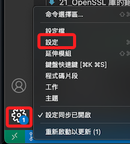

# VSCode 重複啟動虛擬環境

_避免環境衝突，建議排除_

 

## 說明

1. 使用 VSCode 連線數莓派時，假如系統預設的虛擬環境是 `envAWS`，那在 VSCode 中啟動值終端機時會重複啟動虛擬環境，如下圖。

    

 

2. 進入 `設定`。

    

 

3. 輸入關鍵字 `Activate` 搜尋，取消勾選 `Activate Enviroment`。

    

 

4. 重啟 VSCode，開啟終端機就不會重複啟動了。

    

 

___

_END_