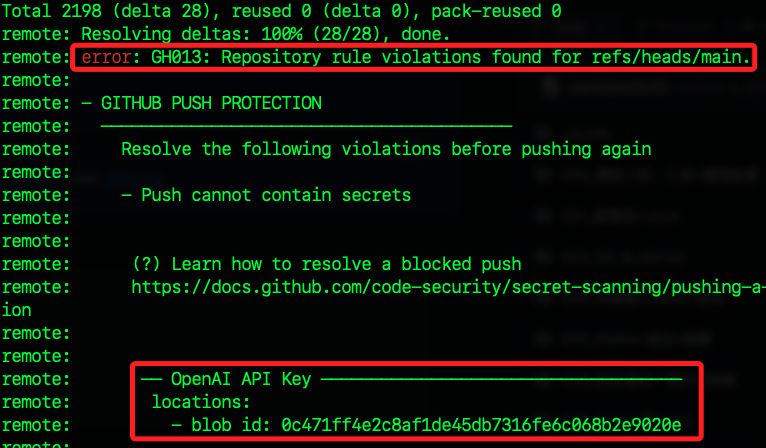

# 版本更新操作記錄

_以下僅記錄本次儲存庫更新的操作過程_

<br>

## 步驟

1. 從舊倉庫將資料克隆到本地，避免命名衝突，同時指定了新的名稱，該命名我將用於倉庫命名。

    ```bash
    git clone https://github.com/samhsiao6238/RaspberryPi_20231015.git RaspberryPi_20240629
    ```

<br>

2. 進入資料夾。

    ```bash
    cd RaspberryPi_20240629
    ```

<br>

3. 進入 GitHub 建立新倉庫，並命名為 `RaspberryPi_20240629`，無需建立任何文件。

<br>

4. 更改原本倉庫的遠程 URL。

    ```bash
    git remote set-url origin https://github.com/samhsiao6238/RaspberryPi_20231015.git
    ```

<br>

5. 推送。

    ```bash
    git push -u origin main
    ```

<br>

## 假如遇到敏感資訊

1. 警告。

    

<br>

2. 透過終端機查詢位置後進行修改，_以下省略部分文字_。

    ```bash
    git rev-list --objects --all | grep 0c471ff4e2c8af1de45db7316feXXXXXXXXXXXXXXXXXXXX
    ```

<br>

3. 重新添加到暫存區並提交，然後推送。

    ```bash
    git add . && git commit -m "first commit" && git push -u origin main
    ```

<br>

___

_以上完成重建倉庫到新的 URL_