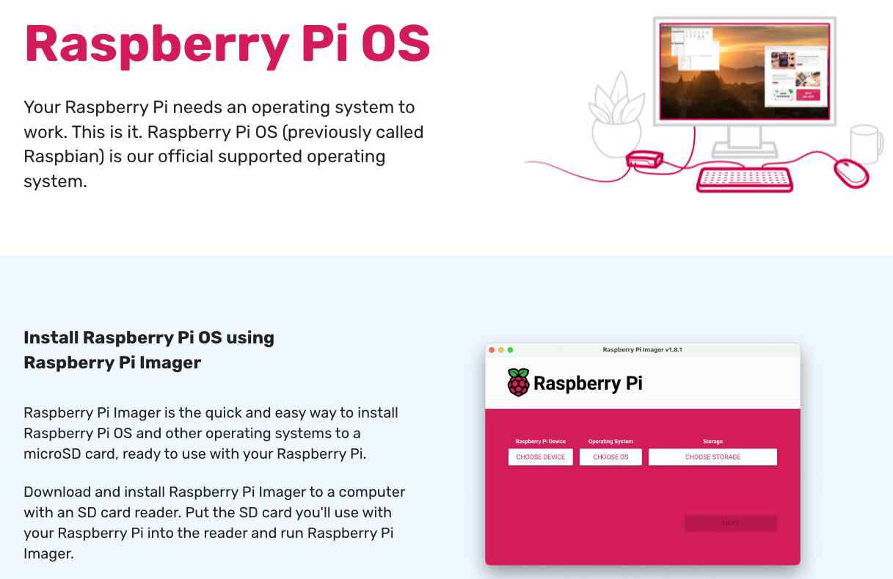

# 樹莓派開發常用工具

_這裡僅列出清單，不做說明_

 

## 桌面應用

1. [Google Meet](https://meet.google.com/)

   _上課 & 廣播工具_

 

2. [VNC Viwer](https://www.realvnc.com/en/connect/download/viewer/)

   _遠端連線樹莓派工具_

   

 

3. [Miro](https://miro.com/)

   _白板_

 

4. [VSCode](https://code.visualstudio.com/)

   _程式碼編輯器，可整合為一個 `IDE` 整合開發環境_

   

 

5. [GitHub Desktop](https://desktop.github.com/)

   _版本控制桌面應用_

   

 

6. [Raspberry Pi Imager](https://www.raspberrypi.com/software/)

   _官方燒錄器_

   

 

7. [Docker Desktop](https://www.docker.com/products/docker-desktop/)

   _容器的部署、運行和管理_

   

 

8. [fritzing](https://fritzing.org/)

   _設計和製作電子原型，支持從設計圖到印刷電路板的完整製作流程_

   

 

## 手機應用

1. 手機 APP，用於雙重認證。

   

 

2. 手機 APP，用於雙重認證。

   

 

3. 手機 APP，用於檢測熱點設備。

   

 

## 所需相關服務帳號

_以下標註 `星號 * ` 者代表可選*；標註 `驚嘆號 ! ` 者代表需要信用卡*_

 

1. [Google](https://google.com)

   _登入 Meet、GitHub、Miro 等應用或服務時所需_

 

2. [VNC Viewer](https://www.realvnc.com/en/connect/download/viewer/)

   _用於遠端連線樹莓派_

 

3. [AWS*](https://aws.amazon.com/tw/)

   _用於雲服務 IoT Core 及 VSCode 插件_

 

4. [GitHub](https://github.com/)

   _檔案同步備份、版本控制平台、代碼儲存與託管倉庫、集成開發工具 Codespace 等_

 

5. [Ngrok](https://ngrok.com/)

   _隧道 Tunel、臨時公網服務、反向代理工具_

 

6. [Streamlit](https://streamlit.io/)

   _類網頁框架，技術上說，算是一個 Python 模組、網頁託管_

 

7. [Firebase](https://firebase.google.com/)

   _Firebase realtime Database、Firestore 等網頁資料庫、Hosting 網頁託管_

 

8. [MongoDB](https://www.mongodb.com/zh-cn)

   _資料庫_

 

9. [Blynk](https://blynk.io/)

   _IoT 應用平台_

 

10. [ThingSpeak](https://thingspeak.com/)

      _輕量 IoT 應用平台_

 

11. [Vercel](https://vercel.com/)

      _可用於 Flask 網站的網頁託管_

 

12. [OpenWeather](https://openweathermap.org/)

      _氣候資訊 API_

 

13. [Zapier*](https://zapier.com/)

      _線上的自動化工具_

 

14. [IFTTT](https://ifttt.com/explore)

      _網路自動化服務_

 

15. [Line Develpoers](https://developers.line.biz/zh-hant/)

      _發送 Line Notify 通知使用、ChatBot 使用_

 

___

_END_