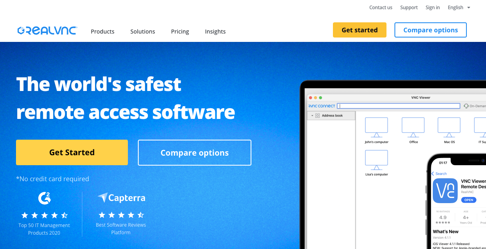

# 樹莓派開發常用工具

_這裡僅列出清單，不做說明_

 

1. [GitHub Desktop](https://desktop.github.com/)
   
   

 

2. 手機 APP，用於雙重認證。
   
   

 

3. 手機 APP，用於雙重認證。
   
   

 

4. 手機 APP，用於檢測熱點設備。
   
   

 

5. [VSCode](https://code.visualstudio.com/download)

   

 

6. [RealVNC Viewer](https://www.realvnc.com/en/connect/download/viewer/?lai_sr=10-14&lai_sl=l)

   

 

7. [Raspberry Pi Imager](https://www.raspberrypi.com/software/)

   

 

8. [Docker Desktop](https://www.docker.com/products/docker-desktop/)

   

 

___

_END_