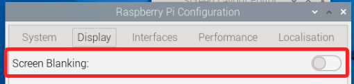
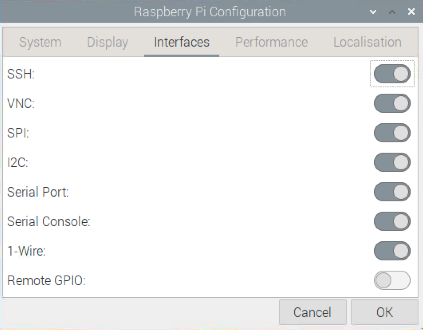
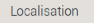
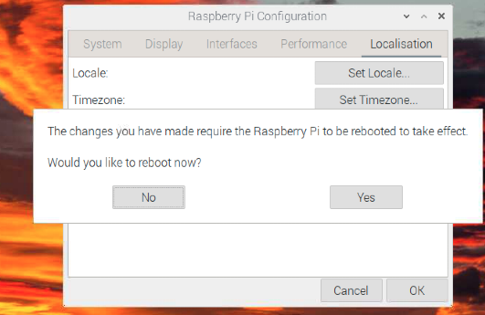
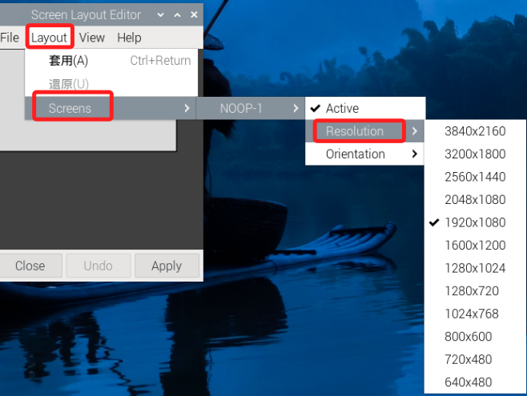
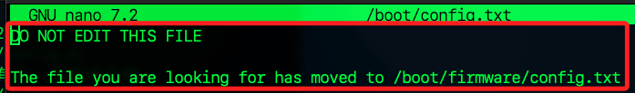
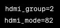

# 環境設置

_完整介紹環境設置_

<br>

## 基本環境設置

<br>

1. 開啟樹莓派後，左上角點擊樹莓派圖標。

   

<br>

2. 在 `偏好設定` 中選擇 `Raspberry Pi 設定`。

   

<br>

3. 於 `系統` 部分，除非要修改主機名稱或密碼，否則不須做其他設定。

      

<br>

4. 點選 `Display` 頁籤，新版作業系統中僅有一個休眠設置 `Screen Blanking`，預設是關閉的，這裡可不予變更。

   

<br>

5. 若是舊版的作業系統，可進行設置無頭模式下的解析度 `Headless Resolution`， 這是在沒有接螢幕的情況下，樹莓派預設的螢幕解析度，這個設置可避免在沒有外接螢幕時，樹莓派顯示連線錯誤。

   

<br>

6. 在 `介面` 頁籤中，可將所有的服務全部開啟，這些是樹莓派與硬體相關的介面或功能設定；`SPI` 用於啟用同步串行通信；`I2C` 用於啟用雙線式低速通信；`Serial Port` 用於啟用 UART 串行通信；`Serial Console` 用於通過串行端口進行命令行訪問；`1-Wire` 用於啟用單線通信協議；`Remote GPIO` 用於通過網路遠程控制 GPIO。

   

<br>

7. 進行地區設置（Locatcalisation、在地化）。

   

<br>

8. 設定語系，且特別注意，字元集（Character Set）應設為 `UTF-8`。

   

<br>

9. 完成設置後，記得儲存並重啟系統。

   

<br>

## 設定螢幕解析度

1. 登入樹莓派後，如果發現解析度很低，先檢查 `偏好設定` 裡的 `螢幕設定`。

   

<br>

2. 依序展開 `Layout`、`Screens`、`Resolution` 後可選取合適的解析度。

   

<br>

3. 假如遇到無可選內容時，可參考後續的 `手動編輯設定檔` 程序。

   

<br>

4. 又或是可選解析度的選項並無理想的數值，如截圖中僅有 `640*480` 這一選項時，同樣可進行手動編輯設定文件。

   

<br>

## 手動編輯設定文件

1. 使用終端機開啟並修改設定檔案。

   ```bash
   sudo nano /boot/config.txt
   ```

<br>

2. 特別注意，在新版的作業系統中，雖然這個文件還是存在，但預設寫入以下訊息，表示檔案已移至 `/boot/firmware/config.txt`。

   

<br>

3. 新版運行以下指令。

   ```bash
   sudo nano /boot/firmware/config.txt
   ```

<br>

## 新版設定文件詳解

_依據新版的文件說明_

<br>

1. 以下針對預設的文件內容進行說明。

   ```bash
   # 啟用不同的硬體接口
   # dtparam=i2c_arm=on
   # dtparam=i2s=on
   # dtparam=spi=on

   # 啟用樹莓派的音頻接口 (loads snd_bcm2835)
   dtparam=audio=on

   # 自動加載相機和顯示器
   camera_auto_detect=1
   display_auto_detect=1

   # 自動加載 initramfs 文件，用於啟動時初始化內核
   auto_initramfs=1

   # 啟用樹莓派的 DRM 驅動，這是為了提供更好的圖形支持
   dtoverlay=vc4-kms-v3d
   max_framebuffers=2
   disable_fw_kms_setup=1

   # 64 位元模式
   arm_64bit=1

   # Disable compensation for displays with overscan
   disable_overscan=1

   # 禁用顯示器的超掃描補償
   arm_boost=1

   # 專門針對 Compute Module 4，啟用 USB 主機模式
   [cm4]
   otg_mode=1

   # 這個標籤下的設置適用於所有樹莓派模型
   [all]
   ```

<br>

2. 若有新增的設定可以寫在 `[all]` 區塊內。

<br>

## 解析度設定說明

_適用於舊版設置文件，用於指定輸出顯示器為 2K 電腦螢幕或 4K 電視_

<br>

1. `hdmi_group` 有 `CEA` 或 `DMT` 兩種模式，其中 `CEA` 用於電視機，`DMT`用於電腦螢幕。

<br>

2. 使用 2K 電腦螢幕。

   

<br>

3. 使用 4K 電視。

   

<br>

4. 另外可設定 `渲染解析度` 的參數，這兩個數值 `framebuffer_width` 和 `framebuffer_height` 需與顯示器的 `hdmi_group`、`hdmi_mode` 匹配；設定之後會將指定的解析度渲染到 hdmi 螢幕上。

   ```
   framebuffer_width=1920
   framebuffer_height=1080
   ```

<br>

## 模式參數對照表

1. DMT (電腦監視器，`hdmi_group=2` )。

   | MODE | 解析度    | 刷新率 |
   | ---- | --------- | ------ |
   | 4    | 640x480   | 60Hz   |
   | 9    | 800x600   | 60Hz   |
   | 16   | 1024x768  | 60Hz   |
   | 35   | 1280x1024 | 60Hz   |
   | 51   | 1600x1200 | 60Hz   |
   | 58   | 1680x1050 | 60Hz   |
   | 82   | 1920x1080 | 60Hz   |

<br>

2. CEA (電視，`hdmi_group=1` )。

   | Mode | 解析度    | 刷新率 |
   | ---- | --------- | ------ |
   | 1    | 640x480   | 60Hz   |
   | 4    | 1280x720  | 60Hz   |
   | 16   | 1920x1080 | 60Hz   |
   | 31   | 1920x1080 | 50Hz   |
   | 34   | 1920x1080 | 30Hz   |

<br>

## 重新啟動後的設定

1. 重啟後進入 `Screen Configuration`。

<br>

2. 選擇想要的解析度，例如： `1920x1080`。

<br>

3. 若有進行更改，完成後點擊 `Apply` 保存設定。

<br>

___

_END：以上為基本環境的設置_
