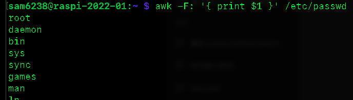

# 關於使用者

<br>

## 基本操作

1. 切換使用者。

    ```bash
    su <使用者帳號>
    ```

<br>

2. 賦予權限。

    ```bash
    sudo usermod -a -G sudo <使用者帳號>
    ```

<br>

3. 修改權限設定檔。

    ```bash
    sudo visudo
    ```

<br>

## 基本查詢

1. 查詢指定用戶所在群組。

    ```bash
    groups <使用者帳號>
    ```

<br>

2. 查詢當前登入系統的用戶資訊：簡式資訊。

    ```
    who
    ```

    

<br>

3. 當前登入系統的用戶資訊：詳細資訊。

    ```
    user
    ```

    

<br>

4. 登入紀錄：使用者的操作紀錄。

    ```
    last
    ```

    

<br>

## 使用者權限

1. 查看全部用戶詳細資訊：`/etc/passwd` 是一個系統文件，包含系統上每個用户的信息，查看所有用戶（包含服務，很多無用資訊）。

    ```bash
    cat /etc/passwd
    ```

    

<br>

2. 延續前一點，可對此指令添加參數操作，從 `/etc/passwd` 文件中提取每行的第一個字段並顯示出來，這個字段就是用戶名稱；指令部分，`cut` 是用於剪切文件文本片段；參數部分，`-d:` 指定分隔符為冒號 `:`，也就是每行中的字段將根據冒號分隔，
`-f1` 表示選取第一個字段，也就是每行中選取被冒號分隔的第一個部分。

    ```bash
    cut -d: -f1 /etc/passwd
    ```

3. 只想查看用戶名稱：使用 `awk` 指令修正前一個指令的結果。

    ```bash
    awk -F: '{ print $1 }' /etc/passwd
    ```

    

<br>

4. 使用 getent  也是一樣。

    ```bash
    getent passwd | awk -F: '{ print $1 }'
    ```

<br>

5. 或使用 compgen 比較簡潔：compgen 是一個內建於 Bash 中的命令。用於顯示由 shell 自動生成的特定查詢結果。

    ```bash
    compgen -u
    ```

    

<br>

6. 透過篩選 UID 來顯示普通用戶：普通用戶的 UID 一般來說是大於或等於 1000。

    ```bash
    awk -F: '$3 >= 1000 && $3 < 65534 { print $1 }' /etc/passwd
    ```

    

<br>

7. 觀察用戶權限：在 Linux 系统中，可通过查看 `/etc/group` 文件或使用 `groups` 命令来確定普通用户是否擁有 `sudo` 權限。

    ```bash
    grep 'sudo' /etc/group
    ```

    

<br>

8. 觀察該用戶擁有哪些群組權限；也就是查看所在群組兩者是一樣的。

    ```bash
    groups sam6238
    ```

    

<br>

9. 列出用戶具備哪些 `sudo` 權限。

    ```bash
    sudo -l -U sam6238
    ```

    

<br>

___

_END：以上關於使用者_
