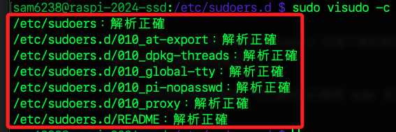
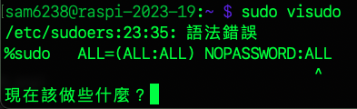
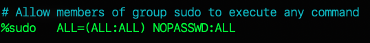
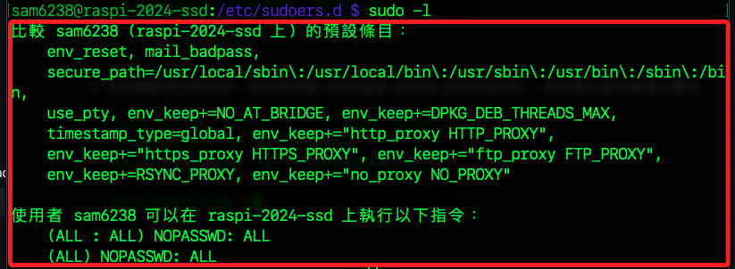
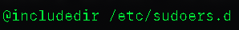
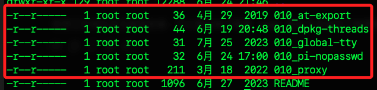
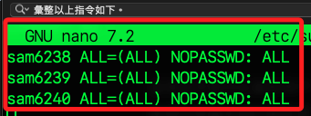
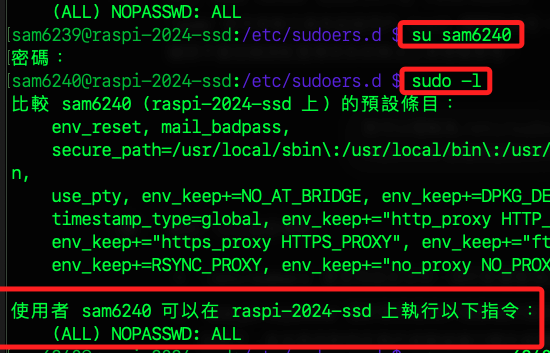
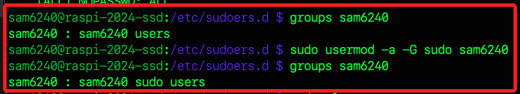
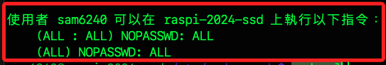

# 設定 sudo 群組免密碼

<br>

# 注意事項

1. 所謂的 `不需要輸入密碼`，是指用戶在使用 `sudo` 指令執行需要超級用戶權限的指令時，不需要再輸入密碼。換句話說，一旦用戶已經成功地以自己的用戶密碼執行了 sudo 指令，系統就會暫時授予該用戶超級用戶權限，允許其不必重新輸入密碼就能執行其他 sudo 指令。

<br>

2. sudo 的主配置文件位於 `/etc/sudoers`，但在 `/etc/sudoers.d` 目錄中也可能存在其他相關的配置文件。

<br>

3. 在對 `sudo` 配置進行修改時，建議不要直接編輯 `/etc/sudoers` 文件，而應該使用 `visudo` 命令或在 `/etc/sudoers.d` 下建立新的文件進行配置，以避免可能的語法錯誤影響系統安全。

<br>

## 說明權限設置的語法

_這是一個相對複雜的操作，以下只列舉幾種狀況_

<br>

1. `sudoers` 文件用於定義用戶和群組的權限，決定用戶可以 `在哪些主機上`、`以何種方式`、`執行哪些命令`、`是否需要密碼`。

<br>

2. 配置語法結構：`主機` 用以指定權限在哪些主機上有效，`標誌` 用來定義是否需要密碼或其他標誌，`NOPASSWD` 表示無需密碼，`命令` 用以指定哪些命令可以被執行，`ALL` 表示所有命令。

    ```bash
    (主機) 標誌: 命令
    ```

<br>

3. 語法範例。

    | 指令                          | 主機 | 用戶 | 群組 | 任何命令 | 無需密碼 |
    | ----------------------------- | ---- | ---- | ---- | -------- | -------- |
    | `(ALL ) : ALL`              | O    | O    |      | O        |          |
    | `(ALL : ALL) : ALL`         | O    | O    | O    | O        |          |
    | `(ALL) NOPASSWD: ALL`       | O    | O    |      | O        | O        |
    | `(ALL : ALL) NOPASSWD: ALL` | O    | O    | O    | O        | O        |

<br>

4. 在 `命令` 部分，可對多個具體命令進行設置，如下設置表示 user 可以使用 sudo 執行 ls、cat 和 tail 命令。

    ```bash
    user ALL=(ALL) /bin/ls, /bin/cat, /usr/bin/tail
    ```

<br>

5. 延續上一點，還可以允許特定命令參數，如下設置表示 user 只能使用 sudo 執行 ls /home/user 和 tail -n 10 /var/log/syslog 這兩個特定的命令和參數組合。

    ```bash
    user ALL=(ALL) /bin/ls /home/user, /usr/bin/tail -n 10 /var/log/syslog
    ```

<br>

6. 允許一個目錄下的所有命令，如下設置表示 user 可以使用 sudo 執行 /usr/bin/ 目錄下的所有命令。

    ```bash
    user ALL=(ALL) /usr/bin/
    ```

<br>

7. 允許命令及其所有參數，如下設置表示 user 可以使用 sudo 執行 ls 命令及其所有可能的參數。

    ```bash
    user ALL=(ALL) /bin/ls *
    ```

<br>

## 開始實作

_編輯全局設定文件 `/etc/sudoers`，用於配置整個系統範圍內的 sudo 權限_

<br>

1. 使用以下指令切換到指定路徑，並使用 `visudo` 編輯全局設定檔案 `/etc/sudoers`，這個文件內有系統建立的設定文本。

    ```bash
    cd /etc/sudoers.d && sudo visudo
    ```

<br>

2. 滑動到最下方，可看到預設權限設置如下，分別對於 root 用戶及 sudo 群組進行最大授權。

    ```bash
    # 允許 `root 用戶` 在任何主機上以任何用戶身份運行任何命令
    root    ALL=(ALL:ALL) ALL

    # 允許 `sudo 群組` 在任何主機上以任何用戶身份運行任何命令。
    %sudo   ALL=(ALL:ALL) ALL
    ```

<br>

3. 加入免密碼 `NOPASSWD` 的參數，設置後表示 `sudo 群組的成員`、`可在任何主機上`、`以任何用戶身份`、`執行任何命令且無需輸入密碼`。

    ```bash
    %sudo   ALL=(ALL:ALL) NOPASSWD:ALL
    ```

<br>

4. 自動檢查語法是否正確。

    ```bash
    sudo visudo -c
    ```

    

<br>

5. 這個編輯會自帶檢查，以下示範將參數 `NOPASSWD` 誤植為 `NOPASSWORD` ，系統會在儲存後提出警告。

    

<br>

6. 按下 `e` 重新編輯即可。

    

<br>

7. 使用以下命令來驗證新的設定是否生效。

    ```bash
    sudo -l
    ```

    

<br>

## 更安全的做法

_編輯資料夾 `sudoers.d` 內用戶或群組的個別設定文件_

<br>

1. 在前項設定文件的最後一行可看到以下設定 `@includedir /etc/sudoers.d`，表示全局設定文件 `sudoers` 會在最後載入個別設定文件夾中的所有設定檔；特別說明，由於這個載入是在全局文件中的最末行，換句話說對於全局文件是具備 `覆蓋效果` 的權限配置。

    

<br>

2. 使用 `ls` 進行查詢會發現裡面有五個設定文件，舊版中是三個。

    ```bash
    ls -al /etc/sudoers.d/
    ```

    

<br>

3. 透過 `cat` 語法逐一查看內容。

    ```bash
    sudo cat /etc/sudoers.d/010_at-export
    sudo cat /etc/sudoers.d/010_dpkg-threads
    sudo cat /etc/sudoers.d/010_global-tty
    sudo cat /etc/sudoers.d/010_pi-nopasswd
    sudo cat /etc/sudoers.d/010_proxy
    ```

<br>

4. 其中 `010_pi-nopasswd` 對用戶 `sam6238` 設定了如同之前步驟所做的免密碼設置。

    

<br>

5. 可知透過編輯這個文件也可以達到相同目的。

    ```bash
    sudo nano /etc/sudoers.d/010_pi-nopasswd
    ```

<br>

6. 將要免密碼的用戶或是 `ALL` 加入。

    

<br>

7. 特別注意，雖然對 `sam6240` 進行 `sudo` 權限的設置，但尚未將加入 `sudo` 群組中，此時這些設定並無效果。

    ```bash
    sudo -l
    ```

    _輸出_

    

<br>

8. 進行分組後重新查看。

    

<br>

9. 若要讓設定生效，要登出使用者在重新登入，再次進行查看。

    ```bash
    sudo -l
    ```

    

<br>

___

_END_