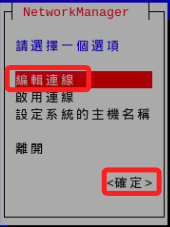
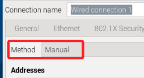

# 設置固定 IP

_在新版系統中使用 `network-manager` 替代 `dhcpcd` 來管理網路連接，配置 `靜態 IP` 的方法有所不同_

<br>

_[舊版操作的參考網址](https://www.ionos.com/digitalguide/server/configuration/provide-raspberry-pi-with-a-static-ip-address/)_

<br>

## 說明

1. 樹莓派預設是 `雙通道`，可同時透過有線網路與 WiFi 進行連線；所以若只是想同時啟用有線與無線網路連線，則可不用做此設定。

<br>

2. `設置固定 IP` 的用意是基於網路受到管理限制時所做。

<br>

## 基本介紹

1. 查詢 IP 指令。

   _Windows 系統_

   ```bash
   ipconfig
   ```

   _Linux 系統_

   ```bash
   ifconfig
   # 或
   ip add
   ```

<br>

2. 查詢結果：`interface eth0` 是有線網路的資訊，`interface wlan0` 是無線網路設定。

   _這是無線網路_

   

   _要加入設定的資訊是有線網路的部分_

   

<br>

3. 顯示當前連線的 SSID。

   ```bash
   iwgetid
   ```

   

<br>

## 開始設置

_若使用舊版樹莓派系統如 Bullseye_

<br>

1. 查看 `DHCPCD` 是否已經啟動。

   ```bash
   sudo service dhcpcd status
   ```

<br>

2. 假如已經啟動會顯示。

   

<br>

3. 新版樹莓派系統 `Bookworm` 會顯示並未安裝。

   

<br>

## 檢查是否安裝新版的 DHCP 客戶端

_使用新版樹莓派系統如 Bookworm_

<br>

1. 查詢是否已安裝 `network-manager`，顯示已經安裝。

   ```bash
   dpkg -l | grep network-manager
   ```

   _輸出_

   ```bash
   # 表示該包已安裝並正常運行
   ii
   # 用於管理網路連接的框架
   network-manager
   # 主版本號
   1.42.4-1+rpt1
   # 該包適用於 64 位的 ARM 架構
   arm64
   # 用於網路管理的框架
   network management framework (daemon and userspace tools)
   ```

<br>

2. 查詢 `network-manager` 服務狀態，當服務顯示狀態為 `active` 表示運行中。

   ```
   sudo systemctl status NetworkManager
   ```

   

<br>

## 查詢網路線路 IP

1. 先查詢當前網路連接資訊，如下的結果是表示有線 `eth0` 與無線 `wlan0` 皆已連線，其中 `eth0` 就是要進行設置的 `有線網路`，其 `連線名稱` 為 `有線連線 1`，這將被用於後續的指令中；另外，無線網路連線顯示的 `preconfigured` 是個連接標識名稱，實際配置是由在燒錄系統時指定的。

   ```bash
   nmcli connection show <各種參數設置>
   ```

   

<br>

2. 接著先以連線中的電腦查詢網路線路的 IP，再將網線拔起、插入樹莓派使用；特別注意，Windows 系統與 Linux 系統的查詢語法不同。

   ```bash
   # Windows
   ipconfig
   
   # Linux
   ifconfig
   ```

   

<br>

3. 檢查所有網路設備的狀態，包括是否連接、設備類型和連接名稱；其中 `WiFi Direct` 是一種無需無線接入點（AP）的技術，允許 WiFi 設備直接相互連接，常用於設備間的短距離通信，如無線打印機、無線投影、文件共享等。

   ```bash
   nmcli device status
   ```

   

<br>

4. 查看路由表，並標記出預設路由使用的設備，預設路由（default）指示了目前主要的網路接口。

   ```bash
   ip route
   ```

   

<br>

## 使用 nmcli 設置固定 IP

_nmcli 是 network-manager 提供的命令行工具，用於配置網路連接_

<br>

1. 以下透過終端指令進行設置 `靜態 IP`，也就是對 `eth0` 使用命令進行設置。

   ```bash
   sudo nmcli connection modify
   ```

<br>

2. 將每個項目分段設置，如此可更清楚觀察每個設置的內容，分別設置了 `指定 IP`、`子網遮罩`、`網關`、`DNS`、`指定手動配置`。

   ```bash
   # 修改 IP 地址和子網遮罩
   # "/24" 是子網遮罩的 CIDR 表示法，相當於子網遮罩 255.255.255.0
   sudo nmcli connection modify "有線連線 1" ipv4.addresses 192.168.1.150/24
   
   # 設置網關，也就是內部網路中路由器的 IP 地址
   sudo nmcli connection modify "有線連線 1" ipv4.gateway 192.168.1.1
   
   # 設置 DNS 伺服器
   sudo nmcli connection modify "有線連線 1" ipv4.dns "192.168.1.1 8.8.8.8"
   
   # 將 eth0 配置為靜態 IP
   # 這個指令將 "有線連線 1" 設置為手動配置 IP 地址
   sudo nmcli connection modify "有線連線 1" ipv4.method manual
   ```
   
   _以下為實際指令_

   ```bash
   sudo nmcli connection modify "Wired connection 1" ipv4.addresses 172.16.4.35/24
   sudo nmcli connection modify "Wired connection 1" ipv4.gateway 172.16.4.1
   sudo nmcli connection modify "Wired connection 1" ipv4.dns "8.8.8.8 8.8.4.4"
   sudo nmcli connection modify "Wired connection 1" ipv4.method manual
   ```

<br>

3. 延續前一項設定，其中 `DNS 服務器` 可用空格分隔多個伺服器地址；以下是單行指令的寫法，設定內容是相同的。

   ```bash
   sudo nmcli connection modify "有線連線 1" ipv4.method manual ipv4.addresses "192.168.1.150/24" ipv4.gateway "192.168.1.1" ipv4.dns "192.168.1.1 8.8.8.8"
   ```

<br>

4. 以上指令完成後，要重新啟動 `網路服務` 讓設定生效；切記，假如當前僅有一個網路連線，一但停用後將失去與樹莓派的通信，假如樹莓派沒有連接螢幕、鍵盤與滑鼠時切勿貿然進行 `停用`；這時可先在樹莓派設定好能夠與電腦設備形成區網的無線網路連線，並先將電腦連上無線網路確認可通信，如此便可進行 `停用` 並順利完成 `重啟` 指令。

   ```bash
   # 停用
   sudo nmcli connection down "有線連線 1"
   # 重新啟用
   sudo nmcli connection up "有線連線 1"
   ```

   _以下為實際指令_

   ```bash
   sudo nmcli connection down "Wired connection 1"
   sudo nmcli connection up "Wired connection 1"
   ```

   _在無線網路連線狀態下，停用並啟用有線網路並不會造成斷線_

   

<br>

5. 也可使用 `systemctl` 重啟 `NetworkManager` 以套用新的網路設置；重啟需要一點點時間。

   ```bash
   sudo systemctl restart NetworkManager
   ```

<br>

6. 若要觀察 `停用` 後的狀態，可透過 `ifconfig` 查看 IP 配發狀態，停用下並無顯示有線網路的 IP。

   

<br>

## 進階設置

1. NetworkManager 將網路連接的配置保存在 /etc/NetworkManager/system-connections/ 目錄中，可透過手動方式進行編輯；特別注意，下方指令中的 `有線網路\ 1` 為實際的網路連線名稱，要替換為自己的。

   ```bash
   sudo nano /etc/NetworkManager/system-connections/有線連線\ 1.nmconnection
   ```

<br>

2. 文件內容與說明。

   ```bash
   [connection]
   id=有線連線 1
   # 連接的唯一識別碼 (UUID)
   uuid=d11c54fe-e58b-359e-9eba-f68d9134235b
   # 連接類型為以太網
   type=ethernet
   # 自動連接優先級設為 -999，這樣的設置或許是基於只在沒有其他可用連接時才使用
   autoconnect-priority=-999
   # 指定連接使用的網路接口為 eth0
   interface-name=eth0
   # 記錄該配置的時間戳
   timestamp=1719343147

   [ethernet]

   [ipv4]
   # 設定靜態 IP 地址為 192.168.1.150
   # 子網遮罩 255.255.255.0 (表示為 /24)
   # 預設網關為 192.168.1.1
   address1=192.168.1.150/24,192.168.1.1
   # 設定 DNS 伺服器地址，優先使用 192.168.1.1，備用 8.8.8.8
   dns=192.168.1.1;8.8.8.8;
   # IPv4 地址配置方式為手動
   method=manual

   [ipv6]
   addr-gen-mode=default
   method=auto

   [proxy]
   ```

<br>

## 查看網路設置

1. 使用 `nmcli` 查看網路當前設定資訊。

   ```bash
   nmcli connection show
   # 可指定網路名稱
   nmcli connection show "有線連線 1"
   ```

<br>

2. 使用 `ip` 命令檢查網路接口的 IP 地址分配狀態。

   ```bash
   ip addr show eth0
   ```

<br>

3. 也可使用 `ifconfig` 命令檢查網路接口的 IP 地址分配狀態。

   ```bash
   ifconfig eth0
   ```

<br>

4. 使用 `ping` 命令測試網路連通性，驗證網路是否正常運行，這會向 Google 的公共 DNS 服務器發送 4 個 ICMP 回應請求，查看是否能夠通過網路連接。

   ```bash
   ping -c 4 8.8.8.8
   ```

<br>

5. 檢查系統的網路路由表以確保網關和路由設置正確。

   ```bash
   ip route
   ```

<br>

6. 使用 `route -n` 命令檢查系統的網路路由表，確認是否有正確的預設路由指向網關 IP。

   ```bash
   route -n
   ```

<br>

7. 查看 DNS 配置，確保 DNS 服務器設置正確。

   ```bash
   cat /etc/resolv.conf
   ```

   _輸出_

   ```
   nameserver 192.168.1.1
   nameserver 8.8.8.8
   ```

<br>

8. 使用 `journalctl` 查看網路日誌了解網路啟用過程中的詳情。

   ```bash
   sudo journalctl -u NetworkManager
   ```

<br>

## 其他網路服務

1. 檢查 systemd-networkd 服務狀態。

   ```bash
   sudo systemctl status systemd-networkd
   ```

<br>

2. 查詢是否已啟用 systemd-networkd。

   ```bash
   sudo systemctl is-enabled systemd-networkd
   ```

<br>

3. 要查看系統上運行的所有網路相關服務

   ```bash
   sudo systemctl list-units --type=service | grep -i network
   ```

   

<br>

4. 查詢運行中的 DHCP 客戶端

   ```bash
   ps aux | grep dhclient
   ps aux | grep dhcpcd
   ps aux | grep NetworkManager
   ```

   

<br>

## 圖形化界面工具

_在樹莓派上使用 nmtui 工具設置固定 IP_

<br>

1. 啟動 nmtui 工具。

   ```bash
   sudo nmtui
   ```

<br>

2. 選擇 `編輯連線` 然後 `ENTER`。

   

<br>

3. 選擇 `有線網路 1`。

   

<br>

4. 可手動編輯相關欄位，此與前面步驟相同，不再贅述。

   

<br>

5. 其中勾選的欄位，打上 `X` 即表示勾選。

   

<br>

6. 最後選取並按下 `確認` 即可。

   

<br>

7. 完成後按下 `上一步`。

   

<br>

8. 使用 `TAB` 選取 `確定` 並按下 `ENTER`。

   

<br>

9. 重啟網路服務。

   ```bash
   sudo systemctl restart NetworkManager
   ```

<br>

## 在樹莓派桌面的圖形化介面中設定

1. 展開 `網路連線` 中的 `Advanced Options`，接著點擊 `Edit Connections`。

   

<br>

2. 可自訂連線 `連線名稱 Connection name`。

   

<br>

3. 設定固定 IP 時，要將連線方法設定為 `手動 Manual`。

   

<br>

4. 切換到 `IPv4 Settings` 頁籤，在這裏設定與舊版系統相同的網路設定值，其中 `Netmask` 網路遮罩可設定簡稱的 `24`，代表 `255.255.255.0`，路由設置為 `172.16.4.254`。

   

<br>

5. 可設置多個彼此間以半形逗號 `,` 間隔；這裡設置的 DNS 為 `8.8.4.4, 8.8.8.8`，這是 Google 提供的公共 DNS 伺服器地址，用於域名解析。

   

<br>

6. 完成以上設定後務必記得儲存。

   

<br>

## 各種查詢狀態的指令

1. 使用 `systemctl` 查詢 `狀態 status`。

   ```bash
   sudo systemctl status NetworkManager
   ```

   

<br>

2. 使用 `nmcli` 檢查 `NetworkManager` 是否在運行，並查看 `NetworkManager` 的一般狀態；特別說明，其中 `WWAN-HW (WWAN 硬體狀態): missing` 是因為樹莓派並沒有內建 `無線廣域網（WWAN）硬體設備`，這類設備能夠連接到無線廣域網路，如 4G LTE 模塊。

   ```bash
   nmcli general status
   ```

   

<br>

3. 使用 `服務 service` 命令來檢查服務的狀態。

   ```bash
   sudo service NetworkManager status
   ```

<br>

4. 確認 `NetworkManager` 是否設定為 `開機自動啟動`。

   ```bash
   sudo systemctl is-enabled NetworkManager
   ```

<br>

5. 使用進程查詢查看服務狀態。

   ```bash
   ps aux | grep NetworkManager
   ```

<br>

## 特別補充

1. 一但對有線網路 `eth0` 設置了 `靜態 IP`，使用 Hostname 進行連線時，將會自動使用 `wlan0` 無線網路進行連線，若要使用有線網路連線，則必須所設定的靜態 IP。

<br>

## 以下為舊版系統的設定

1. 執行以下指令啟動服務。

   ```bash
   sudo service dhcpcd start
   ```

<br>

2. 設定為開機啟動。

   ```bash
   sudo systemctl enable dhcpcd
   ```

<br>

3. 編輯/修改設定檔。

   ```bash
   sudo nano /etc/dhcpcd.conf
   ```

<br>

4. 建議使用 VSCode 開啟編輯更加方便。

   

<br>

5. 要修改的部分是註記了如下說明的部分

   ```bash
   # Example static IP configuration:
   ```

<br>

6. 以下是要修改的部分，預設是註解的，要取消部分註解。

   

<br>

7. 依據查詢自己樹莓派的結果。

   ```bash
   inet 192.168.1.132  
   netmask 255.255.255.0  
   broadcast 192.168.1.255
   ```

<br>

8. 替換其中的 IP 位址 `ip_address`、 預設閘道 `routers` ，並刪除 `domain_name_servers` 中的 IP。

   ```bash
   interface eth0
   static ip_address=192.168.1.132/24
   static routers=192.168.1.1
   static domain_name_servers=192.168.1.1 8.8.8.8
   ```

<br>

___

_END：以上完成固定 IP 設定_
