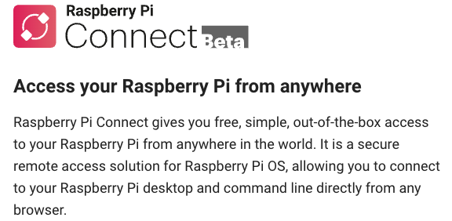

# Raspberry Pi Connect 

_這是官方在 2024/05/07 發佈的測試版功能，使用 WebRTC 技術來建立安全的點對點連接_



<br>

## 硬體需求

1. Raspberry Pi 5。

<br>

2. Raspberry Pi 4。

<br>

3. Raspberry Pi 400。

<br>

## 軟體需求

1. 64位元版本的 Raspberry Pi OS Bookworm。

<br>

2. 使用 Wayland 窗口服務器。

<br>

## 安裝步驟

1. 更新系統。

    ```bash
    sudo apt update && sudo apt upgrade -y
    ```

<br>

2. 安裝 Raspberry Pi Connect。

    ```bash
    sudo apt install rpi-connect
    ```

<br>

3. 重啟 Raspberry Pi。

    ```bash
    sudo reboot
    ```

<br>

4. 重啟後透過 VNC 連線桌面，會在右上角看到一個新的圖標，點擊此圖標並選擇 [Sign in](https://connect.raspberrypi.com/sign-in)，建議在電腦上開啟。

    

<br>

5. 初次使用先建立帳號。

    

<br>

6. 需要驗證郵件。

    

<br>

7. 完成後重新登入，並對設備命名。

    

<br>

8. 登入完成會亮起顏色；特別注意，必須先在樹莓派完成登入，才能到其他設備上進行遠端連線。

    

<br>

## 設置完成後的操作

_可在任意設備中的瀏覽器進行兩種連線方式訪問樹莓派_

<br>

1. 使用網頁瀏覽器訪問 [Raspberry Pi Connect](https://connect.raspberrypi.com/)，登入後系統會看到可連線設備及連線方式。

    

<br>

2. 點擊右側 `Connect via` 展開選單。

    

<br>

3. 依據官網說明，這個網路連線在一般情況下會是 `點對點` 的連接，建立連接後，無需通過伺服器進行流量傳輸；如果無法建立直接連接，流量會通過位於英國的 TURN 伺服器進行中繼。

<br>

## 使用 Screen sharing

1. 展開後點擊 `Screen sharing`。

    

<br>

2. 會開啟樹莓派專用的遠端桌面。

    

<br>

## 使用 `Remote shell`

1. 展開後點擊 `Remote shell`。

    

<br>

2. 會開啟樹莓派專用的桌面終端機。

    

<br>

___

_END_