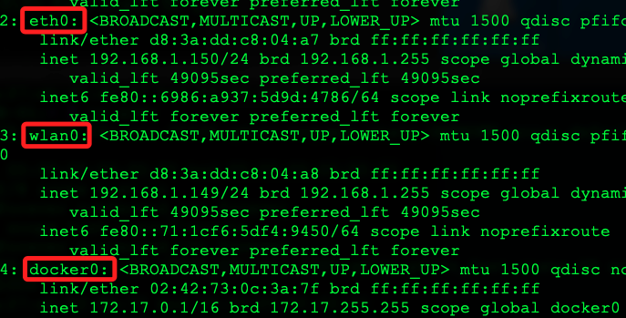

# 查看樹莓派資訊的 Linux 指令

<br>

1. 硬體版本。

    ```bash
    cat /proc/cpuinfo
    ```

<br>

2. 記憶體資訊。

    ```bash
    cat /proc/meminfo
    ```

    _說明_

    ```bash
    # 可用的總內存量
    MemTotal:        8245648 kB
    # 可用的未使用內存量
    MemFree:         5597968 kB
    # 可供新應用程序使用的內存量
    MemAvailable:    7289392 kB
    
    ... （以下省略）
    ```

<br>

3. 作業系統版本：包含核心以及其他軟體與工具。

    ```bash
    cat /etc/os-release
    ```

<br>

4. Kernal 版本：在基於 Linux 的系統中，`Kernel` 指的是操作系統架構的中心，是軟體和硬體之間的橋樑，負責管理系統的硬體資源，例如 `CPU`、`記憶體` 和 `儲存設備`，並提供一個軟體應用可以使用的 `系統服務層`；特別注意，這與刷新韌體不同，韌體是位於 `硬體層面`，用於控制硬體操作和性能。

    ```bash
    uname -a
    ```

    _結果：樹莓派 5_
    ```bash
    Linux raspi-2024-ssd 6.6.31+rpt-rpi-2712 #1 SMP PREEMPT Debian 1:6.6.31-1+rpt1 (2024-05-29) aarch64 GNU/Linux
    ```

    結果：樹莓派 4_
    ```bash
    Linux raspi-2024-01 6.6.20+rpt-rpi-v8 #1 SMP PREEMPT Debian 1:6.6.20-1+rpt1 (2024-03-07) aarch64 GNU/Linux
    ```

    _更新樹莓派 4 核心版本，會下載並安裝最新的 Linux 核心_
    ```bash
    sudo rpi-update
    ```

    _重啟_
    ```bash
    sudo reboot now
    ```

    _查詢：升級到 6.6.35-v8+_
    ```bash
    Linux raspi-2024-01 6.6.35-v8+ #1779 SMP PREEMPT Tue Jun 25 11:37:38 BST 2024 aarch64 GNU/Linux
    ```

<br>

5. 顯示所有配置的網路接口的 IP 地址：會以 IP 方式呈現，不會看到 `hostname`。

    ```bash
    hostname -I
    ```

<br>

6. 完整的 IP 資訊。

    ```bash
    ifconfig
    ```

<br>

7. USB 裝置查詢：用於連接USB裝置如攝影機、麥克風、喇叭等裝置時。

    ```bash
    lsusb
    ```

<br>

8. 磁碟容量查詢。

    ```bash
    df -h
    ```

<br>

9. WiFi 連線狀況：顯示硬體狀態，這會列出所有可用的 WiFi 網路。

    ```bash
    iwconfig
    ```

<br>

10. WiFi 硬體資訊：列出所有可用的 WiFi 網路。

    ```bash
    iwlist wlan0 scan
    ```

<br>

11. 藍芽查詢。

    ```bash
    hciconfig -a
    ```

<br>

12. 攝影機設備查詢。

    ```bash
    ls /dev/video*
    ```

<br>

13. 錄音設備查詢。

    ```bash
    arecord -l
    ```

<br>

14. 音訊裝置查詢。

    ```bash
    aplay -l
    ```

<br>

## 關於樹莓派的 IP 

_樹莓派可能分配到多個 IP_

<br>

1. 多重網路接口來自於有多個網路接口正在工作，例如 `以太網`、`Wi-Fi`及 `Docker` 虛擬網路接口等，若出現類似 `172.17.0.1`，這可能是 `Docker` 默認的橋接網路地址。

<br>

2. 檢查所有的網路接口狀態，其中 `wlan0` 是無線網路、`eth0` 是有線網路、`docker0` 是虛擬網路。

    ```bash
    ip addr
    ```

    

<br>

3. 查看 DHCP 配置，因為可為設備配置多個靜態 IP 地址；特別注意，這是 Bullseye 之前版本使用的配置文件。
    
    ```bash
    cat /etc/dhcpcd.conf
    ```

<br>

4. 如果安裝了 Docker，檢查 Docker 的網路配置；特別注意，假如沒安裝 Docker，會顯示 `-bash: docker: command not found`。

    ```bash
    docker network ls
    ```
    _輸出_
    ```bash
    NETWORK ID     NAME      DRIVER    SCOPE
    56c57dcedbf7   bridge    bridge    local
    eeff04fe9415   host      host      local
    b316d1253d17   none      null      local
    ```

<br>

5. 配置和顯示無線網卡參數的工具，通過適當的參數設置，可以控制無線網卡的多種功能，以適應不同的網路需求，這裡簡單介紹用來查詢時所顯示的資訊。

    ```bash
    iwconfig
    ```

    _輸出_

    ```bash
    # 環回接口，用於設備自身的通信
    lo        no wireless extensions.
    # 有線網卡接口
    eth0      no wireless extensions.
    # 無線網卡接口
    wlan0     IEEE 802.11  ESSID:"SamHome"  
            Mode:Managed  Frequency:5.745 GHz  Access Point: 24:F5:A2:7D:13:37   
            Bit Rate=24 Mb/s   Tx-Power=31 dBm   
            Retry short limit:7   RTS thr:off   Fragment thr:off
            Power Management:on
            Link Quality=66/70  Signal level=-44 dBm  
            Rx invalid nwid:0  Rx invalid crypt:0  Rx invalid frag:0
            Tx excessive retries:14  Invalid misc:0   Missed beacon:0
    # ocker 預設建立的橋接網路接口
    docker0   no wireless extensions.
    # 虛擬以太網接口，通常用於容器或虛擬機之間的通信
    veth0bbb98d  no wireless extensions.
    ```

<br>

___

_END：以上為樹莓派相關指令_