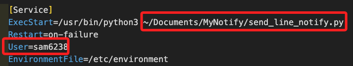
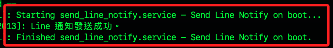

# 簡易的自訂服務範例

_使用 Python 腳本，在開機後發送 Line 通知，另外，使用 Bash 腳本會相對簡單，可參考後續小節說明。_

<br>

## 取得 LineNotify Token

1. 關於取得 Token 的部分暫時略過，請自行操作，務必確保妥善保存 Token。

<br>

2. 連線並進入樹莓派，編輯環境變數文件 `/etc/environment`；特別注意，這個文件是內建的，只是無預設內容，所以第一次使用時會是空的。

    ```bash
    sudo nano /etc/environment
    ```

<br>

3. 編輯環境變數文件，並添加 LINE Notify Token；完成後保存（`Ctrl+O`）並退出 （`Ctrl+X`）。

    ```bash
    LINE_NOTIFY_TOKEN=<輸入 LINE_NOTIFY_TOKEN>
    ```

<br>

4. 特別注意，由於 `/etc/environment` 文件不能通過 `source` 命令加載，所以需要重新啟動系統來加載新的環境變數。

    ```bash
    sudo reboot now
    ```

<br>

5. 重啟後透過輸出查詢環境變數是否已可讀取。

    ```bash
    printenv LINE_NOTIFY_TOKEN
    ```

<br>

## 建立 Python 腳本

1. 在家目錄的 `/Documents/MyNotify` 建立腳本 `send_line_notify.py`。

    ```bash
    mkdir -p ~/Documents/MyNotify && sudo nano ~/Documents/MyNotify/send_line_notify.py
    ```

<br>

2. 編輯腳本發送 Line 通知。

    ```python
    import requests
    import os

    def send_line_notify(message, token):
        headers = {
            "Authorization": f"Bearer {token}",
            "Content-Type": "application/x-www-form-urlencoded"
        }
        data = {"message": message}
        url = "https://notify-api.line.me/api/notify"
        response = requests.post(url, headers=headers, data=data)
        return response.status_code

    if __name__ == "__main__":
        token = os.getenv("LINE_NOTIFY_TOKEN")
        message = "\n樹莓派已經成功開機。"
        status = send_line_notify(message, token)
        if status == 200:
            print("Line 通知發送成功。")
        else:
            print("Line 通知發送失敗。")
    ```

<br>

## 權限設定

1. 確保 `send_line_notify.py` 有執行權限。

    ```bash
    sudo chmod +x ~/Documents/MyNotify/send_line_notify.py
    ```

<br>

## 服務文件

1. 建立一個開機時運行的服務文件 `send_line_notify.service`。

    ```bash
    sudo nano /etc/systemd/system/send_line_notify.service
    ```

<br>

2. 編輯服務文件，其中會使用樹莓派系統預裝的 `python3` 運行自訂並存放在 `Documents` 的腳本 `send_line_notify.py`；完成後同樣保存並退出；請務必檢查以下腳本的路徑與自己的是否相同；另外，最重要的，務必將 `User` 替換為自己的帳號，在這裡示範的是 `sam6238`；還有，在 `systemd 服務檔案` 中，不能直接使用 `~` 來表示使用者的家目錄，需要使用絕對路徑，所以要確定已更換為自己的家目錄路徑。

    ```ini
    [Unit]
    Description=Send Line Notify on boot
    After=network.target
    Wants=network-online.target

    [Service]
    ExecStartPre=/bin/sleep 20
    ExecStart=/usr/bin/python3 /home/sam6238/Documents/MyNotify/send_line_notify.py
    Restart=on-failure
    Type=oneshot
    RemainAfterExit=true
    User=sam6238
    EnvironmentFile=/etc/environment

    [Install]
    WantedBy=multi-user.target
    ```

    

<br>

3. 重新加載 systemd 配置。

    ```bash
    sudo systemctl daemon-reload
    ```

<br>

4. 設置為開機啟動並立即啟動服務。

    ```bash
    sudo systemctl enable send_line_notify.service && sudo systemctl start send_line_notify.service
    ```

<br>

5. 確認服務狀態。

    ```bash
    sudo systemctl status send_line_notify.service
    ```

<br>

6. 重啟系統並確認 Line 對話中是否收到開機成功的通知。

    ```bash
    sudo reboot
    ```

<br>

7. 若要查詢日誌，透過參數 `-n 50` 僅查詢最後 50 筆。

    ```bash
    sudo journalctl -u send_line_notify.service -n 50
    ```

    

<br>

## 補充說明服務參數

1. `Description=`：這只是對服務做簡單的描述。

<br>

2. `After=network.target`：指定服務應在 `network.target` 之後啟動，確保網路設置已經完成，但這並不保證網路連接已經成功。

<br>

3. `Wants=network-online.target`：希望服務在網路連接完成後再啟動。

<br>

4. `ExecStartPre=/bin/sleep 20`：在執行 `ExecStart` 指令之前，先執行 `/bin/sleep 20`，這個先執行的指令是讓服務延遲 20 秒後再啟動，希望讓系統有更多時間確保網路已連接。

<br>

5. `ExecStart=/usr/bin/python3 /home/sam6238/Documents/MyNotify/send_line_notify.py`：這是執行 Python 腳本 `send_line_notify.py` 的終端機指令。

<br>

6. `Restart=on-failure`：設定當服務因故障而終止時自動重啟服務。

<br>

7. `Type=oneshot`：指定的服務類型 `oneshot` 表示這是一次性執行的服務，啟動後立即退出。

<br>

8. `RemainAfterExit=true`：指定服務在退出後仍然 _被視為保持活躍狀態_，也就是 `ExecStart` 命令完成後，服務仍然被視為啟動狀態，這個設置適用於執行一次命令後就不再需要持續運行的服務，如此避免被標記為失敗或停止。

<br>

9. `User=sam6238`：指定這個服務應該以 `sam6238` 用戶的身份運行。

<br>

10. `EnvironmentFile=/etc/environment`：指定環境變數文件的位置。

<br>

11. `WantedBy=multi-user.target`：指定服務應該在 `multi-user.target` 之後啟動，表示系統已經啟動到允許多用戶登入並具有網絡功能的狀態時啟動服務。

<br>

___

_END_

