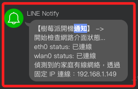

# 自動化腳本切換連線

_自定義一個開機時啟動的服務，開機後隨即按規範的順序檢查當前網路，並根據優先級進行連接，同時使用 LineNotify 發送通知，內容包含檢查狀態與選擇的連線 IP。_

<br>

## 介紹 EOF

_在 Bash 腳本中處理多行字串的方法，並可賦值給變量或用作命令的輸入，也稱為 `Here Document`。_

<br>

1. 語法。

    ```bash
    變量=$(cat << EOF
    多行字符串內容
    EOF)
    ```

<br>

2. `cat` 命令表示開始接收 `多行輸入`，直到遇到 `定界符 EOF`，可在頭尾的 `EOF` 間輸入多行內容，所有內容將作為 `字串` 被捕獲並賦值給變量。

<br>

3. `<<` 是 `Here Document（Heredoc）` 的語法，表示將接下來的一段多行文本重定向作為輸入，直到遇到指定的 `結束定界符 EOF`。

<br>

4. `EOF` 可以是任何不與內容衝突的字串，比如 `END`、`MYDELIMITER` 等，_只要前後定界符一致即可_；開始的 `EOF` 必須是行的開始，不能有空格或其他字符。結束的 EOF 也必須是行的開始，且不能有空格或其他字符。

<br>

## 建立自動網路切換腳本

1. 進入樹莓派，在任意位置執行以下指令，使用 `nano` 編輯器建立並編輯一個腳本 `auto_network_switch.sh`，該腳本的存放位置在 `/usr/local/bin/`，這個目錄通常用於安裝和管理系統預設以外的套件，可避免與系統預設的可執行文件發生衝突。

    ```bash
    sudo nano /usr/local/bin/auto_network_switch.sh
    ```

<br>

2. 編輯腳本內容，完成後使用組合鍵 `保存 Ctrl+O` 並 `退出 Ctrl+X`。

    ```bash
    #!/bin/bash

    # 加載 .env 文件中的環境變量
    if [ -f .env ]; then
        export $(cat .env | xargs)
    fi

    # LineNotify Token
    # TOKEN=""

    # 發送通知的函數
    send_line_notify() {
        local message=$1
        curl -X POST -H "Authorization: Bearer $TOKEN" -F "message=$message" https://notify-api.line.me/api/notify
    }

    # 等待網路接口初始化
    sleep 20

    # 初始化通知訊息變量
    # 預設已經有表頭 【樹莓派開機通知】
    notification_message=$(cat << EOF

    開始檢查網路介面狀態...

    EOF
    )

    # 檢查網路接口狀態
    eth0_status=$(nmcli device status | grep -E "^eth0\s" | awk '{print $3}')
    wlan0_status=$(nmcli device status | grep -E "^wlan0\s" | awk '{print $3}')

    # 添加接口狀態到通知訊息
    notification_message+=$(cat << EOF

    eth0 status: $eth0_status
    wlan0 status: $wlan0_status

    EOF
    )

    # 檢查並連接到教室網路
    if ping -c 1 -W 1 172.16.4.1 &> /dev/null; then
        notification_message+=$(cat << EOF

    偵測到教室網路，

    EOF
    )
        sudo nmcli connection modify "WC1" ipv4.addresses 172.16.4.35/24
        sudo nmcli connection modify "WC1" ipv4.gateway 172.16.4.1
        sudo nmcli connection modify "WC1" ipv4.dns "8.8.8.8 8.8.4.4"
        sudo nmcli connection down "WC1"
        sudo nmcli connection up "WC1"
        IP=$(ip -4 addr show dev eth0 | grep -oP '(?<=inet\s)\d+(\.\d+){3}')
        notification_message+=$(cat << EOF

    透過 IP 連線：$IP

    EOF
    )

    # 檢查並連接到家庭有線網路
    elif ping -c 1 -W 1 192.168.1.1 &> /dev/null && [ "$eth0_status" = "已連線" ]; then
        notification_message+=$(cat << EOF

    偵測到的家庭有線網路，

    EOF
    )
        sudo nmcli connection modify "WC1" ipv4.addresses 192.168.1.149/24
        sudo nmcli connection modify "WC1" ipv4.gateway 192.168.1.1
        sudo nmcli connection modify "WC1" ipv4.dns "8.8.8.8 8.8.4.4"
        sudo nmcli connection down "WC1"
        sudo nmcli connection up "WC1"
        IP=$(ip -4 addr show dev eth0 | grep -oP '(?<=inet\s)\d+(\.\d+){3}')
        notification_message+=$(cat << EOF
    透過固定 IP 連線：$IP

    EOF
    )

    # 檢查並連接到家庭無線網路
    elif ping -c 1 -W 1 192.168.1.1 &> /dev/null && [ "$wlan0_status" = "已連線" ]; then
        notification_message+=$(cat << EOF

    偵測到的家庭無線網路，

    EOF
    )
        sudo nmcli connection modify "SamHome" ipv4.addresses 192.168.1.150/24
        sudo nmcli connection modify "SamHome" ipv4.gateway 192.168.1.1
        sudo nmcli connection modify "SamHome" ipv4.dns "8.8.8.8 8.8.4.4"
        sudo nmcli connection down "SamHome"
        sudo nmcli connection up "SamHome"
        IP=$(ip -4 addr show dev wlan0 | grep -oP '(?<=inet\s)\d+(\.\d+){3}')
        notification_message+=$(cat << EOF
    透過固定 IP 連線：$IP

    EOF
    )

    else
        notification_message+=$(cat << EOF

    未找到已知網路。

    EOF
    )
    fi

    # 發送合併的通知訊息
    send_line_notify "-> $notification_message"
    ```

<br>

3. 設置腳本可執行權限，除了。

    ```bash
    # 將檔案設置為可執行檔案
    sudo chmod +x /usr/local/bin/auto_network_switch.sh
    # 給檔案擁有者增加寫入權限，這在使用遠端 VSCode 編輯時可用
    sudo chmod u+w /usr/local/bin/auto_network_switch.sh
    # 確保目前使用者對文件有寫入權限
    # 務必記得將 sam6238 改為自己的 username
    sudo chown sam6238 /usr/local/bin/auto_network_switch.sh
    ```

<br>

4. 建立一個 `systemd` 服務文件 `auto_network_switch.service`；這將用於在開機時運行服務，並在其中指令運行前面編輯的網路功能腳本。

    ```bash
    sudo nano /etc/systemd/system/auto_network_switch.service
    ```

<br>

5. 編輯文件寫入以下內容。

    ```ini
    [Unit]
    Description=Auto Network Switch

    [Service]
    ExecStart=/usr/local/bin/auto_network_switch.sh
    Type=oneshot
    RemainAfterExit=true

    [Install]
    WantedBy=multi-user.target
    ```

<br>

6. 編輯完成後要重新加載 systemd 服務文件。

    ```bash
    sudo systemctl daemon-reload
    ```

<br>

7. 設定開機自動啟動，並立即啟用服務。

    ```bash
    sudo systemctl enable auto_network_switch.service
    sudo systemctl start auto_network_switch.service
    ```

<br>

8. 重啟樹莓派系統。

    ```bash
    sudo reboot now
    ```

    

<br>

___

_END_

