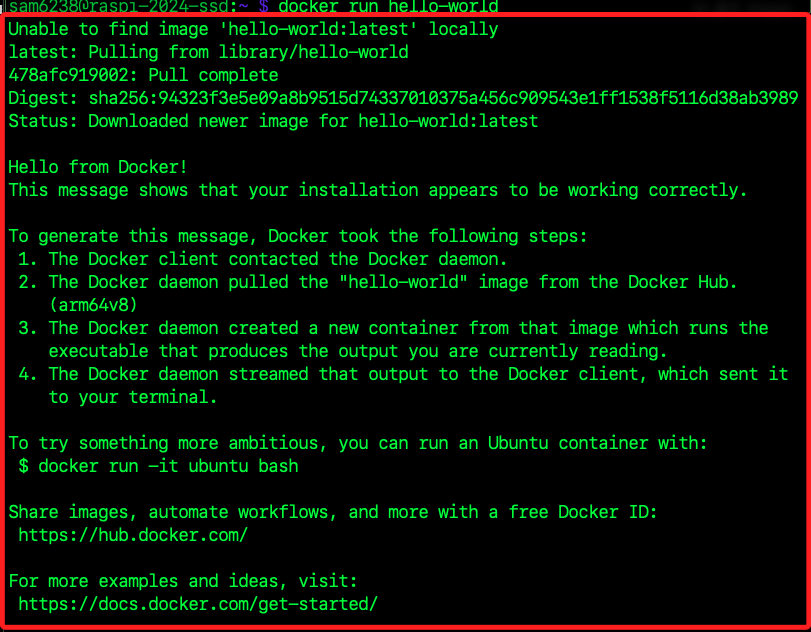
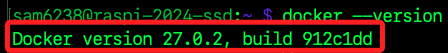

# 在樹莓派上安裝 Docker 的步驟

<br>

## 說明

1. [Docker 官網](https://www.docker.com/)。

<br>

2. 官方 [Debian 安裝說明](https://docs.docker.com/engine/install/debian/) 及 [樹莓派 32 位元系統安裝說明](https://docs.docker.com/engine/install/raspberry-pi-os/)；若使用 64 位元樹莓派系統請參考 [Debian 安裝說明](https://docs.docker.com/engine/install/debian/)。

<br>

## 步驟

1. 更新系統。

   ```bash
   sudo apt update && sudo apt upgrade -y && sudo apt autoremove -y
   ```

<br>

2. 進入目錄。

   ```bash
   cd ~/Downloads
   ```

<br>

3. 下載 Docker 安裝腳本。

   ```bash
   curl -fsSL https://get.docker.com -o get-docker.sh
   ```

<br>

4. 運行安裝腳本。

   ```bash
   sudo sh get-docker.sh
   ```
   
   _若通知等待 20 秒是一種保護機制_   
   
   

<br>

5. 將當前用戶加入 Docker 群組，如此可擁有群組權限；若未加入，每次使用 Docker 指令都需要使用 `sudo`。

   ```bash
   sudo usermod -aG docker $USER
   ```

<br>

6. 因為變更了使用者的群組，這等效於授權行為所以要刷新授權，可登出並重新登入樹莓派來實現；若不嫌麻煩重啟也是可以。

   ```bash
   exit
   ```

<br>

7. 另外，刷新授權也可以透過啟動 shell，這會要求輸入密碼；或嘗試關閉並重啟新的終端機。

   ```bash
   su - $USER
   ```

<br>

## curl 指令與參數說明

1. curl：命令行工具，用於從 URL 取得或發送數據。

<br>

2. -f (或 --fail): 表示在 HTTP 錯誤時如 404 頁面未找到的錯誤，使 curl 失敗。

<br>

3. -s (或 --silent): 表示靜默模式，不顯示進度信息或錯誤消息。

<br>

4. -S (或 --show-error): 與 -s 一起使用時，表示在發生錯誤時顯示錯誤，也就是會隱藏正常的操作，僅顯示錯誤。

<br>

5. -L (或 --location): 如果指定的 URL 被重定向，則跟隨重定向的位置。

<br>

6. -o get-docker.sh：指定輸出文件的名稱，就是從 URL 下載的數據將被保存為 get-docker.sh 文件。

<br>

## 關於警告

1. 警告若使用特權訪問 Docker daemon 上的遠程 API，等同在主機上的 root 訪問。

<br>

2. 也就是說若能夠訪問 Docker API，如同以最高權限在主機上做任何事情。

<br>

3. 這裡只是基本教學所以了解一下即可。

   

<br>

4. 若出現依賴庫的版本衝突，可依據官網提供的方式，運行以下指令刪除所有衝突的套件。

   ```bash
   for pkg in docker.io docker-doc docker-compose podman-docker containerd runc; do sudo apt-get remove $pkg; done
   ```

<br>

## 驗證安裝

1. 驗證之前先啟動 Docker 服務；特別注意，安裝 Docker 後會自動建立成為系統服務，這裡之所以進行手動啟動，是因為在初次安裝 Docker 後，以手動啟動服務可以用來驗證 Docker 是否正確安裝和配置，確保其能夠正常運行。

   ```bash
   sudo service docker start
   ```

<br>

2. 驗證 Docker 安裝；這個指令會從 Docker Hub 下載一個名為 hello-world 的測試鏡像。

   ```bash
   docker run hello-world
   ```

   _第一次執行會通知並下拉_
   
   

<br>

3. 查詢當前 Docker 版本。

   ```bash
   docker --version
   ```

   

<br>

## Docker 基本指令

1. `docker pull`：下載 Docker 映像，從Docker Hub或其他Docker registry下載指定的映像。

<br>

2. `docker run`：運行 Docker 容器，根據指定的映像啟動一個新的容器實例。

<br>

3. `docker ps`：列出運行中的容器，顯示運行中的所有Docker容器的列表。

<br>

4. `docker stop`：停止運行的容器，使用容器ID或名稱來停止容器。

<br>

5. `docker start`：啟動已停止的容器，使用容器ID或名稱來啟動停止的容器。

<br>

6. `docker rm`：刪除一個容器，使用容器ID或名稱來刪除一個停止的容器。

<br>

7. `docker images`：列出本地的 Docker 映像，顯示在本地機器上儲存的所有Docker映像的列表。

<br>

8. `docker rmi`：刪除 Docker 映像，使用映像ID或名稱來刪除指定的Docker映像。

<br>

## 卸載 Docker Engine

_若要更新 Docker Engine 也是運行這個卸載程序後重新安裝_

<br>

1. 卸載 Docker Engine、CLI、containerd 和 Docker Compose 套件。

   ```bash
   sudo apt-get purge docker-ce docker-ce-cli containerd.io docker-buildx-plugin docker-compose-plugin docker-ce-rootless-extras
   ```

<br>

2. 刪除所有映像、容器和卷。

   ```bash
   sudo rm -rf /var/lib/docker /var/lib/containerd
   ```

<br>

## 注意事項

1. 樹莓派使用的是 ARM 架構 的處理器，而大部分的 Docker 映像是為 x86 架構 的處理器設計的，所以在選擇 Docker 映像時，必須確保它支援 ARM 架構。

<br>

2. 官網另外提供了使用 apt 儲存庫安裝的說明，但指令較為複雜，參考即可。

   ```bash
   sudo apt-get update
   sudo apt-get install ca-certificates curl
   sudo install -m 0755 -d /etc/apt/keyrings
   sudo curl -fsSL https://download.docker.com/linux/debian/gpg -o /etc/apt/keyrings/docker.asc
   sudo chmod a+r /etc/apt/keyrings/docker.asc

   echo \
   "deb [arch=$(dpkg --print-architecture) signed-by=/etc/apt/keyrings/docker.asc] https://download.docker.com/linux/debian \
   $(. /etc/os-release && echo "$VERSION_CODENAME") stable" | \
   sudo tee /etc/apt/sources.list.d/docker.list > /dev/null
   sudo apt-get update
   ```

<br>

3. 若使用 apt 儲存庫安裝 Docker，則需要手動安裝 Docker 套件。

   ```bash
   sudo apt-get install docker-ce docker-ce-cli containerd.io docker-buildx-plugin docker-compose-plugin
   ```

<br>

___

_END：以上完成在樹莓派安裝 Docker_
