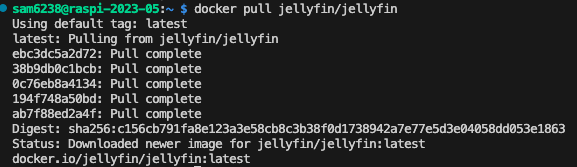
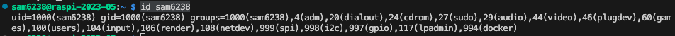
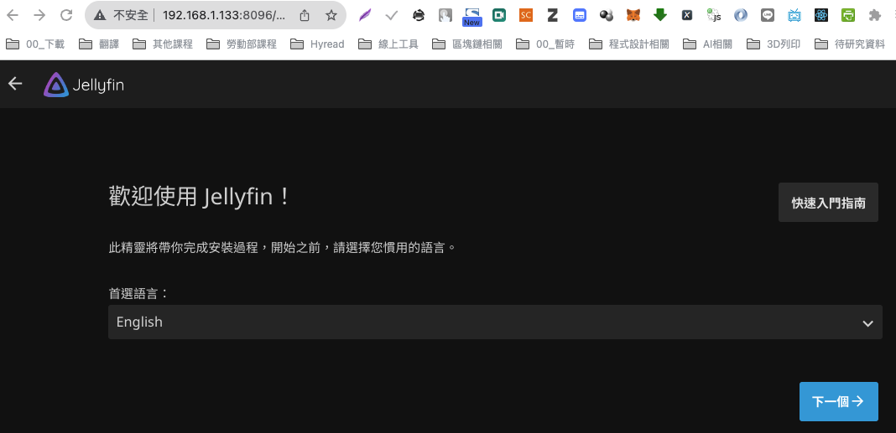

# 安裝 Jellyfin

<br>

1. 拉取鏡像；特別說明，Docker 映像檔會被存放在 Docker 的預設儲存路徑中，這個預設路徑通常是 `/var/lib/docker`，所以執行 `pull` 之前不用進入任何指定的路徑中。

   ```bash
   sudo docker pull jellyfin/jellyfin
   ```

   

<br>

2. 查詢用戶身份資訊，確認是否擁有群組 `docker` 的權限。

   ```bash
   id <使用者帳號>
   ```

   _如_

   ```bash
   id sam6238
   ```
   
   

<br>

3. 關於用戶的說明，其中 `994(docker)` 表示 `docker` 群組的 `GID` 是 `994`。

   ```bash
   (1) UID：用戶ID，是用戶在系統上的唯一編號。
   
   (2) GID：主群組ID，是用戶的主群組的唯一編號。
   
   (3) groups：這個用戶是其成員的所有群組的列表。
   ```

<br>

4. 建立鏡像使用的目錄，不需要使用 sudo。

   ```bash
   mkdir ~/jellyfin_config ~/media
   ```

<br>

5. 延續上一點，若使用了 `sudo`，就必須進行授權。

   ```bash
   sudo chmod 755 /home/sam6238/jellyfin_config
   ```
   ```bash
   sudo chmod 755 /home/sam6238/media
   ```

<br>

6. 建立容器。

   ```bash
   sudo docker run -d \
   --name=jellyfin \
   -e PUID=1000 \
   -e PGID=1000 \
   -e TZ=Asia/Taipei \
   -p 8096:8096 \
   -v /home/sam6238/jellyfin_config:/config \
   -v /home/sam6238/media:/media \
   --restart unless-stopped \
   jellyfin/jellyfin
   ```

<br>

7. 訪問，設定步驟不再贅述，這裡僅示範啟動容器。

   ```bash
   <樹莓派 IP>:8096
   ```

   _假設樹莓派 IP 為 `192.168.1.217`_

   ```bash
   192.168.1.217:8096
   ```

   

<br>

___

_END：以上簡單示範安裝倉庫_