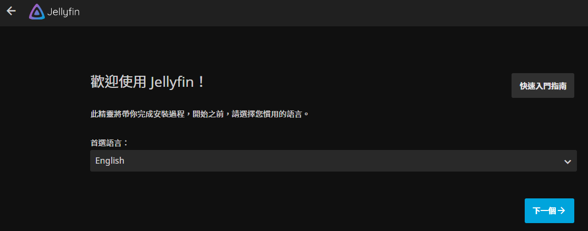
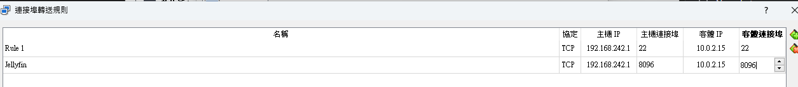
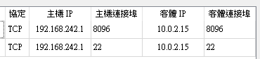
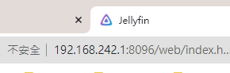

# 在虛擬機上運行 Jellyfin

1. 安裝好之後，可測試從容器內部訪問。

   ```bash
   docker exec -it jellyfin curl http://localhost:8096
   ```

<br>

2. 或是。

   ```bash
   curl http://localhost:8096
   ```

<br>

3. 先確定可以訪問。

   

<br>

4. 在 VirtualBox 設定虛擬機轉接。

   

<br>

5. 放大看清楚，轉接 8096。

   

<br>

6. 在區網訪問。

   ```bash
   192.168.242.1:8096
   ```

   

<br>

___

_END：以上示範基本運作_