# 系統燒錄

_`MacOS` 與 `Windows` 系統的操作流程是一樣的_

 

## 樹莓派版本

1. 安裝工作建議使用 `Raspberry Pi Imager`，樹莓派系統建議使用官方推薦的版本。

   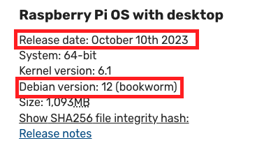

 

## 安裝 ＆ 燒錄步驟

1. 前往 [樹莓派官網](https://www.raspberrypi.com/) 下載並安裝 `Raspberry Pi Imager`。

   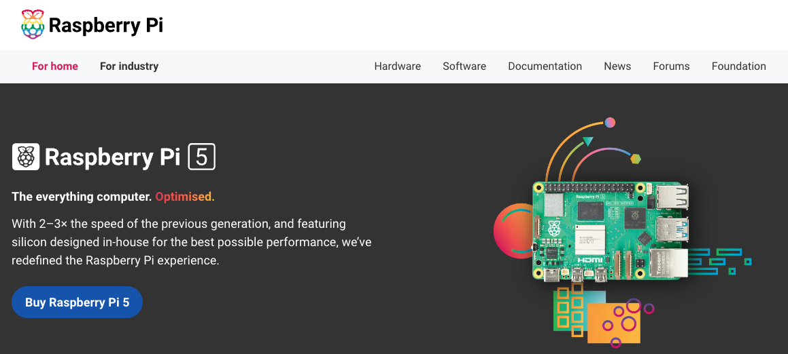

 

2. 點選頁籤 `Software`。

   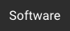

 

3. 依據使用的系統下載並安裝官方燒錄程式 `Raspberry Pi Imager`。

   

 

4. 安裝完成後，開啟桌面應用。

   

 

5. 先選擇 `設備型號`。

   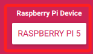

 

6. 接著選擇 `操作系統`，在 `樹莓派 5 或 4` 上建議安裝官方推薦的 64 位元版本，`樹莓派 3` 可選擇 32 位元系統。

   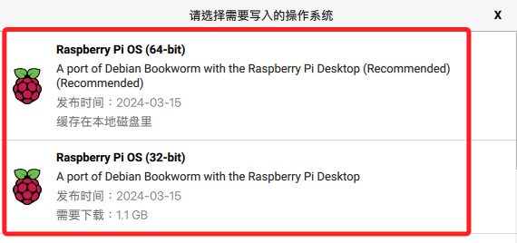

 

7. 假如要安裝的版本不在選單內，可點擊 `Raspberry Pi OS（other）` 進入下一層選單。

   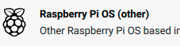

 

## 手動安裝

1. 如果 [手動下載映像檔](https://www.raspberrypi.com/software/operating-systems/) 來安裝，可以回到官網點選 `See all download options` 。

   

 

2. 並選擇要下載的鏡像版本。

   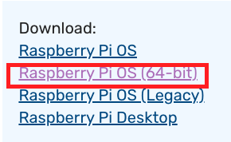

 

3. 在所選的映像檔案點擊 `Download` 進行下載。

   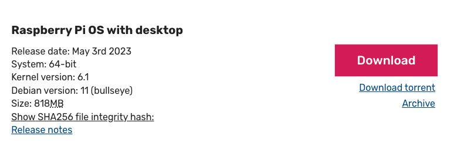

 

4. 回到燒錄器中，滑動到最下方點擊 `Use custom`，接著便可在下載資料夾中選取自行下載的映像檔。

   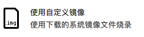

 

## 繼續安裝步驟

 

1. 選擇記憶卡。

   

 

2. 點擊右下角的 `NEXT` 進入下一步。

   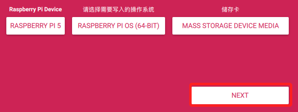

 

3. 點擊 `編輯設置`。

   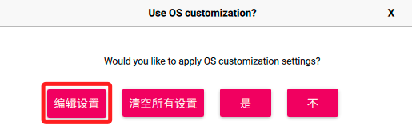

 

## 進行設定

1. 自定義 `主機名稱 hostname`，這將用於第一次的連線，請務必牢記。

   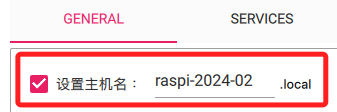

 

2. 自訂使用者名稱及密碼，請務必牢記。

   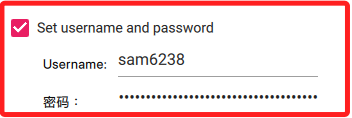

 

3. 若是多人共用的設備，建議這裡使用的 `Username` 是 `pi` ，這樣之後可以共用這個帳號作為共用的頂級管理帳號。

   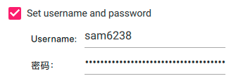

 

4. 預先設定好 WiFi，這樣若無網路一樣可以進行連線設定。

   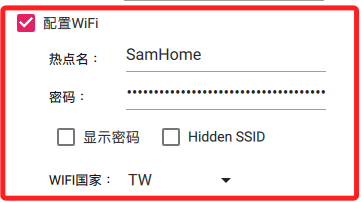

 

5. 時區與鍵盤配置使用預設值即可。

   

 

6. 新版的燒錄器已預設開啟 `SSH` 服務，若使用舊版燒錄器，務必確認 `SSH` 是否已經開啟。

   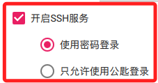

 

7. 另外兩個頁籤中的設定可跳過。

   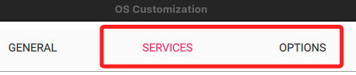

 

8. 完成後點擊下方的 `保存`。

   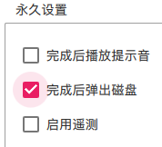

 

## 開始燒錄

1. 確認設置正確，接著點擊 `是`。

   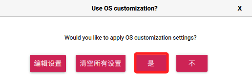

 

2. 再次跳出警告視窗，點擊 `是` 便會開始燒錄。

   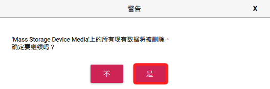

 

3. 這個過程可能需要一點時間，燒錄完畢後，系統會 `自動驗證`，完成驗證後將卡片取出並插入樹莓派進行開機。

   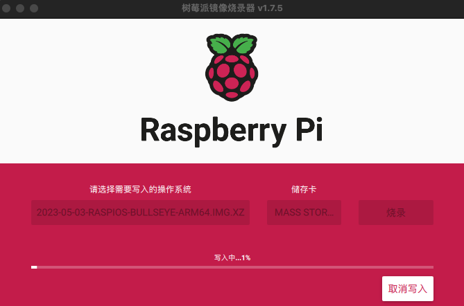

 

___

_END：以上完成樹莓派系統記憶卡燒錄_
