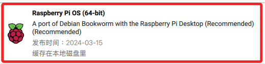
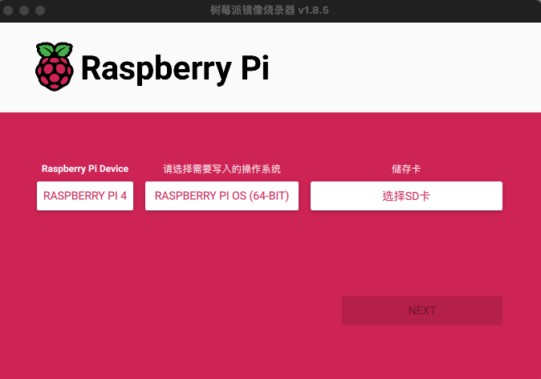
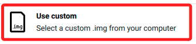
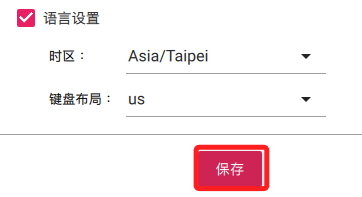

# 系統燒錄

_`MacOS` 與 `Windows` 系統的操作流程是一樣的_

 

## 樹莓派版本

1. 安裝工作建議使用 `Raspberry Pi Imager`，樹莓派系統建議使用官方推薦的版本。

   

 

## 安裝 ＆ 燒錄步驟

1. 前往 [樹莓派官網](https://www.raspberrypi.com/) 下載並安裝 `Raspberry Pi Imager`。

   

 

2. 點選頁籤 `Software` 進行操作。

   

 

3. 先下載並安裝燒錄程式。

   

 

4. 安裝好燒錄器後開啟應用。

   

 

5. 選擇操作系統，在 `樹莓派 5 或 4` 上建議安裝 64 位元，`樹莓派 3` 可選擇 32 位元系統。

   

 

6. 選 `Raspberry Pi OS（other）`。

   

 

7. 選擇 64-bit 的版本。

   

 

## 手動安裝

1. 如果手動下載映像檔案來安裝，可以回到官網點選 `See all download options` 。

   

 

2. 並選擇要下載的鏡像版本。

   

 

3. 32 或 64 位元版本。

   

 

4. 同樣地，假如是自行下載的鏡像檔案，安裝時滑動到最下方選擇 `使用自定義鏡像` 。

   

 

## ⬇️ 以下繼續安裝步驟 ⬇️ 

 

1. 選擇記憶卡。

   

 

2. 點擊右下角的齒輪進行 `設定` 。

   

 

## 設定

1. 定義主機 `host` 名稱 *<任意命名>*。

 

2. 開啟 `SSH` 服務。

   

 

3. 若是多人共用的設備，建議這裡使用的 `Username` 是 `pi` ，這樣之後可以共用這個帳號作為共用的頂級管理帳號。

   

 

4. 預先設定好 WiFi，這樣若無網路一樣可以進行連線設定。

   

 

5. 設定適當的時區與鍵盤配置。

   

 

6. 完成後退出。

   

     

## 開始燒錄

1. 這個過程可能需要一點時間，燒錄完畢後，系統會自動驗證。

   

 

2. 完成時插入樹莓派進行開機。

   

 

___

_END：以上完成樹莓派系統記憶卡燒錄_