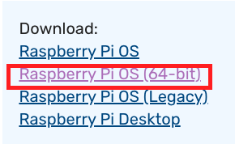
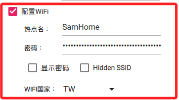
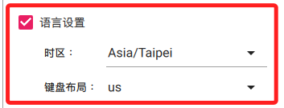

# 📦 應用安裝＆系統燒錄

*註: MacOS 與 Windows 系統安裝流程一樣*

 

### 🌟 建議版本

- ❗️ ***不建議*** 安裝最新版本的 Raspberry Pi OS *bookworm*。
- 不是因為對這個版本有何疑慮，只是目前還有些相容性問題。
- 另外因為版本太新（2023/10/10），社區支援也很有限。
  
  

 

### 🌟 安裝＆燒錄步驟

1. 前往[樹莓派官網](https://www.raspberrypi.com/)
   
2. 點選頁籤 `Software` 進行操作
   
   

3. 先下載並安裝燒錄程式
   
   

4. 安裝好燒錄器後開啟應用
   
   

5. 選擇操作系統，建議在數沒派4上安裝 64 位元
   
   

6. （所以）選 `Raspberry Pi OS（other）`
   
   

7. 選擇 64-bit 的版本
   
   

 

## ❗️*特別提示*

- 1. 如果手動下載映像檔案來安裝，可以回到官網點選 `See all download options` 。
   
    

- 2. 並選擇要下載的鏡像版本
  
    

- 3. 32 或 64 位元版本
   
    

- 4. 同樣地，假如是自行下載的鏡像檔案，安裝時滑動到最下方選擇 `使用自定義鏡像` 。
   
    

 
    
    ⬇️ 以下繼續安裝步驟 ⬇️ 

 

8. 選擇記憶卡
   
   

9. 點擊右下角的齒輪進行 `設定` 。
    
    

   ❗️ **尤其前兩項設定非常重要**
   
   1. 定義主機 `host` 名稱 *<任意命名>*。
    
   2. 開啟 `SSH` 服務。
    
        
   
   3. 若是多人共用的設備，建議這裡使用的 Username 是 `pi` ，這樣之後可以共用這個帳號作為共用的頂級管理帳號。
        
        

   4. 預先設定好 WiFi，這樣若無網路一樣可以進行連線設定
    
        

   5. 設定適當的時區與鍵盤配置
    
        

   6. 完成後退出
    
        

     

10.  開始燒錄，這個過程可能需要一點時間，燒錄完畢後，系統會自動驗證。
   
        

11.  完成時插入樹莓派進行開機。
   
        

 

---
_END：以上完成樹莓派系統記憶卡燒錄_