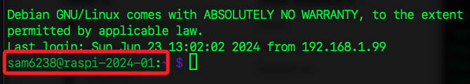
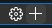
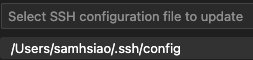
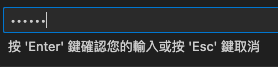
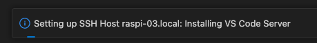
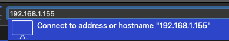

# 第一次啟動

<br>

## 📌 特別注意

1. 在前一個步驟燒錄記憶卡時，務必記得開啟 `SSH`，並牢記設置的密碼。

<br>

2. 接下來先在 `終端機` 使用 `SSH` 指令連線樹莓派，並執行設定指令將樹莓派的 `VNC` 開啟。

<br>

3. 接著下載並安裝 VSCode，後續亦將使用 VSCode 連線樹莓派進行相關開發。

<br>

4. 完成以上步驟後，可下載安裝 VNC，並用以連線到樹莓派的桌面。

<br>

## 🖥️ 使用終端機連線

_第一次啟動後先使用 `終端機` 進行連線_

<br>

1. 在終端機使用 SSH 連線指令進行連線。

    ```bash
    ssh 使用者帳號＠主機名稱 或 IP
    ```

<br>

2. 若是第一次連線會被問到是否要繼續。

    

<br>

3. 輸入密碼。

    

<br>

4. 完成連線畫面。

    

<br>

5. 退出連線，將終端機返回本地電腦。

    ```bash
    exit
    ```

<br>

6. 進行設定開啟 VNC。

    ```bash
    sudo raspi-config
    ```

    

<br>

7. 使用上下鍵進行選取 `Interface`。

   

<br>

8. 開啟 `VNC`。

   

<br>

9. 以 `TAB` 鍵選取 `YES`。

    

<br>

10. 按下 `FINISH` 完成。

    

<br>

## 🛠️ VSCode 遠端連線

_先連線 [官網](https://code.visualstudio.com/download) 下載安裝_

<br>

1. 透過 VSCode 的 `遠端總管` 進行連線。

    

<br>

2. 添加連線。

    

<br>

3. 使用 SSH 連線及主機名稱。

    ```bash
    ssh 使用者名稱@主機名稱
    ```

<br>

4. 選擇保存 SSH 配置的位置。

    

<br>

5. 點擊 `Connect` 進行連線。

    

<br>

6. 輸入您的密碼。

    

<br>

7. 連線完成時，右下角將顯示相關信息。

    

<br>

## VNC 連線

<br>

1. 前往 [官網](https://www.realvnc.com/en/connect/download/viewer/) 下載並安裝。

<br>

2. 啟動 VNC Viewer。

    

<br>

2. 輸入主機名稱。

    

<br>

3. 使用 IP 也可以。

    

<br>

3. 輸入帳號、密碼並選擇記住密碼，然後點擊 `OK`。

    

<br>

## 其他常用指令

1. 關機指令。

    ```bash
    sudo shutdown now
    ```

<br>

2. 重新啟動指令。

    ```bash
    sudo reboot now
    ```
<br>

## 補充說明多人 VNC 連線

1. 可多人同時透過 VNC 連線進入同一台樹莓派主機，且會看到多個滑鼠指標，但這些滑鼠指標會同步控制。

<br>

2. `樹莓派 3` 應可以正常顯示，`樹莓派 4` 可能會出現 `Cannot currently show the desktop` 的錯誤，隨著版本的變化與更新，相關錯誤訊息會有所不同。

<br>

___

_END：以上完成第一次啟動_