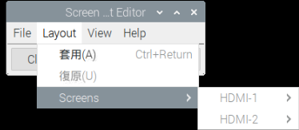

# 環境設置

_完整介紹環境設置_

<br>

## 基本環境設置

<br>

1. 開啟樹莓派後，左上角點擊樹莓派圖標。

   

<br>

2. 在 `偏好設定` 中選擇 `Raspberry Pi 設定`。

   

<br>

3. 於 `系統` 部分，除非要修改主機名稱或密碼，否則不須做其他設定。

      

<br>

4. 點選 `Display` 頁籤，新版作業系統中僅有一個休眠設置 `Screen Blanking`，預設是關閉的，這裡可不予變更。

   

<br>

5. 若是舊版的作業系統，可進行設置無頭模式下的解析度 `Headless Resolution`， 這是在沒有接螢幕的情況下，樹莓派預設的螢幕解析度，這個設置可避免在沒有外接螢幕時，樹莓派顯示連線錯誤。

   

<br>

6. 在 `介面` 頁籤中，建議將所有的服務全部開啟，尤其是 VNC 一定要確保已開啟。

   

<br>

7. 進行地區設置（Locatcalisation、在地化）。

   

<br>

8. 設定語系，且特別注意，字元集（Character Set）應設為 `UTF-8`。

   

<br>

9. 完成設置後，記得儲存並重啟系統。

   

<br>

10. 等待。

   

<br>

11. 如果發現解析度仍然偏低，可進一步手動修正，詳細的調整方法將在下一部分進行說明.

<br>

## 在樹莓派中設定螢幕解析度

1. 登入樹莓派後，如果發現解析度很低，先檢查系統偏好裡的螢幕設定。

<br>

2. 假如遇到無法選取沒關係，可以直接跳到 `步驟4` 編輯設定檔案。

   

<br>

3. 或是發現解析度（Resolution）僅提供 `640*480` 這一選項。

   

<br>

4. 使用終端機開啟並修改設定檔案。

   ```bash
   sudo nano /boot/config.txt
   ```

<br>

## 解析度設定說明

_2K電腦螢幕與4K電視_

<br>

1. 2K電腦螢幕。

   

<br>

2. `hdmi_group` 有 `CEA` 或 `DMT` 兩種模式，其中 `CEA` 用於電視機，`DMT`用於電腦螢幕。

<br>

3. 4K電視:

   

<br>

4. 渲染解析度參數設定：這兩個數值 `framebuffer_width` 和 `framebuffer_height` 基本上需要與 `hdmi_group`、`hdmi_mode` 匹配。意思是將指定的解析度渲染到 hdmi 螢幕上。

   ```
   framebuffer_width=1920
   framebuffer_height=1080
   ```

<br>

## 對照表與說明

1. DMT (電腦監視器，`hdmi_group=2` )。

   | MODE | 解析度    | 刷新率 |
   | ---- | --------- | ------ |
   | 4    | 640x480   | 60Hz   |
   | 9    | 800x600   | 60Hz   |
   | 16   | 1024x768  | 60Hz   |
   | 35   | 1280x1024 | 60Hz   |
   | 51   | 1600x1200 | 60Hz   |
   | 58   | 1680x1050 | 60Hz   |
   | 82   | 1920x1080 | 60Hz   |

<br>

2. CEA (電視，`hdmi_group=1` )。

   | Mode | 解析度    | 刷新率 |
   | ---- | --------- | ------ |
   | 1    | 640x480   | 60Hz   |
   | 4    | 1280x720  | 60Hz   |
   | 16   | 1920x1080 | 60Hz   |
   | 31   | 1920x1080 | 50Hz   |
   | 34   | 1920x1080 | 30Hz   |

<br>

## 重新啟動後的設定

1. 重啟後進入 `Screen Configuration`。

<br>

2. 選擇想要的解析度，例如： `1920x1080`。

<br>

3. 若有進行更改，完成後點擊 `Apply` 保存設定。

<br>

___

_END：以上為基本環境的設置_
