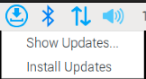

# 更新樹莓派

</br>

## 第一次安裝完系統後需要進行系統更新

1. 進入樹莓派後會看到右上角的「更新」圖標。
   
   

</br>

2. 點擊進入會看到兩個選項。
   
   
   
</br>

3. 點擊「Show」並然後點擊「Install」。需要一點時間。
   
   

</br>

## 若要手動更新
*進行手動更新需要按照以下指令，並注意執行的先後順序*

1. **更新索引列表**  
   ```
   sudo apt update
   ```
   
   更新套件（包）索引列表會從設置的儲存庫中獲取可用的軟件包和版本信息。這是用於更新本地的軟件源（repo），只會更新軟件列表，不會更新包的本身，用意是確保有最新的套件資訊。特別注意，這些套件包括系統工具、庫和應用程序。

</br>

2. **進行更新**  
   ```
   sudo apt upgrade
   ```
   
   根據索引列表更新系統中的所有套件到最新版本，也就是會升級所有已經安裝的套件。這個指令不會移除或是安裝新的軟件。

</br>

3. **移除不必要的套件**  
   ```
   sudo apt autoremove
   ```
</br>

4. __更新完成可依需要重新啟動__
   - 部分更新狀況會提示重新啟動，要注意看。
  
</br>

---

_END_