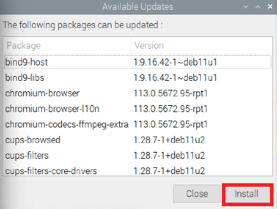

# 更新樹莓派

<br>

## 首次登入

_第一次安裝完系統後需要進行系統更新_

<br>

1. 進入樹莓派後會看到右上角的 `更新` 圖標。

   

<br>

2. 點擊進入會看到兩個選項。

   
   
<br>

3. 點擊 `Show` 並然後點擊 `Install`，這個過程會需要一點時間。

   

<br>

## 若要手動更新

_進行手動更新需要按照以下指令，並注意執行的先後順序_

<br>

1. 更新索引列表：這個指令用於更新本地的軟體源（repo），執行後會從設置的儲存庫中取得可用的軟體包和版本信息，但只會更新軟體列表，不會更新包的本身，用意是確保有最新的套件資訊。特別注意，這些套件包括系統工具、庫和應用程序。

   ```
   sudo apt update -y
   ```

<br>

2. 進行更新：根據索引列表更新系統中的所有套件到最新版本，也就是會升級所有已經安裝的套件，這個指令不會移除或是安裝新的軟體。

   ```
   sudo apt upgrade -y
   ```

<br>

3. 若提示移除不必要的套件，則依提示進行刪除。

   ```
   sudo apt autoremove -y
   ```

<br>

4. 更新完成可依需要重新啟動，若提示 `必須重新啟動` 則依提示操作。

<br>

___

_END_