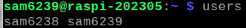
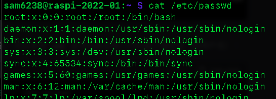
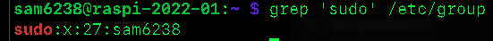
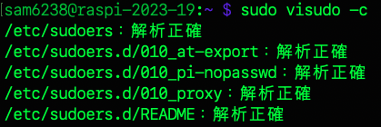
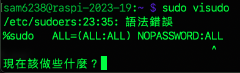
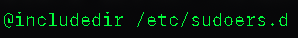
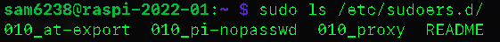
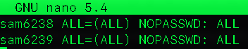

# 關於使用者

<br>

## 與使用者有關的 Linux 指令

| 指令                                     | 說明                     | 備註                       |
| ---------------------------------------- | ------------------------ | -------------------------- |
| `who`                                  | 當前登入系統的用戶資訊   | 簡要                       |
| `users`                                | 當前登入系統的用戶資訊   | 詳細                       |
| `last`                                 | 歷史紀錄                 | 動作紀錄                   |
| `sudo -l -U <使用者帳號>`              | 特定使用者sudo權限的範圍 |                            |
| `cat /etc/passwd`                      | 全部                     | 複雜                       |
| `cut -d: -f1 /etc/passwd`              | 列出文件中的使用者       | 特殊任務使用者             |
| `su <使用者帳號>`                      | 切換使用者               | 只是在終端機中切換         |
| `groups <使用者帳號>`                  | 當前或指定用戶所有群組   |                            |
| `sudo usermod -a -G sudo <使用者帳號>` | 賦予帳號 sudo 權限       | 僅賦予權限，仍需要輸入密碼 |
| `sudo visudo`                          | 修改權限設定檔           |                            |

<br>

1. 查詢當前登入系統的用戶資訊。

    ```
    who
    ```

    

<br>

2. 當前登入系統的用戶資訊

    ```
    user
    ```

    

<br>

3. 登入紀錄

    ```
    last
    ```

    

<br>

## 使用者權限

1. 查看當前用戶：`/etc/passwd` 是一個系統文件，包含系統上每個用户的信息。查看所有用戶（包含服務，很多無用資訊）

    ```bash
    cat /etc/passwd
    ```

    

<br>

2. 只想查看用戶名稱：使用 `awk` 指令修正前一個指令的結果。

    ```bash
    awk -F: '{ print $1 }' /etc/passwd
    ```

    

<br>

3. 使用 getent  也是一樣

    ```bash
    getent passwd | awk -F: '{ print $1 }'
    ```

<br>

4. 或使用 compgen 比較簡潔：compgen 是一個內建於 Bash 中的命令。用於顯示由 shell 自動生成的特定查詢結果。

    ```bash
    compgen -u
    ```

    

<br>

5. 透過篩選 UID 來顯示普通用戶：普通用戶的 UID 一般來說是大於或等於 1000。

    ```bash
    awk -F: '$3 >= 1000 && $3 < 65534 { print $1 }' /etc/passwd
    ```

    

<br>

6. 觀察用戶權限：在 Linux 系统中，可通过查看 `/etc/group` 文件或使用 `groups` 命令来確定普通用户是否擁有 `sudo` 權限。

    ```bash
    grep 'sudo' /etc/group
    ```

    

<br>

7. 觀察該用戶屬於哪些群組，也就代表擁有哪些群組權限。

    ```bash
    groups sam6238
    ```

    

<br>

8. 列出用戶具備哪些 `sudo` 權限。

    ```bash
    sudo -l -U sam6238
    ```

    

<br>

## 檔案內容說明

    | 指令                          | 主機 | 用戶 | 群組 | 任何命令 | 無需密碼 |
    | ----------------------------- | ---- | ---- | ---- | -------- | -------- |
    | `(ALL ) : ALL`              | O    | O    |      | O        |          |
    | `(ALL : ALL) : ALL`         | O    | O    | O    | O        |          |
    | `(ALL) NOPASSWD: ALL`       | O    | O    |      | O        | O        |
    | `(ALL : ALL) NOPASSWD: ALL` | O    | O    | O    | O        | O        |


1. 所謂的 `不需要輸入密碼` ，是指用戶在使用 `sudo` 指令執行需要超級用戶權限的指令時不需要再輸入密碼。換句話說，一旦用戶已經成功地以自己的用戶密碼執行了 sudo 指令，系統就會暫時授予該用戶超級用戶權限，允許其不必重新輸入密碼就能執行其他 sudo 指令。

2. sudo 的主配置文件位於 `/etc/sudoers`，但在 `/etc/sudoers.d` 目錄中也可能存在其他相關的配置文件。

3. 在對 `sudo` 配置進行修改時，建議不要直接編輯 `/etc/sudoers` 文件，而應該使用 `visudo` 命令或在 `/etc/sudoers.d` 下建立新的文件進行配置，以避免可能的語法錯誤影響系統安全。

<br>

## 設定 sudo 群組免密碼

_結合前面的教程_

<br>

1. 編輯設定檔案。

    ```bash
    sudo visudo
    ```

    _可看到預設權限設置如下_

    

2. 加入免密碼 `NOPASSWD`：`sudo` 群組的所有使用者可以在所有主機上，以所有使用者身份執行所有命令且無需密碼。

    ```bash
    %sudo   ALL=(ALL:ALL) NOPASSWD:ALL
    ```

3. 檢查語法是否正確。

    ```bash
    sudo visudo -c
    ```

    

4. 這個編輯會自帶檢查，假設將參數 `NOPASSWD` 誤植為 `NOPASSWORD` ，系統會在儲存後提出警告。

    

5. 按下 `e` 重新編輯即可。

    

<br>

## 還有另一個設定檔案 `sudoers.d`

1. 在前項說明的設定檔最後一行內容。

    

2. 會發現裡面有三項設定。

    

3. 可透過 `cat` 語法逐一查看內容。

    ```bash
    sudo cat /etc/sudoers.d/010_at-export
    sudo cat /etc/sudoers.d/010_pi-nopasswd
    sudo cat /etc/sudoers.d/010_proxy
    ```

4. 其中 `010_pi-nopasswd` 有設定了初始的用戶 `sam6238` 免密碼。

    

5. 可知透過編輯這個設定檔案也可以達到相同目的。

    ```bash
    sudo nano /etc/sudoers.d/010_pi-nopasswd
    ```

6. 將要免密碼的用戶或是 `ALL` 加入。

    

<br>

___

_END：以上關於使用者_
