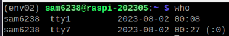
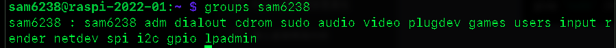

# 關於使用者

</br>

## 1. 與使用者有關的 Linux 指令

| 指令                                     | 說明                     | 備註                       |
| ---------------------------------------- | ------------------------ | -------------------------- |
| `who`                                  | 當前登入系統的用戶資訊           | 簡要                       |
| `users`                                | 當前登入系統的用戶資訊           | 詳細                       |
| `last`                                 | 歷史紀錄                 | 動作紀錄                   |
| `sudo -l -U <使用者帳號>`              | 特定使用者sudo權限的範圍 |                            |
| `cat /etc/passwd`                      | 全部                     | 複雜                       |
| `cut -d: -f1 /etc/passwd`              | 列出文件中的使用者       | 特殊任務使用者             |
| `su <使用者帳號>`                      | 切換使用者               | 只是在終端機中切換         |
| `groups <使用者帳號>`                  | 當前或指定用戶所有群組   |                            |
| `sudo usermod -a -G sudo <使用者帳號>` | 賦予帳號 sudo 權限       | 僅賦予權限，仍需要輸入密碼 |
| `sudo visudo`                          | 修改權限設定檔           | 「詳其他章」               |


</br>

- 指令：當前登入系統的用戶資訊

  ```
  who
  ```

  

</br>

- 指令：當前登入系統的用戶資訊

  ```
  user
  ```

  

</br>

- 指令：登入紀錄

  ```
  last
  ```

  

</br>

## 2. 使用者權限

- 指令：查看當前用戶
    - `/etc/passwd` 是一個系統文件，包含系統上每個用户的信息。
    - 查看所有用戶（包含服務，很多無用資訊）

  ```bash
  cat /etc/passwd
  ```

  

</br>

- 指令：只想查看用戶名稱

    *使用 `awk` 指令修正前一個指令的結果*

  ```bash
  awk -F: '{ print $1 }' /etc/passwd
  ```

  

</br>

- 指令：使用 getent  也是一樣
  ```bash
  getent passwd | awk -F: '{ print $1 }'
  ```

</br>

- 指令：或使用 compgen 比較簡潔
  - compgen 是一個內建於 Bash 中的命令。
  - 用於顯示由 shell 自動生成的特定查詢結果。
 
  ```bash
  compgen -u
  ```

  

</br>

- 指令：透過篩選 UID 來顯示普通用戶
  - 普通用戶的 UID 一般來說是大於或等於 1000。 

  ```bash
  awk -F: '$3 >= 1000 && $3 < 65534 { print $1 }' /etc/passwd
  ```

  

</br>

- 指令：觀察用戶權限
  - 在 Linux 系统中，可通过查看 `/etc/group` 文件或使用 `groups` 命令来確定普通用户是否擁有 `sudo` 權限。

  ```bash
  grep 'sudo' /etc/group
  ```

  

</br>

- 指令：觀察該用戶屬於哪些群組，也就代表擁有哪些群組權限

  ```bash
  groups sam6238
  ```

  

</br>

- 指令：列出用戶具備哪些 `sudo` 權限

  ```bash
  sudo -l -U sam6238
  ```

  

  *檔案內容說明*

    | 指令                         | 主機  | 用戶  |群組  |任何命令  | 無需密碼  |
    | ---------------------------- | --- | --- | -- | ------- | ------ |
    | `(ALL ) : ALL`               |  O  |  O  |    |    O    |        |
    | `(ALL : ALL) : ALL`          |  O  |  O  |  O |    O    |        |
    | `(ALL) NOPASSWD: ALL`        |  O  |  O  |    |    O    |   O    |
    | `(ALL : ALL) NOPASSWD: ALL`  |  O  |  O  |  O |    O    |   O    |


  *備註*
  	1. 所謂的 `不需要輸入密碼` ，是指用戶在使用 `sudo` 指令執行需要超級用戶權限的指令時不需要再輸入密碼。換句話說，一旦用戶已經成功地以自己的用戶密碼執行了 sudo 指令，系統就會暫時授予該用戶超級用戶權限，允許其不必重新輸入密碼就能執行其他 sudo 指令。
	1. sudo 的主配置文件位於 `/etc/sudoers`，但在 `/etc/sudoers.d` 目錄中也可能存在其他相關的配置文件。
	2. 在對 `sudo` 配置進行修改時，建議不要直接編輯 `/etc/sudoers` 文件，而應該使用 `visudo` 命令或在 `/etc/sudoers.d` 下創建新的文件進行配置，以避免可能的語法錯誤影響系統安全。


---

END
