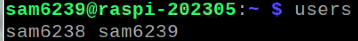
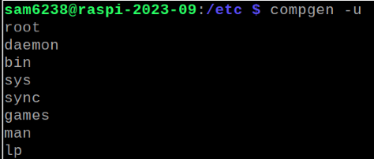
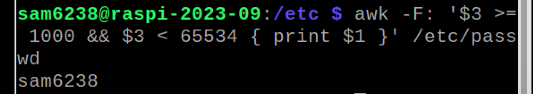
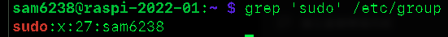

# 關於使用者

<br>

## 與使用者有關的 Linux 指令

| 指令                                     | 說明                     | 備註                       |
| ---------------------------------------- | ------------------------ | -------------------------- |
| `who`                                  | 當前登入系統的用戶資訊   | 簡要                       |
| `users`                                | 當前登入系統的用戶資訊   | 詳細                       |
| `last`                                 | 歷史紀錄                 | 動作紀錄                   |
| `sudo -l -U <使用者帳號>`              | 特定使用者sudo權限的範圍 |                            |
| `cat /etc/passwd`                      | 全部                     | 複雜                       |
| `cut -d: -f1 /etc/passwd`              | 列出文件中的使用者       | 特殊任務使用者             |
| `su <使用者帳號>`                      | 切換使用者               | 只是在終端機中切換         |
| `groups <使用者帳號>`                  | 當前或指定用戶所有群組   |                            |
| `sudo usermod -a -G sudo <使用者帳號>` | 賦予帳號 sudo 權限       | 僅賦予權限，仍需要輸入密碼 |
| `sudo visudo`                          | 修改權限設定檔           |                            |

<br>

_說明如下_

<br>

1. 查詢當前登入系統的用戶資訊。

    ```
    who
    ```

    

<br>

2. 當前登入系統的用戶資訊。

    ```
    user
    ```

    

<br>

3. 登入紀錄。

    ```
    last
    ```

    

<br>

## 使用者權限

1. 查看當前用戶：`/etc/passwd` 是一個系統文件，包含系統上每個用户的信息。查看所有用戶（包含服務，很多無用資訊）。

    ```bash
    cat /etc/passwd
    ```

    

<br>

2. 只想查看用戶名稱：使用 `awk` 指令修正前一個指令的結果。

    ```bash
    awk -F: '{ print $1 }' /etc/passwd
    ```

    

<br>

3. 使用 getent  也是一樣。

    ```bash
    getent passwd | awk -F: '{ print $1 }'
    ```

<br>

4. 或使用 compgen 比較簡潔：compgen 是一個內建於 Bash 中的命令。用於顯示由 shell 自動生成的特定查詢結果。

    ```bash
    compgen -u
    ```

    

<br>

5. 透過篩選 UID 來顯示普通用戶：普通用戶的 UID 一般來說是大於或等於 1000。

    ```bash
    awk -F: '$3 >= 1000 && $3 < 65534 { print $1 }' /etc/passwd
    ```

    

<br>

6. 觀察用戶權限：在 Linux 系统中，可通过查看 `/etc/group` 文件或使用 `groups` 命令来確定普通用户是否擁有 `sudo` 權限。

    ```bash
    grep 'sudo' /etc/group
    ```

    

<br>

7. 觀察該用戶屬於哪些群組，也就代表擁有哪些群組權限。

    ```bash
    groups sam6238
    ```

    

<br>

8. 列出用戶具備哪些 `sudo` 權限。

    ```bash
    sudo -l -U sam6238
    ```

    

<br>

___

_END：以上關於使用者_
