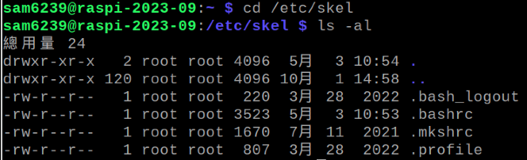
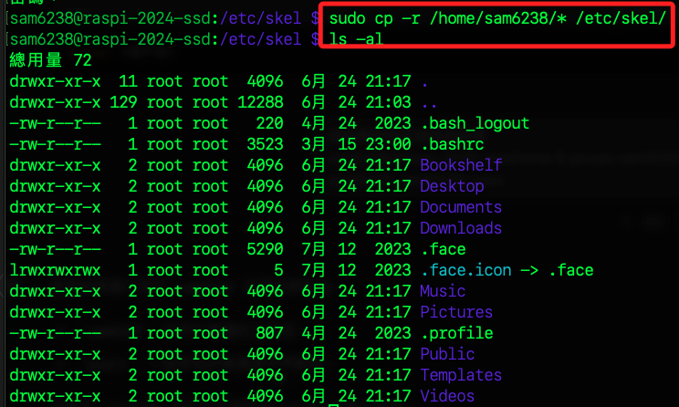
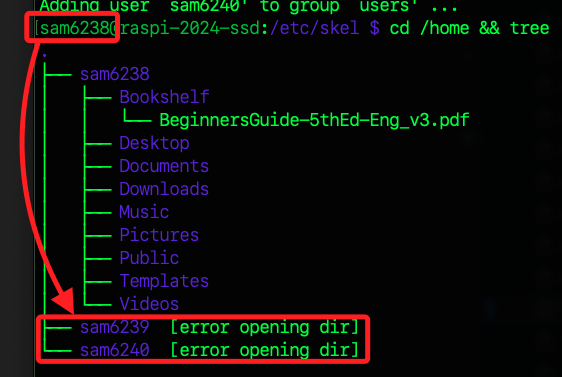

# 新用戶預設環境

_在樹莓派中建立一個新的帳戶時，系統會根據 `/etc/skel` 目錄中的模板來建立新用戶的家目錄，以下對此目錄進行編輯_

<br>

## 編輯設定檔

_編輯使用者的預設環境檔案_

<br>

1. 切換到設定檔案所在目錄。

    ```bash
    cd /etc/skel
    ```

<br>

2. 查看資料夾，可發現有些隱藏的 `預設設定文件`，檔案前綴 `.` 代表的就是 `隱藏檔案`。

    ```bash
    ls -al
    ```

    

<br>

## 複製文件

1. 先切換到主帳號中。

    ```bash
    su sam6238
    ```

<br>

2. 將主帳號 `sam6238` 家目錄中的文件全部複製到資料夾 `/etc/skel/` 中，參數 `-r` 代表遞迴複製；特別注意，因為主帳號也是新建立的，所以當前亦無任何資料，這樣的複製只是將資料夾重建在新用戶家目錄中。

    ```bash
    sudo cp -r /home/sam6238/* /etc/skel/
    ```

    

<br>

## 實測

_建立新用戶_

<br>

1. 建立新用戶試試看。

    ```bash
    sudo adduser <新用戶名稱>
    # 例如
    sudo adduser sam6240
    ```

    

<br>

2. 查看家目錄，可以發現主帳號並無訪問其他新建用戶家目錄的權限。

    ```bash
    cd /home && tree
    ```

    

<br>

3. 分別進入兩個新建帳號中進行查看，可確認其帳號專屬的資料與結構。

    

<br>

___

_END_
