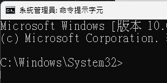
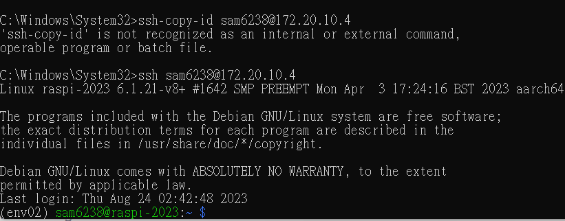

# 連線免密碼

_`Windows` 或 `Mac` 相同_

<br>

## 建立本地設備的密鑰

1. 進入終端機。

    

<br>

2. 輸入指令建立公私鑰。

    ```bash
    ssh-keygen
    ```

<br>

3. 一直都按下 `ENTER` 以預設值建立即可。

    

<br>

## 查看

_完成後，開啟本地資料夾 `查看預設的公鑰`_

<br>

1. Windows 指令。

    ```bash
    type %userprofile%\.ssh\id_rsa.pub
    ```

<br>

2. MacOS 指令。

    ```bash
    cat ~/.ssh/id_rsa.pub
    ```

<br>

3. 複製下來，稍後步驟會需要複製貼上公鑰內容。

    

<br>

## 設置遠端設備

_在樹莓派上建立公鑰檔案_

<br>

1. 連線樹梅派並在根目錄建立一個資料夾：補充說明參數 `-p` 用於建立多層級的資料夾時，不會因為父目錄已經存在而使得建立報錯。

    ```bash
    mkdir -p ~/.ssh
    ```

<br>

2. 在資料夾內建立一個檔案，貼上公鑰內容後，儲存 `control + o`、關閉檔案 `control + x`。

    ```bash
    sudo nano ~/.ssh/authorized_keys
    ```

<br>

3. 可先透過 cat 查看，確認已經貼上。

    ```bash
    cat ~/.ssh/authorized_keys
    ```

<br>

4. 假如有多台設備都要連入，則一行寫一個公鑰。

    

<br>

## 修改設定檔案

_非絕對必要，有時候沒設定也可以正常運行_

<br>

1. 編輯 SSH 的設定檔。

    ```bash
    sudo nano /etc/ssh/sshd_config
    ```

<br>

2. 取消以下三行的註解。

    ```bash
    # 是否允許使用公鑰認證來驗證用戶身份
    PubkeyAuthentication yes
    
    # 指定存放已授權公鑰的文件路徑
    AuthorizedKeysFile .ssh/authorized_keys
    
    # 是否允許使用密碼進行身份驗證
    PasswordAuthentication yes
    ```

<br>

## 關於編輯檔案所需的權限

1. 修改 `~/.ssh` 目錄及其所有子目錄和檔案的權限，`700` 表示僅有 `擁有者` 具有 `讀、寫、執行` 的權限，而其他用戶沒有任何權限。

    ```bash
    sudo chmod -R 700 ~/.ssh
    ```

<br>

2. 更改 `~/.ssh/authorized_keys` 檔案的擁有者和所屬的組，與上一個指令呼應。

    ```bash
    sudo chown <帳戶>:<群組> ~/.ssh/authorized_keys
    ```
    如
    ```bash
    sudo chown sam6238:sam6238 ~/.ssh/authorized_keys
    ```

<br>

3. 重新啟動 SSH 服務。

    ```bash
    sudo service ssh restart
    ```

<br>

## 連線測試

_重新連線測試以上設置是否完成_
  
<br>

1. 退出連線。

    ```bash
    exit
    ```

<br>

2. 再次連線，不再提示輸入密碼， VSCODE 的 SSH 也一樣。

    

<br>

3. 若要查看 SSH 日誌。

    ```bash
    sudo journalctl -u ssh
    ```

<br>

4. 使用 `-v` 參數進行連線查看更多連線資訊。

    ```bash
    ssh -v <帳號>@<主機名稱>
    ```
    如
    ```bash
    ssh -v sam6238@raspi-2023-09
    ```

<br>

___

_END_