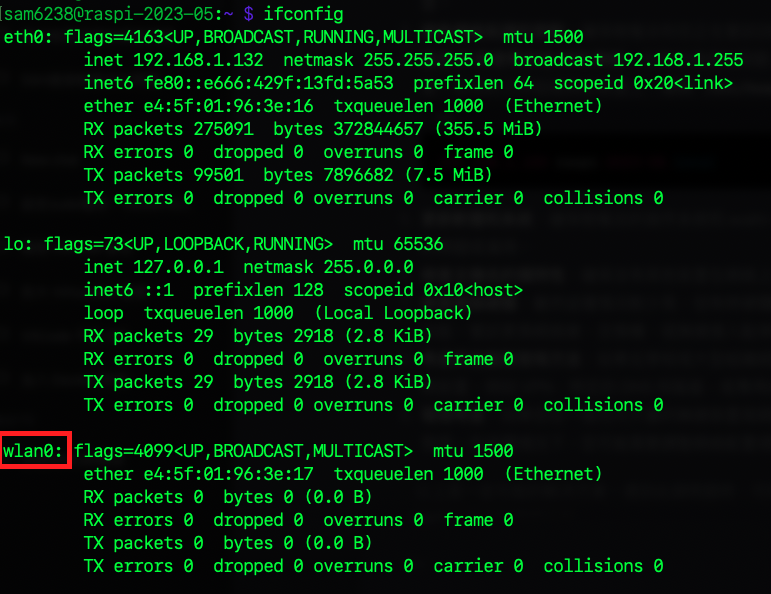
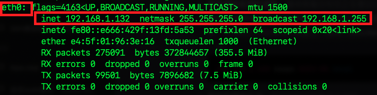

# 設置固定 IP

_[參考網址](https://www.ionos.com/digitalguide/server/configuration/provide-raspberry-pi-with-a-static-ip-address/)_

<br>

## 說明

1. 樹莓派預設是 `雙通道`，可同時透過有線網路與 WiFi 進行連線。

<br>

2. 若僅是為了同時啟用有線與無線網路連線可不用對此做設定。

<br>

3. `設置固定 IP` 的用意是基於網路受到管理限制時所做。

<br>

## 基本介紹

1. 查詢 IP 指令。

   _命令提示字元_

   ```bash
   ipconfig
   ```

   _終端機_

   ```bash
   ifconfig  
   ```

<br>

2. 查詢結果：`interface eth0` 是有線網絡的資訊，`interface wlan0` 是無線網路設定。

   _這是無線網路_

   

   _要加入設定的資訊是有線網路的部分_

   

<br>

## 開始設置

1. 查看DHCPCD 是否已經啟動。

   ```bash
   sudo service dhcpcd status
   ```

<br>

2. 假如已經啟動會顯示。

   

<br>

3. 若未啟動，執行以下指令。

   ```bash
   sudo service dhcpcd start
   ```

<br>

4. 設定為開機啟動。

   ```bash
   sudo systemctl enable dhcpcd
   ```

<br>

5. 編輯/修改設定檔。

   ```bash
   sudo nano /etc/dhcpcd.conf
   ```

<br>

6. 建議使用 VSCode 開啟編輯更加方便。

   

<br>

7. 要修改的部分是註記了如下說明的部分

   ```bash
   # Example static IP configuration:
   ```

<br>

8. 以下是要修改的部分，預設是註解的，要取消部分註解。

   

<br>

9. 依據查詢自己樹莓派的結果。

   ```bash
   inet 192.168.1.132  
   netmask 255.255.255.0  
   broadcast 192.168.1.255
   ```

<br>

10. 替換其中的 IP 位址 `ip_address`、 預設閘道 `routers` ，並刪除 `domain_name_servers` 中的 IP。

   ```bash
   interface eth0
   static ip_address=192.168.1.132/24
   static routers=192.168.1.1
   static domain_name_servers=192.168.1.1 8.8.8.8
   ```

<br>

___

_END：以上完成固定 IP 設定_
