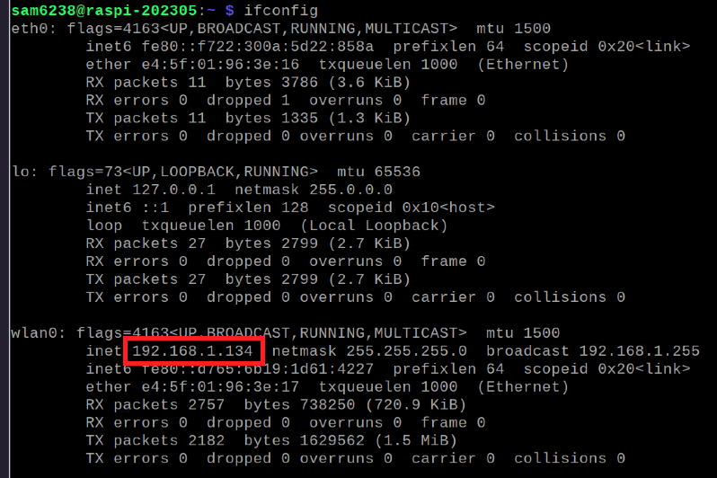
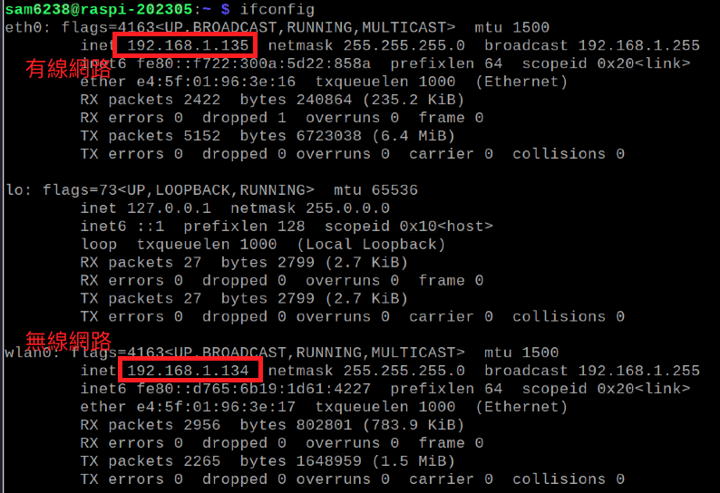
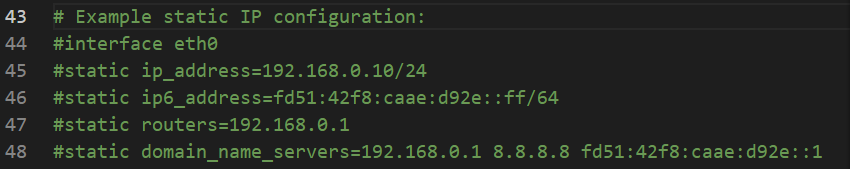
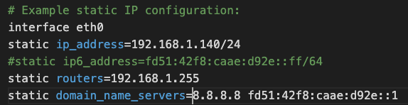

*上課實際操作*

# 設置固定 IP
- 樹莓派預設是雙通道，可同時透過有線網路與 WiFi 進行連線。
- 若僅是為了同時啟用有線與無線網路連線可不用對此做設定。
- 設置固定 IP 的用意是基於網路受到管理限制時所做。
- [參考網址](https://www.ionos.com/digitalguide/server/configuration/provide-raspberry-pi-with-a-static-ip-address/)

</br>

## 基本介紹

1. 查詢 IP 指令
   - 命令提示字元
  
   ```bash
   ipconfig
   ```

   - 終端機

   ```bash
   ifconfig  
   ```

2. 查詢結果
   - 有線網絡的資訊

   ```bash
   interface eth0  
   ```

   - 無線網路設定

   ```bash
   interface wlan0  
   ```
   
   - 這是無線網路

   
   
   - 要加入設定的資訊是有線網路的部分

   

</br>

## 開始設置 

1. 查看DHCPCD 是否已經啟動
   
   ```bash
   sudo service dhcpcd status
   ```

2. 假如已經啟動會顯示
   
   

3. 若未啟動，執行以下指令

   ```bash
   sudo service dhcpcd start
   ```

4. 設定為開機啟動

   ```bash
   sudo systemctl enable dhcpcd
   ```

5. 編輯/修改設定檔

   ```bash
   sudo nano /etc/dhcpcd.conf
   ```

6. 建議使用 VSCode 開啟編輯更加方便
   
   

7. 以下是要修改的部分，預設是註解的，要取消部分註解
   
   

8. 替換其中的 `ip_address`、`routers` ，並刪除 `domain_name_servers` 中的 IP。
   
   


</br>

---

_END：以上完成固定 IP 設定_