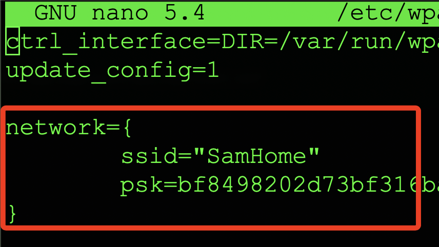
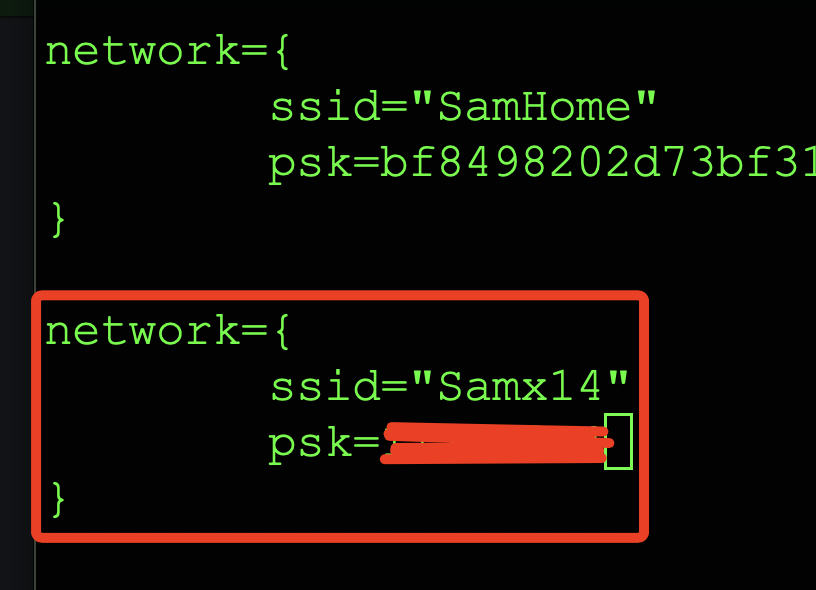

# 多個 WIFI 連線

<br>

1. 終端機指令。

    ```bash
    sudo nano /etc/wpa_supplicant/wpa_supplicant.conf
    ```

<br>

2. 一開始會看到燒錄記憶卡的時候設定的 WIFI。

    

<br>

3. 比照這個格式再加入新的 WIFI 設定即可。

    

<br>

___

_END_