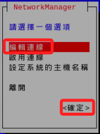

# 設置固定 IP

_在新版系統中使用 `network-manager` 替代 `dhcpcd` 來管理網絡連接，配置 `靜態 IP` 的方法有所不同_

<br>

_[舊版操作的參考網址](https://www.ionos.com/digitalguide/server/configuration/provide-raspberry-pi-with-a-static-ip-address/)_

<br>

## 說明

1. 樹莓派預設是 `雙通道`，可同時透過有線網路與 WiFi 進行連線；所以若只是想同時啟用有線與無線網路連線，則可不用做此設定。

<br>

2. `設置固定 IP` 的用意是基於網路受到管理限制時所做。

<br>

## 基本介紹

1. 查詢 IP 指令。

   _Windows 系統_

   ```bash
   ipconfig
   ```

   _Linux 系統_

   ```bash
   ifconfig
   # 或
   ip add
   ```

<br>

1. 查詢結果：`interface eth0` 是有線網絡的資訊，`interface wlan0` 是無線網路設定。

   _這是無線網路_

   

   _要加入設定的資訊是有線網路的部分_

   

<br>

## 開始設置

_若使用舊版樹莓派系統如 Bullseye_

<br>

1. 查看 `DHCPCD` 是否已經啟動。

   ```bash
   sudo service dhcpcd status
   ```

<br>

2. 假如已經啟動會顯示。

   

<br>

3. 新版樹莓派系統 `Bookworm` 會顯示並未安裝。

   

<br>

## 檢查是否安裝新版的 DHCP 客戶端

_使用新版樹莓派系統如 Bookworm_

<br>

1. 查詢是否已安裝 `network-manager`，顯示已經安裝。

   ```bash
   dpkg -l | grep network-manager
   ```

<br>

2. 查詢 `network-manager` 服務狀態。

   ```
   sudo systemctl status NetworkManager
   ```

<br>

## 使用 nmcli 設置固定 IP

_nmcli 是 network-manager 提供的命令行工具，用於配置網絡連接_

<br>

1. 列出網絡連接，其中有線 `eth0` 與無線 `wlan0` 皆有連線，其中 `eth0` 就是要進行設置的有線連線，其名稱為 `有線連線 1`，這將被用於後續的指令中。

   ```bash
   nmcli connection show
   ```

   

<br>

2. 修改網絡連接設置，對於 `eth0` 使用以下命令來設置靜態 IP 地址，其中 `ipv4.method manual` 表示設置為手動配置，`ipv4.addresses` 指定靜態 IP 地址和子網遮罩，`ipv4.gateway` 設置默認網關，`ipv4.dns` 設置 `DNS 服務器` 地址，可以用空格分隔多個伺服器地址；這些設定值與之前設定方式雷同。

   ```bash
   sudo nmcli connection modify "有線連線 1" ipv4.method manual ipv4.addresses "192.168.1.150/24" ipv4.gateway "192.168.1.1" ipv4.dns "192.168.1.1 8.8.8.8"
   ```

<br>

3. 在實作時，要先以電腦設備查詢 IP，再將網線提供給樹莓派使用；這裡直接使用樹莓派查詢，模擬以上的實作。

   ```bash
   ifconfig
   ```

   

<br>

4. 進行設置，以下分開運行來看清楚一點。

   ```bash
   # 修改 IP 地址和子網遮罩
   sudo nmcli connection modify "有線連線 1" ipv4.addresses 192.168.1.150/24
   # 設置網關
   sudo nmcli connection modify "有線連線 1" ipv4.gateway 192.168.1.1
   # 設置 DNS 伺服器
   sudo nmcli connection modify "有線連線 1" ipv4.dns "192.168.1.1 8.8.8.8"
   # 將 eth0 配置為靜態 IP
   sudo nmcli connection modify "有線連線 1" ipv4.method manual
   ```

<br>

5. 重新啟動網絡連接以使更改生效，切記，假如當前僅有一個網路連線，一但停用後將失去與樹莓派的連線，假如沒有使用螢幕鍵盤，切勿進行斷線，另外可先設定好無線網路連線，並將電腦同時使用無線網路，如此便可順利完成重啟。

   ```bash
   # 停用
   sudo nmcli connection down "有線連線 1"
   # 重新啟用
   sudo nmcli connection up "有線連線 1"
   ```

<br>

6. 若要觀察停用後的狀態，可透過 `ifconfig` 查看 IP 配發狀態，停用下並無顯示 IP。

   

<br>

## 查看網絡設置

1. 使用 `nmcli` 查看網絡識別資訊。

   ```bash
   nmcli connection show
   # 可指定網路名稱
   nmcli connection show "有線連線 1"
   ```

<br>

2. 使用 `ip` 命令檢查網絡接口的 IP 地址分配狀態。

   ```bash
   ip addr show eth0
   ```

<br>

3. 也可使用 `ifconfig` 命令檢查網絡接口的 IP 地址分配狀態。

   ```bash
   ifconfig eth0
   ```

<br>

4. 使用 `ping` 命令測試網絡連通性，驗證網絡是否正常運行，這會向 Google 的公共 DNS 服務器發送 4 個 ICMP 回應請求，查看是否能夠通過網絡連接。

   ```bash
   ping -c 4 8.8.8.8
   ```

<br>

5. 檢查系統的網絡路由表以確保網關和路由設置正確。

   ```bash
   ip route
   ```

<br>

6. 使用 `route -n` 命令檢查系統的網絡路由表，確認是否有正確的默認路由指向網關 IP。

   ```bash
   route -n
   ```

<br>

7. 查看 DNS 配置，確保你的 DNS 服務器設置正確。

   ```bash
   cat /etc/resolv.conf
   ```

   _輸出_

   ```
   nameserver 192.168.1.1
   nameserver 8.8.8.8
   ```

<br>

8. 使用 `journalctl` 查看網絡日誌了解網絡啟用過程中的詳情。

   ```bash
   sudo journalctl -u NetworkManager
   ```

<br>

## 其他網路服務

1. 檢查 systemd-networkd 服務狀態。

```bash
sudo systemctl status systemd-networkd
```

<br>

2. 查詢是否已啟用 systemd-networkd。

   ```bash
   sudo systemctl is-enabled systemd-networkd
   ```

<br>

3. 要查看系統上運行的所有網絡相關服務

   ```bash
   sudo systemctl list-units --type=service | grep -i network
   ```

   

<br>

4. 查詢運行中的 DHCP 客戶端

   ```bash
   ps aux | grep dhclient
   ps aux | grep dhcpcd
   ps aux | grep NetworkManager
   ```

   

<br>

## 圖形化界面工具

_在樹莓派上使用 nmtui 工具設置固定 IP_

<br>

1. 啟動 nmtui 工具。

   ```bash
   sudo nmtui
   ```

<br>

2. 選擇 `編輯連線` 然後 `ENTER`。

   

<br>

3. 選擇 `有線網路 1`。

   

<br>

4. 可手動編輯相關欄位，此與前面步驟相同，不再贅述。

   

<br>

5. 其中勾選的欄位，打上 `X` 即表示勾選。

   

<br>

6. 最後選取並按下 `確認` 即可。

   

<br>

7. 完成後按下 `上一步`。

   

<br>

8. 使用 `TAB` 選取 `確定` 並按下 `ENTER`。

   

<br>

9. 重啟網路服務。

   ```bash
   sudo systemctl restart NetworkManager
   ```

<br>

## 各種查詢狀態的指令

1. 使用 `systemctl` 查詢 `狀態 status`。

   ```bash
   sudo systemctl status NetworkManager
   ```

   

<br>

2. 使用 `nmcli` 檢查 `NetworkManager` 是否在運行，這是 `NetworkManager` 的命令行界面工具。

   ```bash
   nmcli general status
   ```

<br>

3. 使用 `服務 service` 命令來檢查服務的狀態。

   ```bash
   sudo service NetworkManager status
   ```

<br>

4. 確認 `NetworkManager` 是否設定為 `開機自動啟動`。

   ```bash
   sudo systemctl is-enabled NetworkManager
   ```

<br>

5. 使用進程查詢查看服務狀態。

   ```bash
   ps aux | grep NetworkManager
   ```

<br>

## 以下為舊版系統的設定

1. 執行以下指令啟動服務。

   ```bash
   sudo service dhcpcd start
   ```

<br>

2. 設定為開機啟動。

   ```bash
   sudo systemctl enable dhcpcd
   ```

<br>

3. 編輯/修改設定檔。

   ```bash
   sudo nano /etc/dhcpcd.conf
   ```

<br>

4. 建議使用 VSCode 開啟編輯更加方便。

   

<br>

5. 要修改的部分是註記了如下說明的部分

   ```bash
   # Example static IP configuration:
   ```

<br>

6. 以下是要修改的部分，預設是註解的，要取消部分註解。

   

<br>

7. 依據查詢自己樹莓派的結果。

   ```bash
   inet 192.168.1.132  
   netmask 255.255.255.0  
   broadcast 192.168.1.255
   ```

<br>

8. 替換其中的 IP 位址 `ip_address`、 預設閘道 `routers` ，並刪除 `domain_name_servers` 中的 IP。

   ```bash
   interface eth0
   static ip_address=192.168.1.132/24
   static routers=192.168.1.1
   static domain_name_servers=192.168.1.1 8.8.8.8
   ```

<br>

___

_END：以上完成固定 IP 設定_
