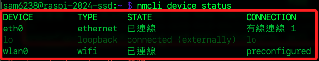
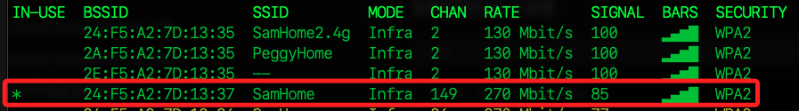
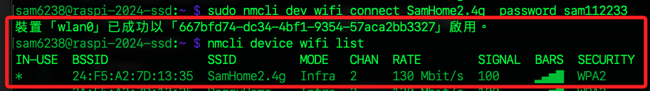
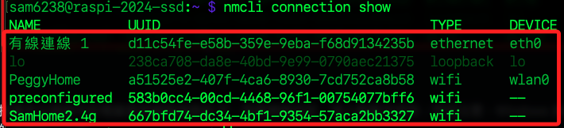
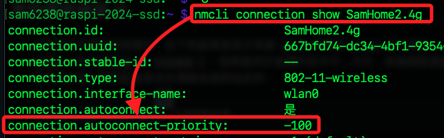

# 多個 WIFI 連線

_新版的網絡管理已改用 `NetworkManager`，雖仍可在 `wpa_supplicant.conf` 文件中進行設定，但為了避免可能的設定衝突，建議不要這樣做。_

<br>

## 編輯設定文件

_適用舊版 Bullseye 以前系統_

<br>

1. 使用終端機指令進行設定文件的編輯。

    ```bash
    sudo nano /etc/wpa_supplicant/wpa_supplicant.conf
    ```

<br>

2. 可看到燒錄 SD 卡的時候設定的 WIFI；特別注意，新版依舊會看到前兩行關於 `控制接口目錄和允許訪問的用戶組` 及 `運行時更新配置文件` 的設定，只是連線資訊已不在這顯示。

    

<br>

3. 在舊版系統中，可使用相同格式添加新的 WIFI 設定參數。

    ```bash
    network={
        ssid="<SSID 名稱>"
        psk=<密碼>
    }
    ```

    _如圖顯示_

    

<br>

## 查看並建立連線

_新版作業系統 Bookworm 適用的設定方式_

<br>

1. 查看當前運行中的 `連線種類`，結果顯示包含有線與無線網路，其中 `preconfigured` 是預設 WIFI 的系統別名。

    ```bash
    nmcli device status
    ```

    

<br>

2. 查看樹莓派可連線的 WIFI，其中 `當前連線` 會加註星號 `*`。

    ```bash
    nmcli device wifi list
    ```

    

<br>

2. 添加 Wi-Fi 連接，要使用 `sudo`。

    ```bash
    # 指令說明
    sudo nmcli dev wifi connect <SSID 名稱>  password <連線密碼>
    # 實際指令
    sudo nmcli dev wifi connect SamHome2.4g  password xxxxxx
    ```

    

<br>

3. 查看連線資訊可看到多個 WIFI 已被設定；特別注意，這個結果顯示的排序不代表優先級別；另外，`preconfigured` 就是燒錄光碟時設定的 WIFI，`preconfigured` 是樹莓派預設的別名。

    ```bash
    nmcli connection show
    ```

    

<br>

4. 最後被設定的 WIFI 會優先連線。

    ```bash
    nmcli device wifi list
    ```

    

<br>

5. 設定優先權，值越大，優先級越高。

    ```bash
    sudo nmcli connection modify <SSID 名稱> connection.autoconnect-priority <優先級別>
    ```

<br>

6. 若要查看優先級別，必須透過 `show` 指令指定 `SSID` 來查看指定參數的設定值。

    ```bash
    nmcli connection show <SSID 名稱>
    ```

    

<br>

___

_END_