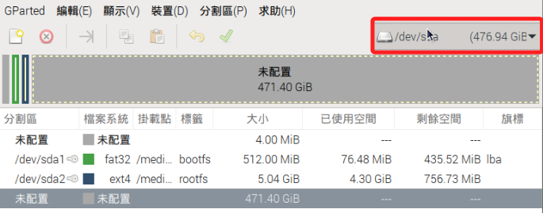
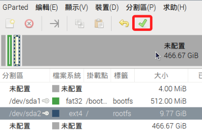
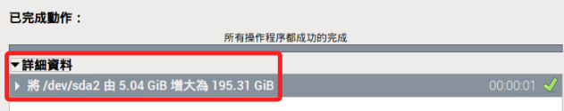

# 安裝在隨身碟

_以下步驟記錄如何將樹莓派系統安裝在 SSD 隨身碟並取代 SD 卡作為系統開機碟使用_

<br>

## 說明

1. 與基礎步驟相同，使用 `官方燒錄器` 對 SSD 進行系統燒錄，同樣要設定並牢記相關資訊。

    

<br>

2. 完成後將 SSD 作為一般儲存設備插入樹莓派 USB，同樣是可以熱插拔，並透過指令查詢當前資訊，預設安裝的容量僅有 `5G`。

    ```bash
    lsblk
    ```

    _輸出_

    ```bash
    NAME        MAJ:MIN RM   SIZE RO TYPE MOUNTPOINTS
    sda           8:0    0 476.9G  0 disk 
    ├─sda1        8:1    0   512M  0 part /media/sam6238/bootfs
    └─sda2        8:2    0     5G  0 part /media/sam6238/rootfs
    mmcblk0     179:0    0  59.5G  0 disk 
    ├─mmcblk0p1 179:1    0   512M  0 part /boot/firmware
    └─mmcblk0p2 179:2    0    59G  0 part /
    ```

<br>

3. 更新樹莓派系統。

    ```bash
    sudo apt update -y && sudo apt full-upgrade -y
    ```

<br>

## 分配分區

_擴大 SSD 分區需要確保分區後面有可用的未分配空間_

<br>

1. 在樹莓派安裝圖形化工具 `GParted` 來管理分區。

    ```bash
    sudo apt install gparted -y
    ```

<br>

2. 這是一個圖形化界面工具，所以要進入樹莓派並從終端啟動 `GParted`：

    ```bash
    sudo gparted
    ```

<br>

3. 啟動後會顯示當前開機的 SD 卡所載分區資訊。

    

<br>

4. 在右上角選單中切換為 SSD 的 `/dev/sda`。

    

<br>

5. 在要修改容量的分區上點右鍵，也就是 `/dev/sda2`，然後點擊 `調整大小/移動`。

    

<br>

6. 可手動輸入分區大小，輸入完成先按下 `ENTER`，然後點擊右下角的 `調整大小`。

    

<br>

7. 點擊工具欄上的綠色 `打勾` 按鈕來套用變更。

    

<br>

8. 在彈出視窗中再次點擊 `套用` 完成設定。

    

<br>

9. 完成時可展開 `詳細資訊` 查看所進行的變更。

    

<br>

10. 重新開機。

    ```bash
    sudo reboot
    ```

<br>

## 繼續

4. 更新 `EEPROM`，目的是更新 `啟動加載程序（bootloader）` 和相關的配置，特別注意這僅適用於 `樹莓派 4` 以上的型號。

    ```bash
    sudo rpi-eeprom-update -a
    ```

<br>

5. 編輯 `EEPROM` 配置文件。

    ```bash
    sudo nano /etc/default/rpi-eeprom-update
    ```

<br>

6. 確保 `BOOT_ORDER` 包含 `USB` 啟動選項。

    ```bash
    FIRMWARE_RELEASE_STATUS="critical"
    ```

<br>

7. 重新啟動樹莓派。

    ```bash
    sudo reboot
    ``` 

<br>

## 修改 SSD

1. 查詢樹莓派系統上所有的儲存設備（block devices），其中 `/dev/sda` 就是外接的 `SSD`。

    ```bash
    lsblk
    ```

    _輸出_

    ```bash
    NAME        MAJ:MIN RM   SIZE RO TYPE MOUNTPOINTS
    sda           8:0    0 476.9G  0 disk 
    ├─sda1        8:1    0   512M  0 part /mnt/usb
    └─sda2        8:2    0     5G  0 part /media/sam6238/rootfs
    mmcblk0     179:0    0  58.3G  0 disk 
    ├─mmcblk0p1 179:1    0   512M  0 part /boot/firmware
    └─mmcblk0p2 179:2    0  57.7G  0 part /
    ```

<br>

2. 透過指令查詢儲存設備的文件系統類型以確認分區格式，其中 `SSD（/dev/sda）` 上有兩個分區，`/dev/sda1` 是 `FAT32` 格式，用於 `/boot`；`/dev/sda2` 是 `ext4` 格式，用於 `根分區（/）`。

    ```bash
    sudo blkid
    ```

    _輸出_

    ```bash
    /dev/sda2: LABEL="rootfs" UUID="fc7a1f9e-4967-4f41-a1f5-1b5927e6c5f9" BLOCK_SIZE="4096" TYPE="ext4" PARTUUID="617a2abd-02"
    /dev/sda1: LABEL_FATBOOT="bootfs" LABEL="bootfs" UUID="50C8-AEAE" BLOCK_SIZE="512" TYPE="vfat" PARTUUID="617a2abd-01"
    ```

<br>

3. 編輯 `SSD` 的 `/boot 分區` 的 `cmdline.txt` 文件。

    ```bash
    sudo nano /mnt/usb/boot/cmdline.txt
    ```

<br>

4. 需要將 `根分區` 指向 `SSD` 的 `/dev/sda2`。

    ```bash
    console=serial0,115200 console=tty1 root=PARTUUID=617a2abd-02 rootfstype=ext4 fsck.repair=yes rootwait quiet splash plymouth.ignore-serial-consoles
    ```

<br>

5. 修改 `SSD` 的 `根分區 /dev/sda2` 的 `/etc/fstab` 文件，設置正確的掛載點。

    ```bash
    sudo nano /media/sam6238/rootfs/etc/fstab
    ```

<br>

6. 將 `/boot` 和 `根分區` 指向 `SSD`。

    ```bash
    proc            /proc           proc    defaults          0       0
    PARTUUID=617a2abd-01  /boot/firmware  vfat    defaults          0       2
    PARTUUID=617a2abd-02  /               ext4    defaults,noatime  0       1
    ```

<br>

## 設置 autoboot.txt 文件

1. 創建並編輯 `autoboot.txt` 文件。

    ```bash
    sudo nano /mnt/usb/autoboot.txt
    ```

<br>

2. 添加以下內容，指定從 `SSD` 的第一分區引導。

    ```bash
    [all]
    boot_partition=1
    ```

<br>

## 設置引導標誌

1. 進入 `fdisk`。

    ```bash
    sudo fdisk /dev/sda
    ```

<br>

2. 在 `fdisk` 內輸入 `a`，然後選擇分區 `1` 來設置引導標誌，最後輸入 `w` 保存並退出。

<br>

3. 更新 `EEPROM`。

    ```bash
    sudo rpi-eeprom-update -a && sudo reboot
    ```

<br>

## 重新啟動並確認引導

1. 卸載 `SSD 分區`。

    ```bash
    sudo umount /mnt/usb
    sudo umount /media/sam6238/rootfs
    ```

<br>

2. 重啟系統並拔掉 `SD 卡`。

    ```bash
    sudo reboot
    ```

<br>

3. 使用以下命令檢查根分區。

    ```bash
    df -h /
    ```

<br>

## 連線

1. 這張卡片雖然燒錄時有進行設定，但是實測 `SSH`、`VNC` 皆未開啟，且帳號為 `pi`、主機名稱為 `raspiberry`，由於 `SSH` 並未開啟，所以一定要連線螢幕、滑鼠、鍵盤才能完成設定。

<br>

___

_END_