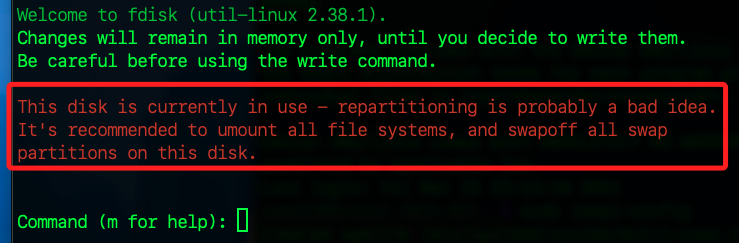
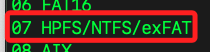
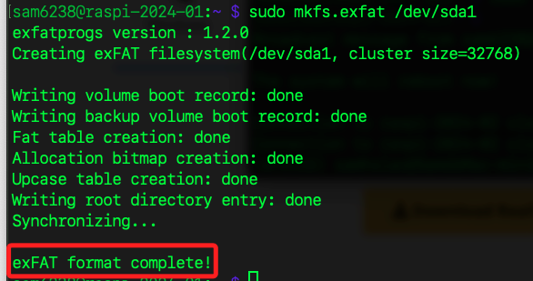
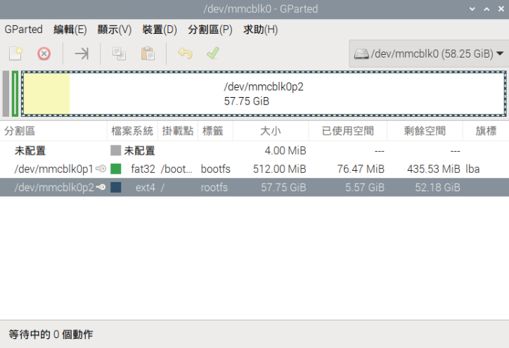
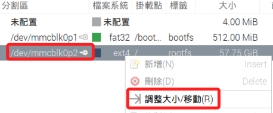
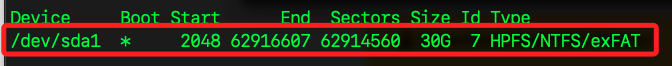

# 樹莓派系統分區

_尚未完成_

<br>

## 說明

1. 可以在已經安裝好系統的樹莓派上設置和管理分區，這通常用於 `增加存儲空間`、`創建備份分區` 或 `配置 A/B 升級系統`。

<br>

## 檢查當前分區

_在進行分區操作之前，先檢查當前的分區情況_

<br>

1. 使用 `lsblk` 進行檢查。

```bash
sudo lsblk
```
_輸出_
```bash
sam6238@raspi-2024-01:~ $ sudo lsblk
NAME        MAJ:MIN RM  SIZE RO TYPE MOUNTPOINTS
mmcblk0     179:0    0 58.3G  0 disk 
├─mmcblk0p1 179:1    0  512M  0 part /boot/firmware
└─mmcblk0p2 179:2    0 57.7G  0 part /
```

<br>

2. 也可以使用 `fdisk` 進行檢查，特別說明，Linux 系統會自動創建多個 RAM 磁碟，這是系統預設行為，用於提供靈活的內存操作選項，其中 `/dev/mmcblk0` 是實際的存儲設備，用於儲存操作系統和數據，這是個物理設備，也就是燒錄系統的 microSD 卡。

```bash
sudo fdisk -l
```

_輸出_

```bash
Disk /dev/ram0: 4 MiB, 4194304 bytes, 8192 sectors
Units: sectors of 1 * 512 = 512 bytes
Sector size (logical/physical): 512 bytes / 16384 bytes
I/O size (minimum/optimal): 16384 bytes / 16384 bytes

Disk /dev/ram1: 4 MiB, 4194304 bytes, 8192 sectors
Units: sectors of 1 * 512 = 512 bytes
Sector size (logical/physical): 512 bytes / 16384 bytes
I/O size (minimum/optimal): 16384 bytes / 16384 bytes

... （中間省略）

Disk /dev/ram15: 4 MiB, 4194304 bytes, 8192 sectors
Units: sectors of 1 * 512 = 512 bytes
Sector size (logical/physical): 512 bytes / 16384 bytes
I/O size (minimum/optimal): 16384 bytes / 16384 bytes

Disk /dev/mmcblk0: 58.25 GiB, 62545461248 bytes, 122159104 sectors
Units: sectors of 1 * 512 = 512 bytes
Sector size (logical/physical): 512 bytes / 512 bytes
I/O size (minimum/optimal): 512 bytes / 512 bytes
Disklabel type: dos
Disk identifier: 0xae60924e

Device         Boot   Start       End   Sectors  Size Id Type
/dev/mmcblk0p1         8192   1056767   1048576  512M  c W95 FAT32 (LBA)
/dev/mmcblk0p2      1056768 122159103 121102336 57.7G 83 Linux
```

<br>

## 進行分區

_使用 `fdisk` 管理磁碟分區_

<br>

1. 使用 `fdisk` 對實際的存儲設備 `/dev/mmcblk0` 進行管理。

    ```bash
    sudo fdisk /dev/mmcblk0
    ```

<br>

2. 執行後出現警告訊息，因為該磁碟當前正被使用，進行重新分區操作可能會帶來風險。

    

<br>

3. 輸入 `p` 來列出當前的分區表，從輸出訊息可知目前的 microSD 卡有兩個分區，一個 `512 MB` 的 `FAT32` 分區，用於存放啟動文件；一個 `57.7 G` 的 `Linux 分區`，用於存放操作系統和數據。

```bash
Disk /dev/mmcblk0: 58.25 GiB, 62545461248 bytes, 122159104 sectors
Units: sectors of 1 * 512 = 512 bytes
Sector size (logical/physical): 512 bytes / 512 bytes
I/O size (minimum/optimal): 512 bytes / 512 bytes
Disklabel type: dos
Disk identifier: 0xae60924e

Device         Boot   Start       End   Sectors  Size Id Type
/dev/mmcblk0p1         8192   1056767   1048576  512M  c W95 FAT32 (LBA)
/dev/mmcblk0p2      1056768 122159103 121102336 57.7G 83 Linux
```

<br>

4. 輸入 `n` 來 `創建新分區`，接著會提示選擇分區類型，`p` 為主分區、`e` 為擴展分區。

    ```bash
    Command (m for help): n
    Partition type
    p   primary (2 primary, 0 extended, 2 free)
    e   extended (container for logical partitions)
    Select (default p): 
    ```

<br>

5. 選擇 `p` 創建主分區，接著會詢問指定分區號。

```bash
Select (default p): p
Partition number (3,4, default 3): 
```

<br>

6. 輸入 3 作為分區號，接著會詢問起始扇區，按下 `Enter` 接受默認值即可。

```bash
Partition number (3,4, default 3): 3
First sector (2048-8191, default 2048):
```

<br>

7. 選擇結束扇區，輸入所需大小，因為所使用的記憶卡是 64 G 算是足夠，這裡設置為 +20G， 表示創建 20GB 的分區。
```bash
First sector (2048-8191, default 2048): 
Last sector, +/-sectors or +/-size{K,M,G,T,P} (2048-8191, default 8191): +20
```

<br>

8. 在以上的操作中，得到以下得結果，由於遺漏了單位 `G`，導致建立的分區是 `10.5K`，也就是 `20 x 512 byte` = `10240 byte`。

```bash
Last sector, +/-sectors or +/-size{K,M,G,T,P} (2048-8191, default 8191): +20
Created a new partition 3 of type 'Linux' and of size 10.5 KiB.
```

<br>

## 刪除分區

1. 再次透過 `p` 指令進行查詢。

```bash
Command (m for help): p
Disk /dev/mmcblk0: 58.25 GiB, 62545461248 bytes, 122159104 sectors
Units: sectors of 1 * 512 = 512 bytes
Sector size (logical/physical): 512 bytes / 512 bytes
I/O size (minimum/optimal): 512 bytes / 512 bytes
Disklabel type: dos
Disk identifier: 0xae60924e

Device         Boot   Start       End   Sectors  Size Id Type
/dev/mmcblk0p1         8192   1056767   1048576  512M  c W95 FAT32 (LBA)
/dev/mmcblk0p2      1056768 122159103 121102336 57.7G 83 Linux
/dev/mmcblk0p3         2048      2068        21 10.5K 83 Linux

Partition table entries are not in disk order.
```

<br>

2. 使用 `d` 指令進行刪除指定分區 `3`。

```bash
Command (m for help): d
Partition number (1-3, default 3): 3
Partition 3 has been deleted.
```

<br>

## 插入 USB 隨身碟

1. 運行以下指令查看設備名稱。

```bash
lsblk
```

_輸出_

```bash
NAME        MAJ:MIN RM  SIZE RO TYPE MOUNTPOINTS
sda           8:0    1 56.3G  0 disk 
mmcblk0     179:0    0 58.3G  0 disk 
├─mmcblk0p1 179:1    0  512M  0 part /boot/firmware
└─mmcblk0p2 179:2    0 57.7G  0 part /
```

<br>

2. 當前尚未掛載，假如已經掛載的話，要先卸載。

```bash
sudo umount /dev/sda1
```

<br>

3. 使用 fdisk 創建分區。

```bash
sudo fdisk /dev/sda
```

<br>

4. 輸入 d 選擇要刪除的分區號，直到清空 USB 隨身碟，輸入 `p` 查詢確認。

```bash
Command (m for help): p
Disk /dev/sda: 56.32 GiB, 60472426496 bytes, 118110208 sectors
Disk model: Transcend 64GB  
Units: sectors of 1 * 512 = 512 bytes
Sector size (logical/physical): 512 bytes / 512 bytes
I/O size (minimum/optimal): 512 bytes / 512 bytes
Disklabel type: dos
Disk identifier: 0x00000000
```

<br>

5. 先輸入 `n` 創建分區，然後輸入 `p` 建立主分區，分區編號輸入 `1`，然後大小設定為 `+30G`，完成時顯示如下。

```bash
Command (m for help): n
Partition type
   p   primary (0 primary, 0 extended, 4 free)
   e   extended (container for logical partitions)
Select (default p): p
Partition number (1-4, default 1): 1
First sector (2048-118110207, default 2048): 
Last sector, +/-sectors or +/-size{K,M,G,T,P} (2048-118110207, default 118110207): +30G

Created a new partition 1 of type 'Linux' and of size 30 GiB.
```

<br>

6. 輸入 `t`設置分區類型，接著因為只有一個分區，所以自動選擇分區 `1`；輸入 `L` 列出所有的 `文件系統標識列表`，選擇 `7`。

```bash
Hex code or alias (type L to list all): 7
Changed type of partition 'Linux' to 'HPFS/NTFS/exFAT'.
```



<br>

7. 輸入 `w` 來寫入分區表並退出 `fdisk`。

```bash
Command (m for help): w
The partition table has been altered.
Calling ioctl() to re-read partition table.
Syncing disks.
```

<br>

## 格式化分區

1. 使用 mkfs.exfat 工具來格式化分區為 exFAT 文件系統。

```bash
sudo mkfs.ext4 /dev/sda1
```



<br>

## 掛載分區

1. 創建一個掛載點。

```bash
sudo mkdir -p /mnt/usb
```

<br>

2. 使用 mount 命令來掛載分區到創建的目錄。

```bash
sudo mount /dev/sda1 /mnt/usb
```

<br>

3. 驗證掛載。

```bash
df -h /mnt/usb
```


<br>

## 調整分區大小

1. 安裝 gparted。

```bash
sudo apt update -y && sudo apt install gparted -y
```

<br>

2. gparted 還需要 `exfatprogs` 這個工具來支持 exFAT 文件系統的調整和管理。

```bash
sudo apt install exfatprogs
```

<br>

3. 使用 VNC 連線樹莓派，開啟終端機運行以下指令啟動 `gparted`，這會開啟一個圖形介面。

```bash
sudo gparted
```



<br>

3. 點擊右鍵進行調整。



<br>

## 自動挂載分區

1. 每次啟動時自動挂載新分區，可以編輯 `/etc/fstab` 文件並添加以下條目。

```bash
sudo nano /etc/fstab
```

<br>

2. 添加一行，指定新分區和挂載點，保存退出。

```plaintext
/dev/sda1  /mnt/usb  ext4  defaults  0  0
```

<br>

3. 重新啟動系統並檢查新分區是否自動挂載。

```bash
sudo reboot
```

<br>

4. 啟動後，確認新分區是否自動挂載。

```bash
df -h
```

<br>

## 設置為開機分區

_要將 USB 驅動器設置為開機分區，需要在這個分區中安裝必要的引導文件，並配置 BIOS 或 UEFI 以允許從該分區啟動。_

<br>

1. 確保分區格式為 FAT32，因為大多數樹莓派的引導加載程序期望從 FAT32 分區讀取引導文件。

```bash
sudo mkfs.vfat /dev/sda1
```

<br>

2. 安裝引導文件。

```bash
sudo cp -r /boot/firmware/* /mnt/usb/
```

<br>

3. 查詢。

```bash
sudo blkid
```

_輸出_

```bash
/dev/mmcblk0p1: LABEL_FATBOOT="bootfs" LABEL="bootfs" UUID="50C8-AEAE" BLOCK_SIZE="512" TYPE="vfat" PARTUUID="ae60924e-01"
/dev/mmcblk0p2: LABEL="rootfs" UUID="fc7a1f9e-4967-4f41-a1f5-1b5927e6c5f9" BLOCK_SIZE="4096" TYPE="ext4" PARTUUID="ae60924e-02"
/dev/sda1: UUID="983f8210-bae1-4fb8-8a79-c44553e75103" BLOCK_SIZE="4096" TYPE="ext4" PARTUUID="8ee228db-01"
```

<br>

4. 查看並配置引導文件。

```bash
sudo nano /mnt/usb/cmdline.txt
```

<br>

5. 將參數 `root=PARTUUID=` 修改為 `/dev/sda1` 的 `PARTUUID` 值 `8ee228db-01`。

```bash
console=serial0,115200 console=tty1 root=PARTUUID=8ee228db-01 rootfstype=ext4 fsck.repair=yes rootwait quiet splash plymouth.ignore-serial-consoles cfg80211.ieee80211_regdom=TW
```

<br>

## 檢查 fdisk 配置

1. 進入 fdisk。

```bash
sudo fdisk /dev/sda
```

<br>

2. 輸入 `p`  查看分區信息，確認 /dev/sda1 的 Boot 標誌已設置（有 *）。



<br>

3. 重新啟動。

```bash
sudo reboot now
```

<br>

___

_END：未完_