# 安裝在隨身碟

_以下步驟記錄如何將樹莓派系統安裝在 SSD 隨身碟並取代 SD 卡作為系統開機碟使用_

<br>

## 重要前提

1. 從樹莓派 4 開始，樹莓派系統已經支援從 USB 儲存裝置燒錄系統並開機，根據官方說明，在此之前的樹莓派型號都只能從 microSD 卡啟動。

<br>

2. 實現這個功能前必須更新 `EEPROM`，使用外部儲存設備作為主要的儲存和引導裝置，可得到更快的讀寫速度和更大的存儲空間。

<br>

3. 透過官方 `Raspberry Pi Imager` 工具燒錄的系統碟預設僅佔用其中的 5G，以下是將燒錄好的 64G SD 卡插入另一台運作中的樹莓派所查詢的結果。

    

<br>

4. 在官方文件有提到，初次啟動樹莓派系統時會自動將根分區擴展到整個 SD 卡或 USB 磁碟的可用空間，這是為了確保用戶可以使用整個存儲設備的可用空間，而不需要手動調整分區；同理，此時分區已經佔用整個可用空間，若要進行調整，可使用分區工具如 `gparted` 來手動調整分區大小，但這要非常小心。

<br>

5. 以下的說明就是在運行中的樹莓派系統中，對於另一個儲存裝置進行設定的過程，而不是單純使用外部儲存裝置作為開機系統。

<br>

## 說明

1. 與基礎步驟相同，使用 `官方燒錄器` 對 SSD 進行系統燒錄，同樣要設定並牢記相關資訊。

    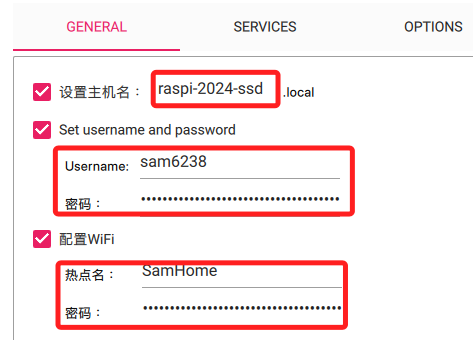

<br>

2. 完成後將 SSD 作為一般儲存設備插入樹莓派 USB，同樣是可以熱插拔，並透過指令查詢當前資訊，預設安裝的容量僅有 `5G`。

    ```bash
    lsblk
    ```

    _輸出_

    ```bash
    NAME        MAJ:MIN RM   SIZE RO TYPE MOUNTPOINTS
    sda           8:0    0 476.9G  0 disk 
    ├─sda1        8:1    0   512M  0 part /media/sam6238/bootfs
    └─sda2        8:2    0     5G  0 part /media/sam6238/rootfs
    mmcblk0     179:0    0  59.5G  0 disk 
    ├─mmcblk0p1 179:1    0   512M  0 part /boot/firmware
    └─mmcblk0p2 179:2    0    59G  0 part /
    ```

<br>

3. 更新運作中的樹莓派系統。

    ```bash
    sudo apt update -y && sudo apt full-upgrade -y
    ```

<br>

## 分配分區

_擴大 SSD 分區需要確保分區後面有可用的未分配空間_

<br>

1. 在樹莓派安裝圖形化工具 `GParted` 來管理分區。

    ```bash
    sudo apt install gparted -y
    # 安裝附屬套件
    sudo apt install dosfstools mtools -y
    ```

<br>

2. 這是一個圖形化界面工具，所以要進入樹莓派並從終端啟動 `GParted`。

    ```bash
    sudo gparted
    ```

<br>

3. 啟動後會顯示當前開機的 SD 卡所載分區資訊。

    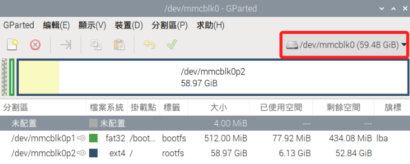

<br>

4. 在右上角選單中切換為 SSD 的 `/dev/sda`，此時會顯示兩個分區，及一個 `未配置` 空間。

    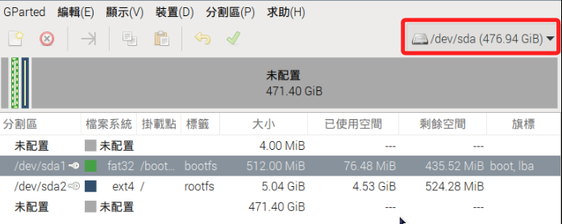

<br>

5. 在要修改容量的分區上點右鍵，也就是 `/dev/sda2`，然後點擊 `調整大小/移動`。

    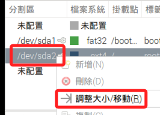

<br>

6. 可手動輸入分區大小，輸入完成先按下 `ENTER`，然後點擊右下角的 `調整大小`。

    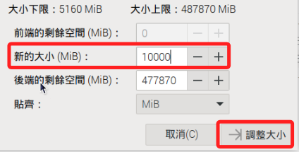

<br>

7. 點擊工具欄上的綠色 `打勾` 按鈕來套用變更。

    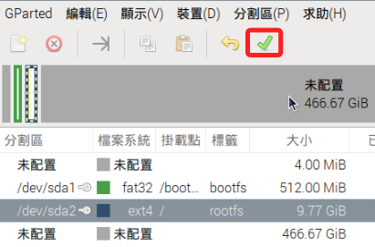

<br>

8. 在彈出視窗中再次點擊 `套用` 完成設定。

    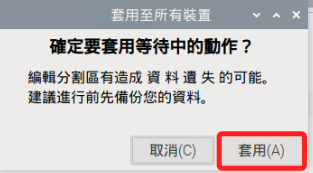

<br>

9. 完成時可展開 `詳細資訊` 查看所進行的變更。

    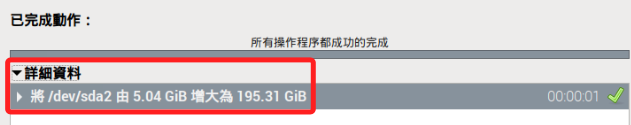

<br>

## 繼續設定

1. 在更新 `EEPROM` 之前，先進行設定，使用以下指令編輯 `EEPROM` 配置文件。

    ```bash
    sudo nano /etc/default/rpi-eeprom-update
    ```

<br>

2. 可看到設定值預設為 `default`，這表示樹莓派會接收所有類型的固件更新，包括測試版、穩定版和關鍵更新。為確保固件版本穩定且經過充分測試，可以將設定值改為 `critical`，這樣樹莓派只會接收經過充分測試的關鍵更新，從而避免固件的不穩定性問題。

    ```bash
    FIRMWARE_RELEASE_STATUS="critical"
    ```

<br>

3. 完成設定後進行更新韌體，目的是更新 `啟動加載程序（bootloader）` 和相關的配置，特別注意這僅適用於 `樹莓派 4` 以上的型號。

    ```bash
    sudo rpi-eeprom-update -a
    ```

    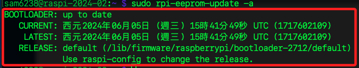

<br>

4. 完成後重新啟動樹莓派。

    ```bash
    sudo reboot
    ``` 

<br>

## 重啟之後

1. 先觀察一下系統現況，透過以下指令查詢樹莓派上的儲存設備（block devices），其中 `/dev/sda` 就是外接的 `SSD`。

    ```bash
    lsblk
    ```

    _輸出_

    ```bash
    NAME        MAJ:MIN RM   SIZE RO TYPE MOUNTPOINTS
    sda           8:0    0 476.9G  0 disk 
    ├─sda1        8:1    0   512M  0 part /media/sam6238/bootfs
    └─sda2        8:2    0 195.3G  0 part /media/sam6238/rootfs
    mmcblk0     179:0    0  59.5G  0 disk 
    ├─mmcblk0p1 179:1    0   512M  0 part /boot/firmware
    └─mmcblk0p2 179:2    0    59G  0 part /
    ```

<br>

2. 接著查詢這些 `儲存設備` 的 `文件系統類型` 及 `掛載資訊 MOUNTPOINTS`；其中 `SSD（/dev/sda）` 上有兩個分區 `/dev/sda1`、`/dev/sda2`。

    ```bash
    sudo blkid
    ```

    _輸出，省略 SD 卡部分_

    ```bash
    /dev/sda2: LABEL="rootfs" UUID="fc7a1f9e-4967-4f41-a1f5-1b5927e6c5f9" BLOCK_SIZE="4096" TYPE="ext4" PARTUUID="617a2abd-02"
    /dev/sda1: LABEL_FATBOOT="bootfs" LABEL="bootfs" UUID="50C8-AEAE" BLOCK_SIZE="512" TYPE="vfat" PARTUUID="617a2abd-01"
    ```

<br>

3. 依據前一個步驟顯示的掛載路徑，執行指令以編輯 `SSD` 上的分區設定文件 `cmdline.txt`，這個文件就在根目錄上，所以直接套用掛載路徑即可取得。

    ```bash
    sudo nano /media/sam6238/bootfs/cmdline.txt
    ```

<br>

4. 這個文件預設內容如下，其中 `root=PARTUUID=617a2abd-02` 指定根文件系統的分區 `UUID` 指向分區 `617a2abd-02`，且系統類型為 `ext4`。

    ```bash
    console=serial0,115200 console=tty1 root=PARTUUID=617a2abd-02 rootfstype=ext4 fsck.repair=yes rootwait quiet init=/usr/lib/raspberrypi-sys-mods/firstboot splash plymouth.ignore-serial-consoles cfg80211.ieee80211_regdom=TW systemd.run=/boot/firstrun.sh systemd.run_success_action=reboot systemd.unit=kernel-command-line.target
    ```

<br>

5. 從查詢結果可知，root 參數已經指向 SSD 上的 `/dev/sda2` 分區，且文件系統類型 `ext4` 與 SSD 根分區的文件系統類型吻合，所以無需進行內容的修正。

<br>

## 設置 fstab 與 autoboot.txt 文件

1. 接下來要針對 `SSD` 中這兩個文件進行設定，特別說明，`autoboot.txt` 和 `fstab` 文件需要放在各自合適的位置，其中 `autoboot.txt` 要放在 `啟動分區`，通常是 `/boot` 或 `/boot/firmware` 的根目錄，在這裡依據查詢結果存放在 `/media/sam6238/bootfs/`；而 `fstab` 要放在 `根文件系統` 的 `/etc` 目錄下，用於定義系統啟動時自動掛載的文件系統，這裡依據查詢結果存放在 `/media/sam6238/rootfs/etc/`。

<br>

## 設置 fstab 文件

1. 先修改 `/etc/fstab` 文件，這 `Linux 文件系統掛載配置文件`，用於設置文件系統在啟動時應該如何掛載。

    ```bash
    sudo nano /media/sam6238/rootfs/etc/fstab
    ```

<br>

2. 將 `/boot` 和 `根分區` 指向 `SSD`，確認 `UUID` 是否與前一個步驟查詢結果一致；至於 `proc` 則是 `虛擬文件系統`，用於表示內核和進程的相關信息。

    ```bash
    proc            /proc           proc    defaults          0       0
    PARTUUID=617a2abd-01  /boot/firmware  vfat    defaults          0       2
    PARTUUID=617a2abd-02  /               ext4    defaults,noatime  0       1
    ```

<br>

## 設置 autoboot.txt 文件

_設置啟動時使用的 `分區號 boot_partition`_

<br>

1. 在之前步驟中有說明過，可透過 `lsblk -f` 或 `sudo blkid` 取得分區資訊，其中 `引導分區` 通常是 `vfat (FAT32)` 格式，而 `根文件系統分區` 通常是 `ext4` 格式；以結果來看，`sda1` 掛載在 `/media/sam6238/bootfs`，可知這個分區是用來放引導文件的，還可進一步查看其內容應該包含以下引導文件如 `boot`、`cmdline.txt`、`config.txt` 等。

    ```bash
    lsblk -f
    ```

    _輸出_

    ```bash
    NAME FSTYPE FSVER LABEL UUID                                 FSAVAIL FSUSE% MOUNTPOINTS
    sda                                                                         
    ├─sda1
    │    vfat   FAT32 bootfs
    │                       50C8-AEAE                             435.5M    15% /media/sam6238/bootfs
    └─sda2
        ext4   1.0   rootfs
                            fc7a1f9e-4967-4f41-a1f5-1b5927e6c5f9  180.2G     2% /media/sam6238/rootfs
    # ... 以下省略
    ```

<br>

2. 建立並編輯 `autoboot.txt` 文件，特別注意這個文件預設是不存在的，路徑也與前一步驟不同，這文件要放在 `boot` 目錄，在這個範例中就是 `/media/sam6238/bootfs/`。

    ```bash
    sudo nano /media/sam6238/bootfs/autoboot.txt
    ```

<br>

3. 添加以下內容，指定從 `SSD` 的第一分區引導，也就是 `sda1` 的 `1`。

    ```bash
    [all]
    boot_partition=1
    ```

<br>

## 設置引導標誌

1. 進入 `fdisk`。

    ```bash
    sudo fdisk /dev/sda
    ```

<br>

2. 在 `fdisk` 內輸入指令 `a` 以進行設置或取消分區的 `啟動標誌（bootable flag）`，然後選擇分區 `1` 來設置 `引導標誌`，最後輸入 `w` 保存並退出。

    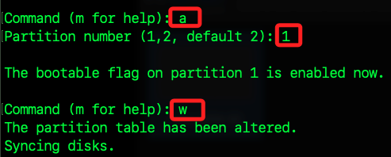

<br>

3. 更新 `EEPROM` 固件，以便讓設備能夠正確識別和支持新的引導設備。

    ```bash
    sudo rpi-eeprom-update -a
    ```

    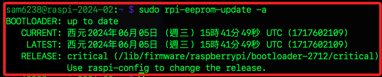

<br>

## 卸載分區並重新啟動

1. 在拔掉 `SD 卡` 並使用 `SSD` 作為 `啟動分區`前，應該卸載所有與 SSD 有關的分區。

    ```bash
    sudo umount /media/sam6238/bootfs /media/sam6238/rootfs
    ```

<br>

2. 接著先關機。

    ```bash
    sudo shutdown now
    ```

<br>

3. 然後拔掉 `SD 卡` 後打開電源啟動系統。

<br>

# 重新啟動

1. 開機後使用燒錄時預設的帳密及主機名稱進行連線。

<br>

2. 查詢當前磁區分配，會顯示當前文件系統的磁區使用情況，包括每個掛載點的容量、已用空間和可用空間。

    ```bash
    df -h
    ```

    _輸出_

    ```bash
    Filesystem      Size  Used Avail Use% Mounted on
    udev            3.8G     0  3.8G   0% /dev
    tmpfs           806M  5.8M  800M   1% /run
    /dev/sda2       469G  4.4G  446G   1% /
    tmpfs           4.0G  288K  4.0G   1% /dev/shm
    tmpfs           5.0M   48K  5.0M   1% /run/lock
    /dev/sda1       510M   75M  436M  15% /boot/firmware
    tmpfs           806M  160K  806M   1% /run/user/1000
    ```

<br>

3. 若只要查詢根分區。

    ```bash
    df -h /
    ```
<br>

4. 顯示所有的塊設備及其分區，包括它們的掛載點。

    ```bash
    lsblk
    ```

    _輸出_

    ```bash
    NAME   MAJ:MIN RM   SIZE RO TYPE MOUNTPOINTS
    sda      8:0    0 476.9G  0 disk 
    ├─sda1   8:1    0   512M  0 part /boot/firmware
    └─sda2   8:2    0 476.4G  0 part /
    ```

<br>

5. 列出所有磁盤及其分區詳細信息。

    ```bash
    sudo fdisk -l
    ```

<br>

## 測速

1. 安裝 `hdparm` 進行速度測試。

    ```bash
    sudo apt update -y && sudo apt install hdparm -y
    ```

<br>

2. 使用 `hdparm` 測試讀取速度，得到的結果是 `339.89 MB`，這是一個相當不錯的表現。

    ```bash
    sudo hdparm -t /dev/sda
    ```

    _輸出_

    ```bash
    sam6238@raspi-2024-ssd:~ $ sudo hdparm -t /dev/sda

    /dev/sda:
    Timing buffered disk reads: 1020 MB in  3.00 seconds = 339.89 MB/sec
    ```

<br>

___

_END_