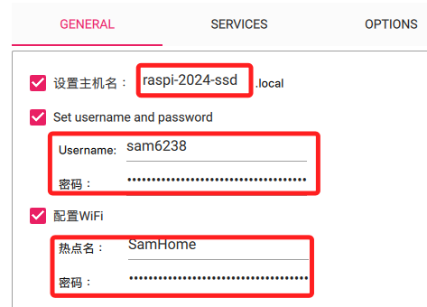
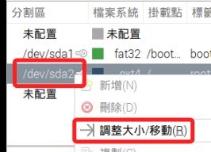
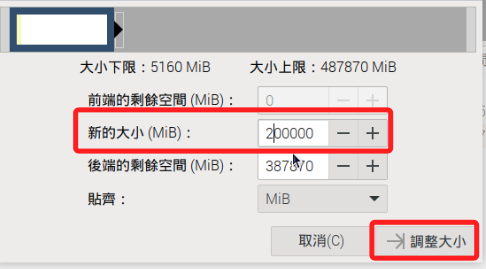

## 製作 USB 啟動碟

_建立包含多個分區的樹莓派系統碟_

<br>

## 說明

1. 從 `樹莓派 4` 開始，樹莓派系統已經支援在 `USB 儲存裝置` 燒錄系統並作為啟動碟，在此之前的樹莓派型號都只能從 `microSD 卡` 進行啟動。

<br>

2. 使用外部儲存設備作為主要的儲存和引導裝置可得到更快的讀寫速度和更大的存儲空間，實現這個功能前必須更新樹莓派的 `EEPROM`。

<br>

3. 特別注意，透過官方燒錄器製作的系統碟預設只會佔用其中的 `5G`，如以下截圖是將燒錄好的一張 `64G SD 卡` 插入另一台運作中的樹莓派所查詢的結果。

    

<br>

4. 延續上一點，在官方文件有提到，初次啟動樹莓派系統時會自動將根分區擴展到整個 SD 卡或USB 磁碟的可用空間，若有多個分區則會擴展最後一個分區，這是為了確保用戶可以使用整個存儲設備的可用空間，且不需要手動進行設置；基於這樣的設計，儲存裝置的全部空間已被分區佔用，若要進行調整，需使用分區工具如 `gparted` 來手動作業，其中涉及的狀況很多，此處不逐一說明。

<br>

5. 以下的操作是在運行中的樹莓派系統中，對於另一個儲存裝置進行設定的過程，而不是單純使用外部儲存裝置作為開機系統。

<br>

## 開始

1. 先使用 `官方燒錄器` 對 USB SSD 儲存裝置進行系統燒錄，同樣要將設定值牢記。

    

<br>

2. 完成後將 SSD 作為一般儲存設備插入運作中的樹莓派 USB 接口，與一般 USB 裝置相同是可熱插拔的，並透過以下指令查詢當前資訊，其中 `sdb` 就是新插入的 USB 碟，並可觀察到預設安裝的容量僅有 `5G`。


    ```bash
    lsblk
    ```
    _輸出_
    ```bash
    NAME   MAJ:MIN RM   SIZE RO TYPE MOUNTPOINTS
    sda      8:0    0 476.9G  0 disk 
    ├─sda1   8:1    0   512M  0 part /boot/firmware
    ├─sda2   8:2    0  97.7G  0 part /
    └─sda3   8:3    0 281.1G  0 part /media/sam6238/data
    sdb      8:16   1  56.3G  0 disk 
    ├─sdb1   8:17   1   512M  0 part /media/sam6238/bootfs
    └─sdb2   8:18   1     5G  0 part /media/sam6238/rootfs
    ```

<br>

## 分配分區

_安裝分配分區所需的工具_

<br>

1. 以下要安裝工具，所以先更新運作中的樹莓派系統。

    ```bash
    sudo apt update -y && sudo apt full-upgrade -y
    ```

<br>

2. 在樹莓派中安裝圖形化工具 `GParted` 來管理分區。

    ```bash
    sudo apt install gparted -y
    ```

<br>

3. 同時安裝附屬工具。

    ```bash
    sudo apt install dosfstools mtools -y
    ```

<br>

## 啟動應用工具

1. 這是一個圖形化界面工具，所以要進入樹莓派並從終端啟動 `GParted`。

    ```bash
    sudo gparted
    ```

<br>

2. 啟動後會顯示當前開機的 SD 卡所載分區資訊。

    

<br>

3. 在右上角選單中切換為 SSD 的 `/dev/sda`，此時會顯示兩個分區，及一個 `未配置` 空間。

    

<br>

4. 在要修改容量的分區上點右鍵，也就是 `/dev/sda2`，然後點擊 `調整大小/移動`。

    

<br>

5. 可手動輸入分區大小，輸入完成先按下 `ENTER`，然後點擊右下角的 `調整大小`。

    

<br>

6. 點擊工具欄上的綠色 `打勾` 按鈕來套用變更。

    

<br>

7. 在彈出視窗中再次點擊 `套用` 完成設定。

    

<br>

8. 完成時可展開 `詳細資訊` 查看所進行的變更。

    

<br>

## 新增分區

1. 拓展現有系統資料分區到之後，緊接著在 `未配置` 點擊右鍵後選取 `新增`。

    

<br>

2. 再建立一個 100G 的分區然後打勾，特別注意，這個分區的大小並不重要，因為在之後的步驟中，樹莓派預設會將剩餘空間全部指派給這個最後建立的分區。

    

<br>

3. 格式化為 `ext4`，同樣再打勾。

    

<br>

## 查看 

1. 查看磁碟資訊。

    ```bash
    lsblk
    ```

    _結果_

    ```bash
    NAME        MAJ:MIN RM   SIZE RO TYPE MOUNTPOINTS
    sda           8:0    0 476.9G  0 disk 
    ├─sda1        8:1    0   512M  0 part /media/sam6238/bootfs
    ├─sda2        8:2    0  97.7G  0 part /media/sam6238/rootfs
    └─sda3        8:3    0 281.1G  0 part 
    mmcblk0     179:0    0  58.3G  0 disk 
    ├─mmcblk0p1 179:1    0   512M  0 part /boot/firmware
    └─mmcblk0p2 179:2    0  57.7G  0 part /
    ```

<br>

2. 查詢已掛載分區。

    ```bash
    df -h
    ```

    _結果_

    ```bash
    檔案系統        容量  已用  可用 已用% 掛載點
    udev            3.8G     0  3.8G    0% /dev
    tmpfs           805M  6.0M  799M    1% /run
    /dev/mmcblk0p2   57G  5.8G   49G   11% /
    tmpfs           4.0G  352K  4.0G    1% /dev/shm
    tmpfs           5.0M   48K  5.0M    1% /run/lock
    /dev/mmcblk0p1  510M   76M  435M   15% /boot/firmware
    tmpfs           805M  160K  805M    1% /run/user/1000
    /dev/sda1       510M   75M  436M   15% /media/sam6238/bootfs
    /dev/sda2        97G  4.2G   88G    5% /media/sam6238/rootfs
    ```

3. 接著關機，然後拔出 SD 卡，僅保留外接儲存裝置。

    ```bash
    sudo shutdown now
    ```

<br>

## 再次查看

_使用外接儲存裝置進行啟動_

<br>

1. 查詢，發現樹莓派系統自動將為分配空間全部配置給第三個分區，並且已經自動掛載。

    ```bahs
    lsblk
    ```

    _輸出_

    ```bash
    NAME   MAJ:MIN RM   SIZE RO TYPE MOUNTPOINTS
    sda      8:0    0 476.9G  0 disk 
    ├─sda1   8:1    0   512M  0 part /boot/firmware
    ├─sda2   8:2    0  97.7G  0 part /
    └─sda3   8:3    0 281.1G  0 part /media/sam6238/276422b4-0136-46bb-a4db-e17d2f0ae8f8
    ```

<br>

2. 修改掛載點名稱，首先，卸載該分區。

    ```bash
    sudo umount /media/sam6238/276422b4-0136-46bb-a4db-e17d2f0ae8f8
    ```

<br>

3. 先確認 `PARTUUID` 是 `343dcec1-03`。

    ```bash
    sudo blkid
    ```

    _結果_

    ```bash
    /dev/sda2: LABEL="rootfs" UUID="fc7a1f9e-4967-4f41-a1f5-1b5927e6c5f9" BLOCK_SIZE="4096" TYPE="ext4" PARTUUID="343dcec1-02"
    /dev/sda3: LABEL="data" UUID="276422b4-0136-46bb-a4db-e17d2f0ae8f8" BLOCK_SIZE="4096" TYPE="ext4" PARTUUID="343dcec1-03"
    /dev/sda1: LABEL_FATBOOT="bootfs" LABEL="bootfs" UUID="50C8-AEAE" BLOCK_SIZE="512" TYPE="vfat" PARTUUID="343dcec1-01"
    ```

<br>

4. 使用 e2label 命令來更改分區的標籤。例如，如果你想將標籤更改為 data。

    ```bash
    sudo e2label /dev/sda3 data
    ```

<br>

5. 編輯 /etc/fstab 文件，將原有的長標籤名稱替換為新的標籤名稱。

    ```bash
    sudo nano /etc/fstab
    ```

<br>

6. 編輯如下，其中掛載點尚未建立。

    ```bash
    proc            /proc           proc    defaults          0       0
    PARTUUID=343dcec1-01  /boot/firmware    vfat    defaults          0       2
    PARTUUID=343dcec1-02  /                 ext4    defaults,noatime  0       1
    PARTUUID=343dcec1-03  /media/sam6238/data   ext4   defaults,noatime  0       1
    ```

<br>

7. 建立新的掛載目錄。

    ```bash
    sudo mkdir -p /media/sam6238/data
    ```

<br>

8. 重新掛載所有文件系統。

    ```bash
    sudo mount -a
    ```

    _完成_

    ```bash
    mount: (hint) your fstab has been modified, but systemd still uses
       the old version; use 'systemctl daemon-reload' to reload.
    ```

<br>

9. 依指示執行指令，並輸入密碼。

    ```bash
    systemctl daemon-reload
    ```

    _輸出_

    ```bash
    sam6238@raspi-2024-ssd:~ $ systemctl daemon-reload
    ==== AUTHENTICATING FOR org.freedesktop.systemd1.reload-daemon ====
    Authentication is required to reload the systemd state.
    Authenticating as: ,,, (sam6238)
    Password: 
    ==== AUTHENTICATION COMPLETE ====
    ```

<br>

## 完成

1. 查詢。

    ```bash
    lsblk
    ```

    _輸出_

    ```bash
    NAME   MAJ:MIN RM   SIZE RO TYPE MOUNTPOINTS
    sda      8:0    0 476.9G  0 disk 
    ├─sda1   8:1    0   512M  0 part /boot/firmware
    ├─sda2   8:2    0  97.7G  0 part /
    └─sda3   8:3    0 281.1G  0 part /media/sam6238/data
    ```

<br>

2. 查詢已掛載分區。

    ```bash
    df -h
    ```
    _輸出_
    ```bash
    Filesystem      Size  Used Avail Use% Mounted on
    udev            3.8G     0  3.8G   0% /dev
    tmpfs           805M  5.8M  800M   1% /run
    /dev/sda2        97G  4.3G   88G   5% /
    tmpfs           4.0G  288K  4.0G   1% /dev/shm
    tmpfs           5.0M   48K  5.0M   1% /run/lock
    /dev/sda1       510M   75M  436M  15% /boot/firmware
    tmpfs           805M  160K  805M   1% /run/user/1000
    /dev/sda3       276G   28K  262G   1% /media/sam6238/data
    ```

<br>

## 關於分區目錄

1. 如果在系統中建立了一個目錄，但未在 `/etc/fstab` 中指定掛載點，這個目錄仍然是可用的，但它會作為一個普通的空目錄存在於文件系統中，可以用來存放文件和資料夾，它不會自動掛載任何設備或分區，也就是說這個目錄並不會在開機時自動掛載任何設備或分區，必須手動掛載或者在需要時動態掛載。

<br>

2. 當更新 `/etc/fstab` 並運行 `sudo mount -a` 或者重啟系統後，新分區會才會掛載到這個目錄。

<br>

## 建立別名

_為自動生成的長路徑設置一個快捷命令來快速切換到該路徑_

<br>

1. 編輯 `~/.bashrc` 配置文件，是 `用戶級別` 的配置文件，用於配置 `Bash shell` 環境。

    ```bash
    nano ~/.bashrc
    ```

<br>

2. 在文件中添加以下指令創建一個別名，添加的位置並無規範，能集中便於查看或編輯即可。

    ```bash
    alias cddata='cd /media/sam6238/data'
    ```

3. 也可以建立一個環境變數來指向該路徑。

    ```bash
    export mydata='/media/sam6238/data'
    ```

<br>

4. 完成後要進行設置的刷新讓其生效。

    ```bash
    source ~/.bashrc
    ```

<br>

5. 完成以上步驟，透過以下兩個指令皆可將工作目錄切換到指定路徑中；特別注意，使用 `cd` 命令時，環境變數必須加上 `$` 才能正確引用，若僅執行 `cd mydata` 時， `mydata` 會被視為一個普通目錄名稱，而不是引用環境變數。

    ```bash
    # 透過環境參數切換目錄
    cd $mydata
    # 透過指令別名切換目錄
    cddata
    ```

<br>

## 建立符號鏈接

_不想使用 `$` 引用環境變數，也可透過符號鏈接來實現_

<br>

1. 在 `家目錄 (~)` 中創建一個名為 `mydata` 的 `符號鏈接`。

    ```bash
    ln -s /media/sam6238/data ~/mydata
    ```

    _建立後可進行查看_

    

<br>

2. 這樣便可透過任何地方進行切換到家目錄中的鏈接符號中，但實際會指向該分區根目錄。

    ```bash
    cd ~/mydata
    ```

<br>

___

_END_
